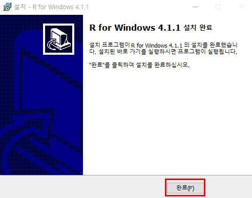

# R 개발환경 설치

> [설치하러 가기](https://www.r-project.org/)

1. R 개발환경 설치 사이트에 접속하여 다음과 같이 CRAN 메뉴를 선택한다.

2. Korea에서 다음과 같은 메뉴를 선택한다.

3. 자신의 컴퓨터 환경에 따라 R 프로그램을 다운받는다.

3-1. 본격적으로 R 4.1.1 프로그램을 설치하기 위해 선택하는 화면

4. R 프로그램 다운로드 완료 후 다음과 같이 개발환경을 설정한다.

5. 설치가 완료된 것을 확인할 수 있다.

