# R Studio 설치

> [설치하러 가기](https://rstudio.com/)

1. R Studio 설치 사이트에 접속하여 다음과 같은 메뉴를 선택한다.

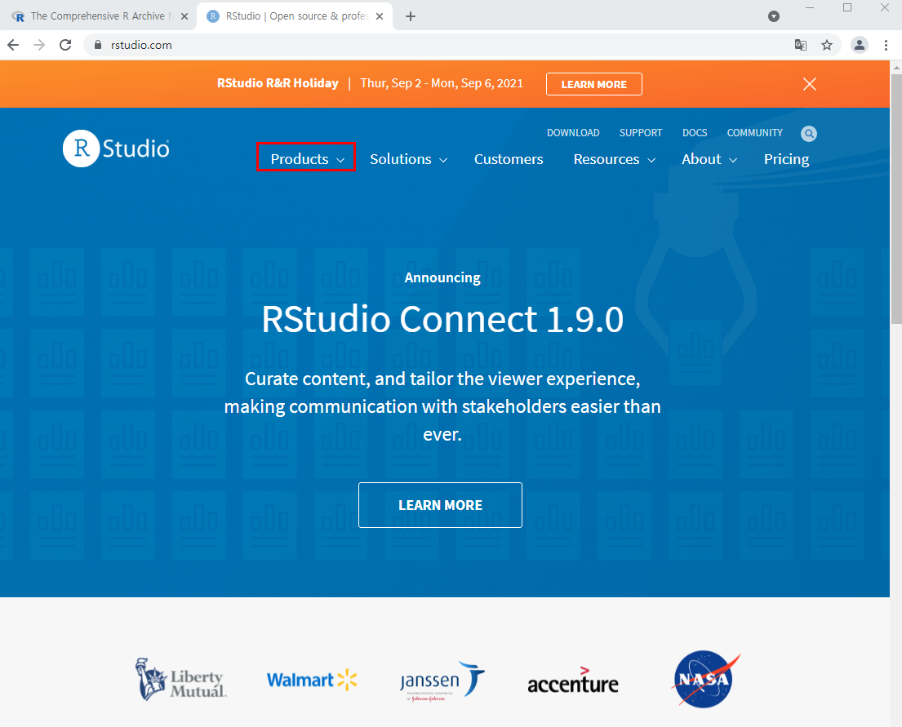

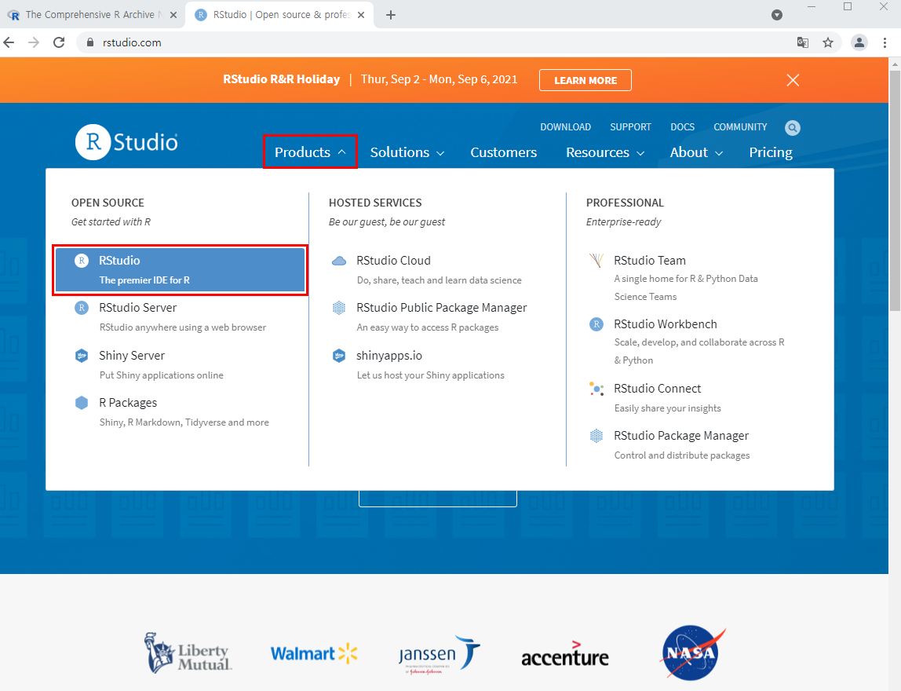

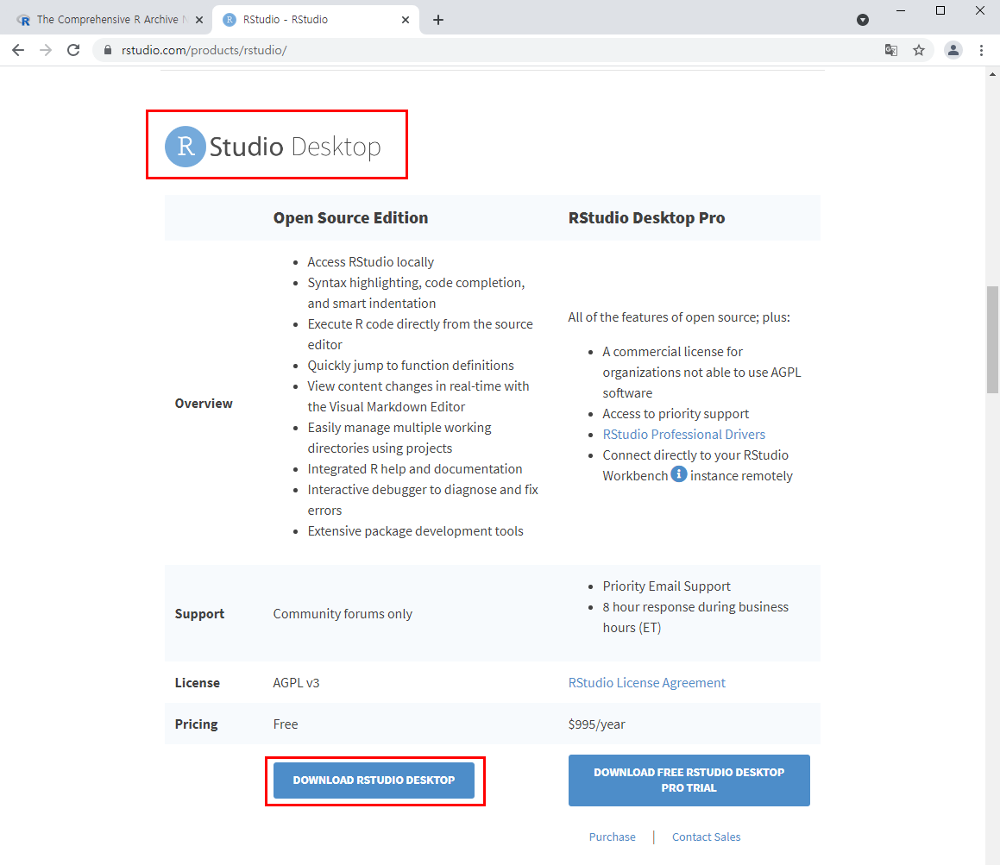

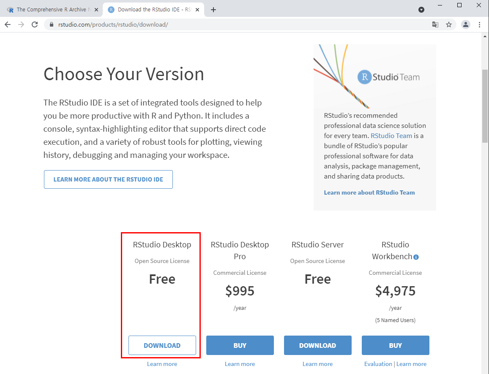

이때, R Studio는 1.4.1717 버전으로 다운받게 된다.

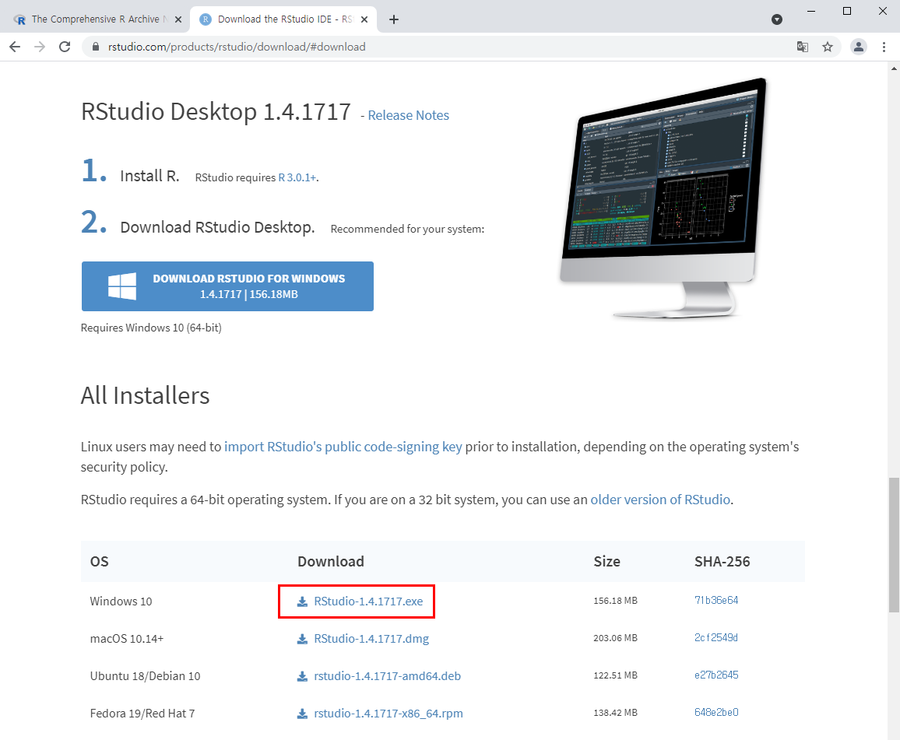

2. 다운로드가 완료되면 다음과 같이 개발환경을 설정한다.

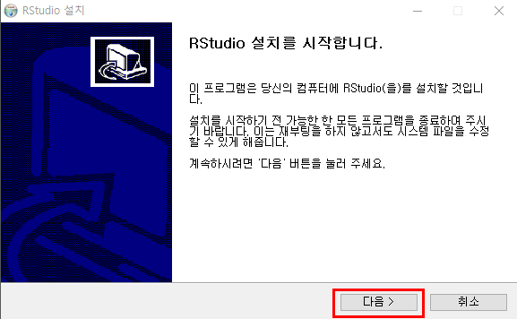

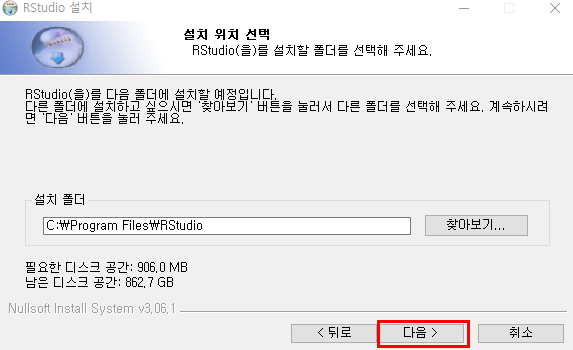

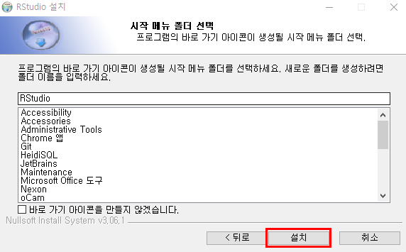

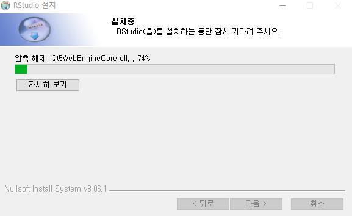

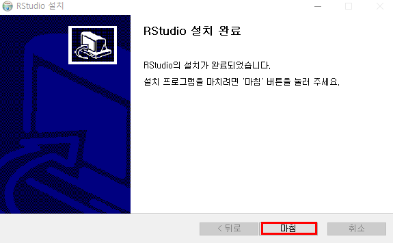

3. 설치과 완료된 것을 확인할 수 있다.

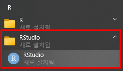

