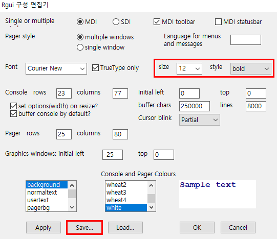

# R 프로그램 환경 설정하기

1. 설치가 완료된 R을 실행하면 다음과 같이 RGui가 실행된다.


2. GUI 설정은 다음과 같이 진행할 수 있다.





# R 프로그램 이용해 보기

1. 기본적인 R의 명령어를 입력해 본다.


```R
R.version # 버전정보 확인하기
10+20 # 연산결과 확인하기
1:10+20
```

2. 스크립트를 통해 실행시키는 방법은 다음과 같다.


2-1. 이어서 plot()함수를 이용하여 그래프도 그려본다.


3. 스크립트를 저장하는 방법은 다음과 같다.


3-1. 다음과 같이 R파일로 저장된 것을 확인할 수 있다.

