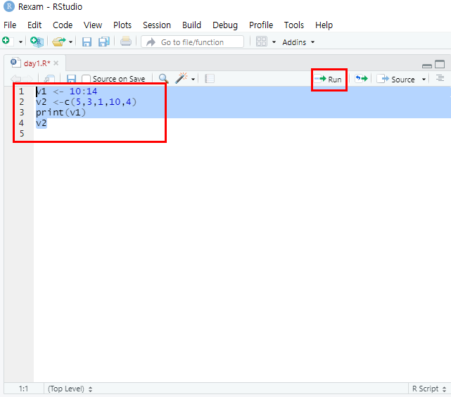

# R Studio 환경 설정하기

## 1. 설치한 R Studio 실행하기

1. 설치한 R Studio를 실행하면 다음과 같은 화면이 출력된다. (이 화면은 최초 수행 시 한 번만 출력된다.)


## 2. 프로젝트 만들기

2. 새로운 프로젝트 하나를 생성한다.

> File > New Project


2-1. 프로젝트를 생성 할 디렉터리를 지정한다.


2-2. 다음과 같이 프로젝트가 생성되었음을 확인할 수 있다.


## 3. 옵션 지정하기

3. 이번엔 환경설정을 바꾸는 방법을 알아본다.

> Tools > Global Options...


3-1. Code 메뉴에서 Default text encoding을 UTF-8로 바꿔준다.


3-2. 이때, Apply 버튼을 적용시키면 다음과 같은 안내창이 뜬다.


3-3. 이어서 다른 메뉴를 통해 사용자가 원하는 환경으로 설정할 수 있다. 원하는 환경으로 설정을 완료하면 'Apply' 버튼을 통해 설정을 활성화 시키는 것을 잊지 말자.


## 4. R Studio 간단하게 실행해보기

4. 새로운 파일을 생성한다.

> File > New File > R Script


4-1. 파일이름을 day1이라고 지정하고 저장한다.


4-2. 다음과 같은 코드를 작성하여 코드를 드래그 한 후, 실행 시켜본다.

> 단축키 ctrl+Enter로도 실행시킬 수 있다.

```R
v1 <- 10:14
v2 <-c(5,3,1,10,4)
print(v1)
v2
```




