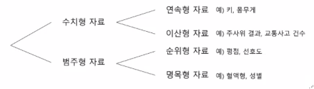

# R 언어에 대한 소개

> [R 언어에 대하여 소개하는 위키백과](https://ko.wikipedia.org/wiki/R언어)


# R 언어의 구문

## 개요

1. R에서 처리 가능한 데이터 타입의 종류

   > 문자형, 숫자형, 논리형

2. 여러 데이터들을 모아서 다루게 하는 데이터 셋 타입의 종류

   > 벡터(vector-1차원), 행렬(matrix-2차원), 배열(array-3차원 이상), 데이터프레임, 리스트

3. R 연산자
4. R 제어문

5. 함수 생성 방법(Java Script와 비슷), 호출 방법
6. 파일 입출력
7. 실행오류(예외) 처리


## 1. R의 자료형

* 문자형(character) : 문자, 문자열
* 수치형(numeric) : 정수(integer), 실수(double)
* 복소수형(complex) : 실수+허수
* 논리형(logical) : 참값과 거짓값


## 2. R의 리터럴

* 문자형(character)리터럴 :"가나다", '가나다', "", '', '123', "abc"

* 수치형(numeric)리터럴 : 100, 3.14, 0

* 논리형(logical)리터럴 : TRUE(T), FALSE(F)

  > 파이썬 : True
  >
  > 자바스크립트 : true
  >
  > R : TRUE / T

* NULL(데이터 셋이 비어있음을 의미)

* **NA(데이터 셋의 내부에 존재하지 않는 값(결측치)를 의미)**

* NaN(not a number: 숫자가 아님), Inf(무한대값)

### 2-1. 타입체크 함수들

* is.character(x) - 문자형
* is.logical(x) - 논리형
* is.numeric(x) - 수치형
* is.double(x) - 실수형
* is.integer(x) - 정수형
* is.null(x)
* is.na(x)
* is.nan(x)
* is.finite(x)
* is.infinite(x)

### 2-2. 자동형변환 룰

* 문자형(character) >복소수형(complex) >수치형(numeric) > 논리형(logical)

### 2-3. 강제형변환 함수

* as.character(x) 
* as.complex(x) 
* as.numeric(x) 
* as.double(x)
* as.integer(x) 
* as.logical(x)

### 2-4. 자료형 또는 구조 확인 함수

* class(x)
* **str(x)**
* mode(x)
* typeof(x)


## 3. R의 데이터 셋

> 벡터(팩터), 행열, 배열, 데이터프레임, 리스트


> 데이터셋이 중요한 이유는 자료를 분석하기 위해서 다양한 형태의 개별 자료를 통합적으로 분석하기 위해서이다. 예를 들어 개인 신용분석을 위해서는 개인의 소득, 부채, 성별, 학력 등등의 숫자형, 문자형, 요인(Factor)형 등의 자료를 데이터셋에 담아야 한다. 특히 변수와-관측값(Variable-Observation) 형식의 자료를 분석하기 위해서는 데이터프레임(data.frame)을 사용한다. 데이터프레임은 모든 변수에 대해서 관측값이 같은 길이를 갖도록 만들어 놓은 것이다.
>
> 

### 3-1. 벡터(vector)

> R 에서 다루는 가장 기초적인 데이터셋(데이터 구조)로서 1차원으로 사용된다.

* 하나의 데이터 값도 벡터로 취급된다.
* **동일 타입의 데이터만으로 구성**된다. (문자형(character) >수치형(numeric) > 논리형(logical))
* 벡터 생성 방법 : c(), seq(), rep(), : 연산자
* 미리 정의된 내장 상수 벡터들 : **LETTERS, letters, month.name, month.abb, pi**
* 인덱싱 : **1**부터 시작하는 인텍스값과 **[ 인덱스 ]** 연산자 사용
* 주요 함수 : length(), names(), sort(), order() ………

### 3-2. 행렬(matrix)

> 2차원의 벡터이다. 

* 동일타입의 데이터만 저장 가능
* 인덱싱 : **[행의인덱싱, 열의인덱싱]**, [행의인덱싱, ], [, 열의인덱싱], *drop 속성-행렬구조 유지여부*
* 행렬 생성방법 :
  *  **matrix(data=벡터, nrow=행의갯수, ncol=열의갯수)**
  * matrix(data=벡터, nrow=행의갯수, ncol=열의갯수, **byrow=TRUE**)
  * rbind(백터들..), cbind(벡터들..)
* dim(m)-행렬이 몇차원인지 체크, nrow(행렬), ncol(행렬), max(m), min(m), sum(m), mean(m)
* colnames(m), rownames(m), rowSums(m), colSums(m), rowMeans(m), colMeans(m), **apply(m, 1 또는 2, FUN)**

### 3-3. 배열(array)

> 3차원 벡터이다.

* 동일타입의 데이터만 저장 가능
* 인덱싱 : [행의인덱싱, 열의인덱싱, 층(면)의인덱스]

### 3-4. 팩터(factor)

> 가능한 범주값(level) 만으로 구성되는 벡터이다.

* 범주형 데이터는 질적자료로써 측정 대상의 특성을 분류하거나 확인할 목적으로 부여한 값 들로서 값들의 순서 적용 여부에 따라서 명목형과 순서형으로 나뉜다.
* 팩터 생성 방법 : factor(벡터), factor(벡터[, levels=레벨벡터]), factor(벡터[, levels=레벨벡터], ordered=TRUE)
* 팩터의 레벨 정보 추출 : levels(팩터변수)



### 3-5. 데이터프레임(data frame)

> 2차원 구조

* 열단위로 서로다른 타입의 데이터들로 구성 가능하다.
* **모든 열의 데이터 개수(행의 개수)는 동일해야 한다.**
* 데이터프레임 생성 방법 : 
  * data.frame(벡터들..), data.frame(열이름=벡터,…)
  * data.frame(벡터들…[,**stringsAsFactors=FALSE]**)  # 4.0 이전에는 T가 기본 4.0 부터는 F 가 기본
  * as.data.frame(벡터 또는 행렬 등)

* 데이터프레임 변환 : rbind(df, 벡터), cbind(df, 벡터)
* 데이터프레임의 구조 확인 :**str(df)**, dim(df)
* 인덱싱 : [행의인덱싱, 열의인덱싱],[열의인덱싱], df$컬럼이름, [[열인덱싱]]
* 원하는 행과 열 추출 : subset(df, select=컬럼명들, subset=(조건))

### 3-6. 리스트(list)

* 저장 가능한 데이터의 타입, 데이터 셋의 종류에 제한이 없다. 
  * 벡터, 행렬, 배열, 데이터프레임, 리스트, 함수…
* 데이터 프레임 등의 서로 다른 구조의 데이터를 하나로 묶을 수 있는 자료구조이다.
* R에서는 통계 분석 결과가 리스트 구조로 제시되는 경우가 많으며 서로 다른 구조의 다수의 데이터 객체를 개별로 따로 따로 관리하는 것보다는, 이것들을 리스트라는 한 바구니에 가지런히 정리해서 모아놓으면 관리하기 편하다.
* list() 함수로 리스트를 생성하고, [, [[, $ 을 통해 부분집합을 뽑아낸다.
  * [: 리스트가 포함한 하위 리스트를 뽑아낸다.
  * **[[, $**: 하위 리스트가 포함한 원소를 추출하고, 계층구조 수준을 한 단계 제거한다.


* **unlist() : 리스트 해제하고, 리스트를 벡터로 반환한다**.


## 4. R의 연산자


## 5. R의 데이터 입출력

### 5-1. 데이터 출력 함수

* print(x, ...)
  * print(출력데이터 [, 옵션들])
* cat()
  * cat(..., 옵션들...)

```R
print(100)
print(pi)
data <- "가나다"
print(data)
print(data, quote=FALSE)
v1 <- c("사과", "바나나", "포도")
print(v1)
print(v1, print.gap=10)
cat(100)
cat(100,200)
cat(100,200,"\n")
cat("aaa", "bbb", "ccc", "ddd", "\n")
cat(v1, "\n")
cat(v1, sep="-", "\n")

print(paste("R", "은 통계분석", "전용 언어입니다."))
cat("R", "은 통계분석", "전용 언어입니다.", "\n")
```

### 5-2. 지금까지 만들어진 데이터 셋과 함수 저장하기

* 모두 저장 : save(list=ls(), file="all.rda")
* rm(list=ls()); ls()
* 읽어오기 : load("all.rda")
* 한 개 저장 : save(변수명, file="one.rda")  # xxx.RData

### 5-3. 파일에서 데이터 읽어들이기

> write.csv(파일명), write.table(파일명)

```R
nums <- scan("sample_num.txt")
words_ansi <- scan("sample_ansi.txt", what="")
words_utf8 <- scan("sample_utf8.txt", what="", encoding="UTF-8")
lines_ansi <- readLines("sample_ansi.txt")
lines_urf8 <- readLines("sample_utf8.txt", encoding="UTF-8")
df1 <- read.csv("CSV파일 또는 CSV를 응답하는 URL")
df2 <- read.table("일정한 단위(공백 또는 탭등)로 구성되어 있는 텍스트 파일 또는 URL")
# 필요에 따라서 stringsAsFactors 속성 사용
```


## 6. 제어문

> 주어진 명령을 수행하는데 있어서 조건에 따라서 수행여부를 정하고자 하는 경우, 필요한 만큼 반복 수행하려는 경우 모두 제어문을 사용한다. 
> 전자의 경우에는 조건문인 if 문을 사용하며 후자의 경우에는 반복문인 for, while, repeat 문을 사용한다. 
> 제어문을 적용하여 수행하려는 명령이 여러 개이면 블록({ }) 로 구성한다.

### 6-1. if 문

* 수행명령문장이 2개 이상일 때는 블록 {...}으로 구성한다.

> if(조건)
>
> ​	수행명령문장

> if(조건)
>
> ​	수행명령문장1
>
> else {
>
> ​	수행명령문장2
>
> ​	수행명령문장3
>
> }

> if(조건1)
> 	수행명령문장1
> else if(조건2)
> 	수행명령문장2
> else if(조건3)
> 	수행명령문장3
>  :
> else
> 	수행명령문장n

### 6-2. ifelse 함수***

* ifelse(조건, 조건이 참일 때 명령문1, 조건이 거짓일 때 명령문2)

### 6-3. switch 함수

* switch(EXPR=수치데이터, 식1, 식2, 식3, …)
* switch(EXPR=문자열데이터, 비교값1=식1, 비교값2=식2, 비교값3=, 비교값4=식3, …, 식4)

### 6-4. 반복문

* for (변수 in 데이터셋) 
  	수행명령문장
* while (조건) 
      수행명령문장
* repeat 명령문 : `while(TRUE)` 와 동일
  * 적어도 한 번 이상 명령문을 실행, 무한 루프에서 벗어나기 위해 분기문을 반드시 포함한다.

### 6-5. 분기문

* break
  * 해당 루프(반복문)를 종료한다.
* next
  * 현재 반복을 종료하고 실행 위치를 다음 반복문으로 이동한다.
  * 반복문내에서는 화면에 결과 출력시 출력함수(print() 또는 cat())를 사용해야 한다.


## 7. 함수

> R 프로그램의 주요 구성 요소로서 특정 작업을 독립적으로 수행하는 프로그램 코드 집합이다.
> 함수를 사용하여 반복적인 연산을 효과적으로 할 수 있다.

- 호출시 함수가 정의하고 있는 **매개변수(기본값이 없는)** 사양에 맞춰서 아규먼트를 전달해야 한다.
 - 리턴값이 없는 함수는 NULL 이 리턴된다.
 - 리턴값은 **return()** 이라는 함수를 호출하여 처리하며 return() 문이 생략된 경우에는 마지막으로 출력된 데이터값이
    자동으로 리턴된다. 가급적 리턴함수를 사용하여 명확히 구현하는 것이 필요하다.
 - 아규먼트의 타입을 제한하려는 경우에는 is.xxxx() 함수를 활용한다.
 - 기본값을 갖는 매개변수 선언하여 선택적으로 전달되는 아규먼트를 처리할 수 있다. 
 - 아규먼트의 개수와 타입을 가변적으로 처리 가능하며 리턴값의 경우에도 선택적으로 처리 가능하다.
 - 함수 안에서 만들어진 변수는 지역변수이며, 지역변수는 함수내에서만 사용 가능하다.
- 함수 안에서 만들어지지 않은 변수를 사용할 때는 전역 변수를 사용하는 결과가 된다. (전역변수에도 존재하지 않으면 오류 발생)
 - 함수내에서 전역변수에 값을 저장하려는 경우 대입연산자로 `<<-` 을 사용한다. 

### 7-1. 함수의 처리과정

- 시작(입력) :매개변수를 통해 아규먼트값을 받아온다.
- 실행(연산) : 연산, 변환 등
- 종료(출력) :수행결과를 데이터셋으로 반환, 출력 등

### 7-2. 함수 정의

> 함수명<- **function**([매개변수]) {
> 				함수의 수행 코드(수행명령문장들..)
> 				[ return(리턴하려는값) ]
> }

### 7-3. 함수 호출

* 변수명<- 함수명()
* 변수명<- 함수명(아규먼트)
* 함수명()
* 함수명(아규먼트)

### 7-4. 함수의 정의와 호출 예제들

```R
f1 <- function() print("TEST") # f1() 로 호출
f2 <- function(num) {print("TEST"); print(num)} # f2(100) 로 호출, f2(100, 200), f2() : 오류 발생
f3<- function (p="R") print(p) # f3(), f3(p="PYTHON"), f3("java")로 호출

f4<- function (p1="ㅋㅋㅋ",p2) for(i in 1:p2) print(p1)
# f4(p1="abc", p2=3), f4("abc", 3) 로 호출
# f4(5) 이건 가능할까? -> f4(p2=5) 로 호출
    
f5<- function(...) { print("TEST"); data <- c(...); print(length(data))}
# f5(10, 20, 30), f5(“abc”, T, 10, 20) 로 호출

f6<- function(...) {
	print("수행시작")
	data<- c(...)
	for(item in data) {
		print(item)
	}
	return(length(data))
}
f6()
f6(10)
f6(10,20)
f6(10,20,30)
f6(10,’abc’, T, F)

f7<- function(...) {
	data<- c(...)
	sum<- 0;
	for(item in data) {
		if(is.numeric(item))
			sum<- sum + item
		else
			print(item)
	}
	return(sum)
}
f7(10,20,30)
f7(10,20,"test", 30,40)

f8<- function(...) {
	data<- list(...)
	sum<- 0;
	for(item in data) {
		if(is.numeric(item))
			sum<- sum + item
		else
			print(item)
 		}
		return(sum)
}
f8(10,20,30)
f8(10,20,"test", 30,40)
```

