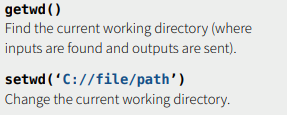

# 주요 API 활용





```R
word <- "JAVA javascript 가나다 123 %^&*"
gsub("A", "", word) 
gsub("a", "", word) 
gsub("[Aa]", "", word) 
gsub("[가-힣]", "", word) 
gsub("[^가-힣]", "", word) 
gsub("[&^%*]", "", word) 
gsub("[[:punct:]]", "", word) 
gsub("[[:alnum:]]", "", word) 
gsub("[1234567890]", "", word) 
gsub("[[:digit:]]", "", word) 
gsub("[^[:alnum:]]", "", word) 
gsub("[[:space:]]", "", word) 
gsub("[[:space:][:punct:]]", "", word)
```


# 날짜와 시간 관련 함수들

- 현재날짜: Sys.Date()
- 현재날짜 및 시간: Sys.time()
- 미국식 날짜 및 시간: date()
- 년월일 시분초 타입의 문자열을 시간으로 변경 : 
as.Date("년-월-일 시:분:초") 또는 as.Date("년/월/일 시:분:초")
- 특정 포맷을 이용한 날짜 및 시간: as.Date("날짜 및 시간 문자열", format="포맷")
- 날짜 데이터끼리 연산 가능 : 
날짜끼리 뺄셈가능, 날짜와 정수의 덧셈뺄셈 가능 - 하루를 1로 간주, 소숫점 생략
날짜 데이터끼리 연산할 때 소숫점을 표현하고자 하는 경우는 as.Date 대신에 as.POSIXct 함수를 이용

```R
today <- Sys.Date()
format(today, "%d %B %Y")
weekdays(today); months(today); quarters(today)
unclass(today) # 1970-01-01을 기준으로 얼마나 날짜가 지났는지의 값을 가지고 있다.
Sys.Date();Sys.time()
Sys.timezone()
as.Date('1/15/2018',format='%m/%d/%Y')
as.Date('4월 26, 2018',format='%B %d, %Y')
as.Date('22118',format='%d%b%y') 

x1 <- "2019-01-10"
# 문자열을 날자형으로
as.Date(x1, "%Y-%m-%d") 
# 문자열을 날짜+시간형으로
strptime(x1, "%Y-%m-%d") 
x2 <- "20180601"
as.Date(x2, "%Y%m%d")
strptime(x2, "%Y%m%d")

as.Date("2018/01/01 08:00:00") - as.Date("2018/01/01 05:00:00")
as.POSIXct("2018/01/01 08:00:00") - as.POSIXct("2018/01/01 05:00:00")
as.POSIXlt("2018/01/01 08:00:00") - as.POSIXlt("2018/01/01 05:00:00")

t<-Sys.time()
ct<-as.POSIXct(t); 
lt<-as.POSIXlt(t)
unclass(ct); 
unclass(lt); lt$mon; lt$hour; lt$year+1900

as.POSIXct(1449894437,origin="1970-01-01")
as.POSIXlt(1449894437,origin="1970-01-01")
```


# 문자열 처리 함수들

```R
nchar()
sort()
tolower()
toupper()
substr()
substring()
grep()
gsub()
strsplit()
```


# apply 계열 함수들

> R에는 벡터, 행렬 또는 데이터 프레임에 임의의 함수를 적용한 결과를 얻기 위한 apply 계열 함수가 있다. 이 함수들은 데이터 전체에 함수를 한 번에 적용하는 벡터 연산을 수행하므로 속도도 빠르고 구현도 간단하다. 

| 함수      | 설명                                                         | 다른 함수와 비교했을 대의 특징                     |
| --------- | ------------------------------------------------------------ | -------------------------------------------------- |
| apply( )  | 배열 또는 행렬에 주어진 함수를 적용한 뒤 그 결과를 벡터, 배열 또는 리스트로 반환 | 배열 또는 행렬에 적용                              |
| lapply( ) | 벡터, 리스트 또는 표현식에 함수를 적용하여 그 결과를 리스트로 반환 | 결과가 리스트                                      |
| sapply( ) | lapply 와 유사하나 결과를 가능한 심플한 데이터셋으로 반환    | 결과가 심플데이터셋                                |
| tapply( ) | 벡터에 있는 데이터를 특정 기준에 따라 그룹으로 묶은 뒤 각 그룹마다 주어진 함수를 적용하고 그 결과를 반환 | 데이터를 그룹으로 묶은 뒤 함수를 적용              |
| mapply( ) | sapply 의 확장된 버전으로, 여러 개의 벡터 또는 리스트를 인자로 받아 함수에 각 데이터의 첫째 요소들을 적용한 결과, 둘째 요소들을 적용한 결과, 셋째 요소들을 적용한 결과 등을 반환 | 여러 데이터셋의 데이터를 함수의 인자로 적용한 결과 |

### apply()
> apply( )는 행렬의 행 또는 열 방향으로 특정 함수를 적용하는 데 사용한다.
>
> apply : 배열 또는 행렬에 함수 FUN을 MARGIN 방향으로 적용하여 결과를 벡터, 배열 또는 리스트로 반환한다.

```R
apply(
 X, # 배열 또는 행렬
 MARGIN, # 함수를 적용하는 방향. 1은 행 방향, 2는 열 방향
 FUN # 적용할 함수
)
```

* 반환 값은 FUN이 길이 1인 벡터들을 반환한 경우 벡터, 1보다 큰 벡터들을 반환한 경우 행렬, 서로 다른 길이의 벡터를 반환한 경우 리스트다. 
* apply( )가 적용된 결과가 벡터, 배열, 리스트 중 어떤 형태로 반환될 것인지는 데이터 X의 데이터 타입과 함수
  FUN의 반환 값에 따라 대부분 자연스럽게 예상할 수 있다. 
* 다음은 합을 구하는 함수 sum( )을 apply( )에 적용하는 예이다. 

```R
d <- matrix(1:9, ncol=3)
d
apply(d, 1, sum)
# [1] 12 15 18
apply(d, 2, sum)
# [1] 6 15 24
```

