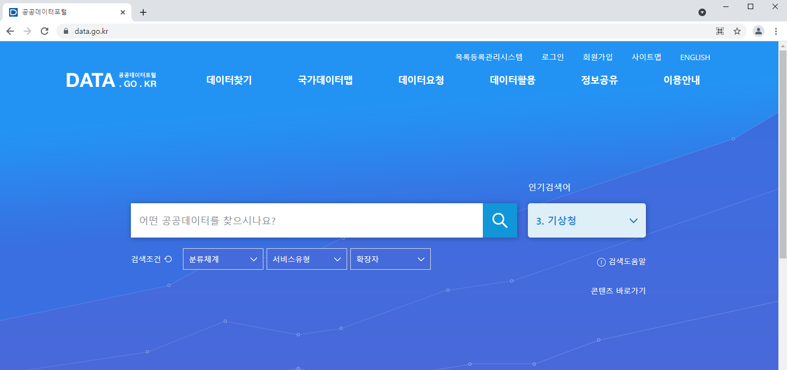

# 정적 데이터 수집

## R 패키지

> R 패키지라는 것은 R를 가지고 할 수 있는 통계, 분석 그리고 시각화와 관련하여 기능을 정의한 함수들의 묶음이라 할 수 있다.
>
> R 패키지는 R을 설치할 때 함께 설치되는 기본 패키지가 있고 만약 찾는 기능이 없다면 원하는 기능을 처리해주는 패키지를 찾아서 추가로 설치 한 후 사용하면 된다.
>
> R 패키지는 CRAN(https://cran.r-project.org/) 사이트에서 모두 검색 가능하고 다운로드 받을 수 있다.
>
> R은 무료라는 장점 외에 일정 규칙에 맞춰 누구나 제작하고 배포할 수 있는 Package를 통해 기능 확장을 유연하게 할 수 있는 큰 장점을 갖고 있다.

- 새로운 R 패키지의 설치
  **install.packages("패키지명")**
- 이미 설치된 R 패키지 확인
  installed.packages()
- 설치된 패키지 삭제
  remove.packages("패키지명")
- 설치된 패키지의 버전 확인
  packageVersion("패키지명")
- 설치된 패키지 업데이트
  update.packages("패키지명")
- 설치된 패키지 **로드**
**library(패키지명)**
**require(패키지명)**
- 로드된 패키지 언로드
(로드상태 해제)
detach("package:패키지명")
- 로드된 패키지 점검
  search()


## 데이터 수집

### 웹 스크래핑(web scraping)

> 웹 사이트 상에서 원하는 부분에 위치한 정보를 컴퓨터로 하여금 자동으로 추출하여 수집하는 기술

### 웹 크롤링(web crawling)

> 자동화 봇(bot)인 웹 크롤러가 정해진 규칙에 따라 복수 개의 웹 페이지를 브라우징 하는 행위


## 스크래핑하려는 페이지에서 원하는 태그 찾기 - *CSS Selector*


## 스크래핑하려는 페이지에서 원하는 태그 찾기 - *XPath*

> XPath(XML Path Language)는 W3C의 표준으로 확장 생성 언어 문서의 구조를 통해 경로 위에 지정한 구문을 사용하여 항목을 배치하고 처리하는 방법을 기술하는 언어이다. 


## 정적 웹 페이지에 스크래핑에 사용되는 주요 API

- xml2 패키지
  - **read_html(url)** : HTML 웹 페이지를 요청해서 받아오기
- rvest 패키지
  - **html_nodes(x, css, xpath)**, html_node(x, css, xpath) : 원하는 노드(태그) 추출하기
  - **html_text(x, trim=FALSE)** : **노드에서 컨텐트 추출하기**
  - html_attrs(x) : 노드에서 속성들 추출하기
  - **html_attr(x, name, default = "")** : **노드에서 주어진 명칭의 속성값 추출하기**
- XML 패키지
* htmlParse 또는 xmlParse (file, encoding="…") : xpathSApply() 사용 가능한 객체로 변환
* xpathSApply(doc, path, **fun**) : 원하는 노드(태그) 추출하고 전달된 함수 수행하기
  * fun : xmlValue, xmlGetAttr, xmlAttrs
- httr 패키지
  - **GET(url)** : HTML 웹 페이지를 요청해서 받아오기
  				요청헤더에 계정 또는 패스워드 등의 정보 전달 가능
  				응답 내용이 바이너리인 경우에도 사용 가능

## 스크래핑할 태그 정보 얻기(Chrome의 개발자도구 활용)

```R
library(rvest)

url <- "http://unico2013.dothome.co.kr/crawling/tagstyle.html"
text <- read_html(url)
text

nodes <- html_nodes(text, "div") # 태그 선택자
nodes
title <- html_text(nodes)
title

node1 <- html_nodes(text, "div:nth-of-type(1)")
node1
html_text(node1)
html_attr(node1, "style")

node2 <- html_nodes(text, "div:nth-of-type(2)")
node2
html_text(node2)
html_attr(node2, "style")

node3 <- html_nodes(text, "div:nth-of-type(3)")
node3
html_text(node3)
html_attr(node3, "style")
```


### DOM 객체의 구조


### 웹문서 읽기

```R
# 웹문서 읽기
url <- "https://www.data.go.kr/tcs/dss/selectDataSetList.do"
html <- read_html(url)
html

# 목록 아이템 추출
title <- html_text(html_nodes(html, "#apiDataList .title"))#, trim=T)
title

# 목록 아이템 설명 추출
desc <- html_text(html_nodes(html, "#apiDataList .ellipsis"))
desc

# 데이터 정제: 제어문자를 공백으로 대체
title <- gsub("[[:cntrl:]]", "", title)
title

desc <- gsub("[[:cntrl:](</br>)∙]", "", desc)
desc

# 데이터 출력
api <- data.frame(title, desc)
api
```


### 자손 선택자 찾기

> 태그에서 마우스 우클릭 후 다음과 같이 'Copy selector'를 선택하고, ctrl+v 를 통해 붙여넣기를 하여 사용한다.


### 단일 페이지

```R
# 단일 페이지(rvest 패키지 사용)
library(rvest)
# 영화 제목과 평점 읽기
text<- NULL; title<-NULL; point<-NULL; review<-NULL; page<-NULL
url<- "http://movie.naver.com/movie/point/af/list.nhn"
text <- read_html(url)
text
#save(text, file="imsi.rda")
# 영화제목
nodes <- html_nodes(text, ".movie")
title <- html_text(nodes)
title
# 영화평점
nodes <- html_nodes(text, ".title em")
point <- html_text(nodes)
point
page <- data.frame(title, point)
print(page)

# 영화 제목, 평점, 리뷰글 읽기
text<- NULL; title<-NULL; point<-NULL; review<-NULL; page<-NULL
url<- "http://movie.naver.com/movie/point/af/list.nhn?page=2"
text <- read_html(url)
text
#save(text, file="imsi.rda")
# 영화제목
nodes <- html_nodes(text, ".movie")
title <- html_text(nodes)
title
# 영화평점
nodes <- html_nodes(text, ".title em")
point <- html_text(nodes)
point
# 영화리뷰
review <- html_nodes(text, xpath="//*[@id='old_content']/table/tbody/tr/td[2]/text()")
review <- html_text(review, trim=TRUE)
review <- review[nchar(review) > 0]
review
page <- data.frame(title, point, review)
print(page)
```


### XML 패키지 사용

```R
# 한겨레 페이지(XML 패키지 사용)
library(XML)
library(rvest)
imsi <- read_html("http://www.hani.co.kr/")
t <- htmlParse(imsi)
content<- xpathSApply(t,'//*[@id="main-top01-scroll-in"]/div/div/h4/a', xmlValue); 
content
```


## 네이버의 뉴스와 블로그 글 읽어오기

> https://developers.naver.com/docs/search/blog/ 에서 내용 검토


## 트위터 글 읽어오기

> 트위터에서는 rtweet 이라는 패키지를 제공하여 트위터에 올려진 글을 수집하는데 도움을 준다.

```R
install.packages("rtweet")
library(rtweet) 
appname <- "edu_data_collection"
api_key <- "..."; api_secret <- "..."; access_token <- "..."; access_token_secret <- "..." 

twitter_token <- create_token(
    app = appname,
    consumer_key = api_key,
    consumer_secret = api_secret,
    access_token = access_token,
    access_secret = access_token_secret)

key <- "취업“; key <- enc2utf8(key)
result <- search_tweets(key, n=100, token = twitter_token)
str(result)
result$retweet_text
content <- result$retweet_text
content <- gsub("[[:lower:][:upper:][:digit:][:punct:][:cntrl:]]", "", content) 
content
```

|                                                              | 설명                                    |
| ------------------------------------------------------------ | --------------------------------------- |
| create_token(appname, api_key,api_secret, access_token,access_token_secret) | 현재의 R세션에 인증토큰를 내려받는 기능 |
| result<- search_tweets(key, n=100, token)                    | key 에 해당되는 트위터 글 읽어 오기     |


## 공공DB 읽어오기

> [공공데이터포털](https://www.data.go.kr/)




