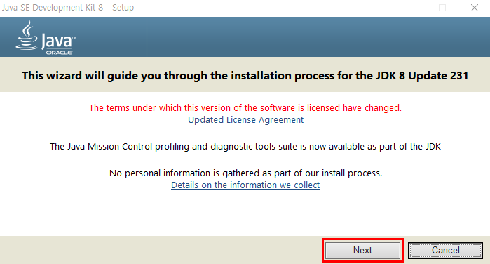
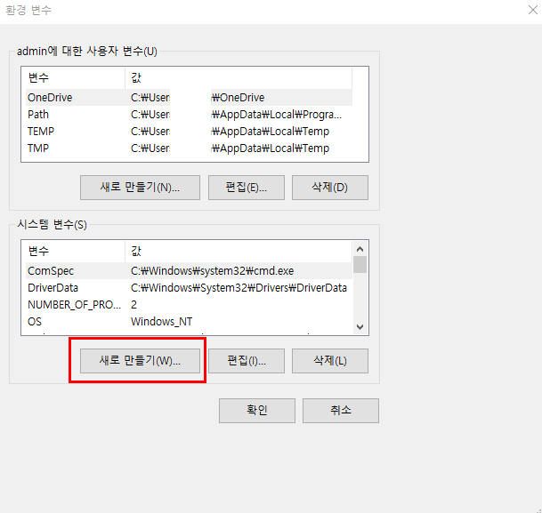

# JDK 설치

> JDK란 자바개발 환경이다. JDK 를 설치하는 이유는 R 에서 사용되는 패키지들 중에서 알맹이가 자바언어로 구현된 것들이 있기 때문이고, 동적 웹페이지 크롤링에 사용하는 셀레늄(Selenium)이라는 서버도 자바로 만들어진 프로그램이라서 자바 프로그램의 실행환경(개발환경)을 준비해야 한다.

* *jdk-8u231-windows-x64.exe* 를 다운로드하고 더블클릭하여 다음과 같이 설치를 시작한다.

* 패스의 마지막에 있는 jdk1.8.0_231을 선택하고 마우스 오른쪽 버튼을 클릭하면 이와 같은 메뉴가 출력된다. 두 번째 메뉴인 **주소를 텍스트로 복사**라는 메뉴를선택한다.

* 내 PC에서 마우스 오른쪽 버튼을 클릭하여 속성을 선택한다.

* **고급 시스템 설정**을 찾은 후 클릭하여 다음과 같이 실행한다.

* *변수 이름*인 **JAVA_HOME** 은 직접 입력하고 *변수 값*은 붙여넣기 기능으로 붙여 넣는다. 

* **Path** 환경 변수를 찾는다. 선택한 후에 편집 버튼을 클릭한다.

* *새로 만들기*를 클릭한 후, 오타를 주의하여 다음과 같이 그대로 직접 입력한다. (오타 주의!!!!)

* %JAVA_HOME%\bin항목이 선택된 상태에서 *위로이동*이라는 버튼을 여러 번 클릭해서 **제일 위**로 올린다.

* *확인* 버튼을 클릭하여 창을 나온다.

* cmd 명령 프롬프트 창을 열고 다음과 같은 명령어를 입력하여 출력 상태를 확인한다. 다음과 같이 출력되면 환경설정을 성공적으로 마친 것이다.
  * echo %JAVA_HOME%
  * path
  * java - version

