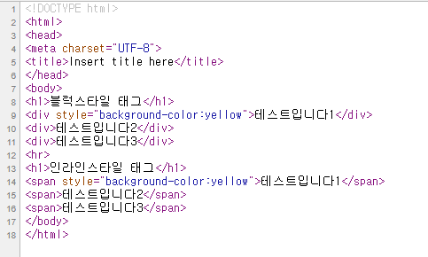
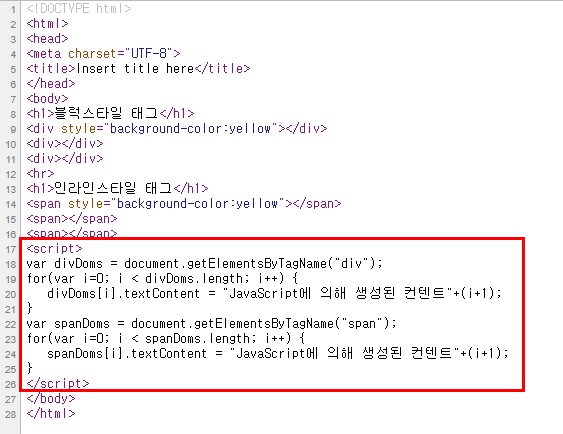
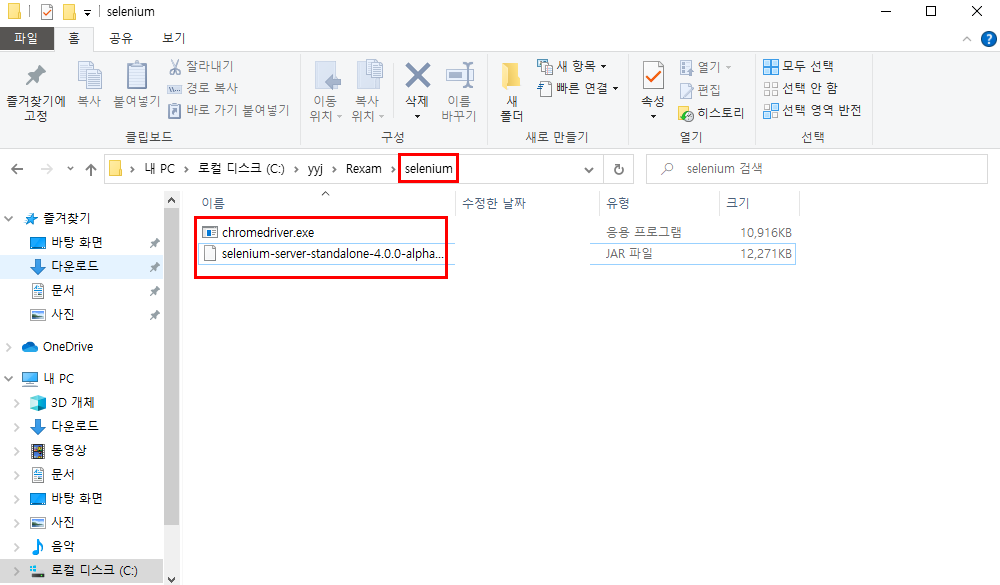
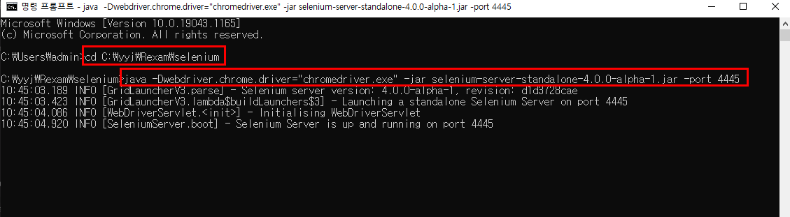
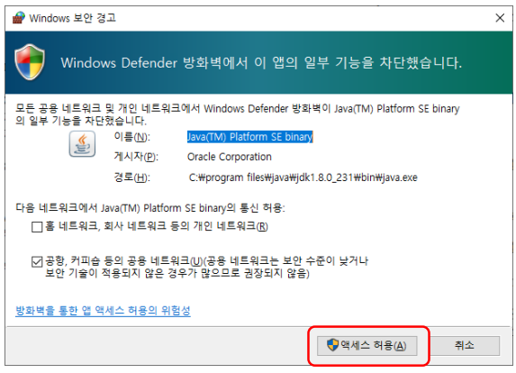
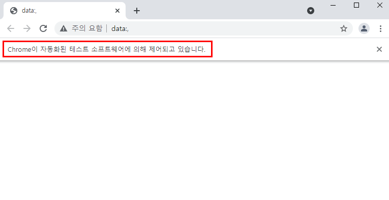
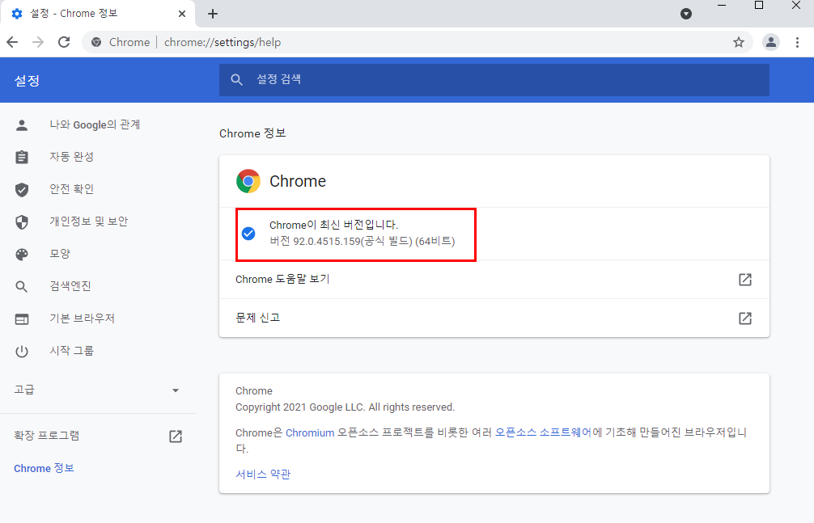
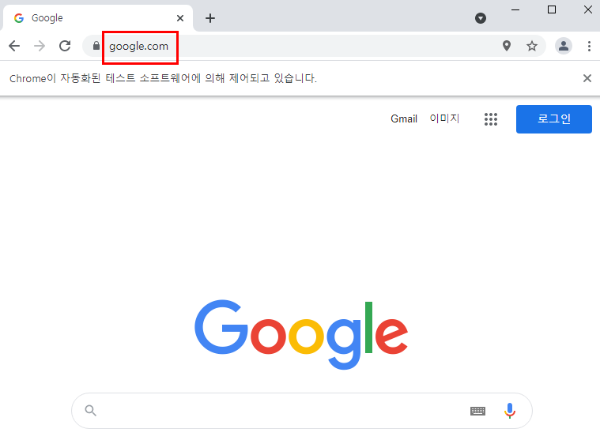
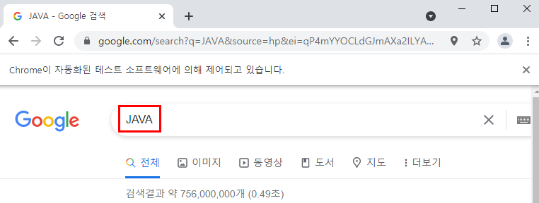

# 정적 / 동적 웹 페이지 구분하기

> 브라우저에 렌더링 된 내용이 서버에 전송된 HTML 문서(원천 소스)에 HTML 문서와  함께 작성되어 있는 경우는 정적 웹 페이지라고 한다.
>
> 브라우저에 렌더링 된 내용이 서버에 전송된 JavaScript 코드의 실행 결과에 의해서 생성되는 경우는 동적 웹 페이지라고 한다.
>
> 즉, 웹 페이지에서 스크래핑하려는 내용이 정적 컨텐츠이면 정적 수집을 해야하고, 동적 컨텐츠이면 동적 수집을 해야한다.

|                        정적 웹 페이지                        |                        동적 웹 페이지                        |
| :----------------------------------------------------------: | :----------------------------------------------------------: |
| [정적 웹 페이지](http://unico2013.dothome.co.kr/crawling/tagstyle.html) | [동적 웹 페이지](http://unico2013.dothome.co.kr/crawling/tagstyle_js.html) |
|  |  |

> *도구 더보기>개발자 도구(Ctrl+Shift_I)*를 통해 웹 페이지의 종류를 확인하면 HTML 또는  JavaScript가 이미 처리된 결과로 보여지는 것이므로 정적/동적 웹 페이지 구분이 불가능하다. 그러므로 *페이지 소스 보기(Ctrl+U)*를 통해 확인해야 한다.

동적 웹 페이지의 예) [네이버 호텔](https://hotel.naver.com/hotels/item?hotelId=hotel:Shilla_Stay_Jeju&destination_kor=%EC%8B%A0%EB%9D%BC%EC%8A%A4%ED%85%8C%EC%9D%B4%20%EC%A0%9C%EC%A3%BC&rooms=2)


# 동적 스크래핑(크롤링)

다음의 경우에는 웹 페이지의 내용이 동적으로 생성되는 경우로 지금까지의 방법으로 스크래핑 할 수 없다.
- 사용자의 선택과 같은 이벤트에 의해서 자바스크립트의 수행 결과로 컨텐츠를 생성한다. 
- 페이지의 랜더링을 끝낸 후에 Ajax 기술을 이용하여 서버로 부터 컨텐트의 일부를 전송받아 동적으로 구성한다.

이러한 경우에는 Selenium 을 사용하면 제어되는 브라우저에 페이지를 랜더링 해놓고 랜더링된 결과에서 컨텐츠를 읽어올 수 있다.  뿐만 아니라 컨텐츠내에서 클릭이벤트를 발생할 수도 있으며 로그인과 같은 데이터를 입력하는 것도 가능하다.


## Selenium 서버 기동하기

* *chromedriver.exe* 와 *selenium-server-standalone-4.0.0-alpha-1.jar* 을 다운로드 하여 C:\xxx\Rexam\selenium 폴더를 생성하여 저장한다.




* cmd 창을 기동시키고 다음과 같은 명령어를 수행시켜 Selenium 서버를 기동시킨다.

  * cd C:\yyj\Rexam\selenium
  * java -Dwebdriver.chrome.driver="chromedriver.exe" -jar selenium-server-standalone-4.0.0-alpha-1.jar -port 4445

  > 이때, 오타 방지를 위해 위의 코드를 복사하여 붙여넣기 할 경우, 복사한 후 cmd 창에서 오른쪽 방향키를 통해 붙여넣기를 실행한다.




* 명령프롬프트(cmd)창에서 셀레니엄을 실행시키면 다음과 같은 보안 경고 창이 출력된다. 이때 엑세스 허용을 선택한다.



### chrome 페이지 열기

> 다음과 같은 R 코드를 작성하여 chrome 페이지를 조작해 본다.

```R
install.packages("RSelenium")
library(RSelenium)
remDr <- remoteDriver(remoteServerAddr = "localhost" , 
                      port = 4445, browserName = "chrome")
```

```R
remDr$open()
```



> 위와 같은 화면이 출력되지 않으면 '도움말>chrome 정보'에서 최신 버전이 맞는지 확인한다.



```R
remDr$navigate("http://www.google.com/")
```



```R
webElem <- remDr$findElement(using = "css selector", "[name = 'q']")
webElem$sendKeysToElement(list("JAVA", key = "enter"))
```




> **코드 분석**

```R
# Selenium 서버에 접속
remDr <- remoteDriver(remoteServerAddr = "localhost" , port = 4445, browserName = "chrome")
# Selenium 서버에 의해 제어되는 브라우저 기동
remDr$open()

# 지정된 URL 페이지를 요청하고 렌더링(자바스크립트 코드 수행)
remDr$navigate("http://www.google.com/")

# 태그에 대한 DOM 객체 찾기
webElem <- remDr$findElement(using = "css selector", "[name = 'q']")
# <input> 태그에 택스트를 입력하고 엔터키 입력을 자동화 하기
webElem$sendKeysToElement(list("PYTHON", key = "enter"))

remDr$navigate("http://www.naver.com/")
str(remDr)

webElem <- remDr$findElement(using = "css selector", "#query")
webElem$sendKeysToElement(list("PYTHON", key = "enter"))
str(webElem)
```


## API 소개

> [RSelenium](https://cran.r-project.org/web/packages/RSelenium/RSelenium.pdf)

| API                                                          | 설명                                                         |
| ------------------------------------------------------------ | ------------------------------------------------------------ |
| remDr <- remoteDriver(remoteServerAddr="localhost", port=4445,browserName="chrome") | R 코드로 Selenium 서버에 접속하고 remoteDriver 객체 리턴     |
| remDr$open()                                                 | 브라우저 오픈(크롬)                                          |
| remDr$navigate(url)                                          | url 에 해당하는 웹페이지 렌더링                              |
| one <- remDr$findElement(using='css selector',‘css선택자')   | 태그 한 개 찾기(webElement 객체)/태그가 없으면 NoSuchElement 오류 발생➡ *findElement는 태그를 한 개만 찾는 함수로서, webElement 객체 리턴* |
| one$getElementTagName()                                      | 찾아진 태그의 태그 명 추출(webElement 객체가 제공)           |
| one$getElementText()                                         | 찾아진 태그의 태그 내용 추출(webElement 객체가 제공)         |
| one$getElementAttribute(”속성명”)                            | 찾아진 태그의 속성 명에 대한 값 추출(webElement 객체가 제공) |
| one$clickElement()                                           | 찾아진 태그에서 클릭이벤트 발생시키기(webElement 객체가 제공) |
| doms <- remDr$findElements(using ="css selector", "컨텐트를추출하려는태그의 CSS선택자") | 태그들을 찾기/존재하지 않으면 비어있는 리스트 리턴➡ *태그를 0개 이상 찾는 함수로서, webElement 객체들의 리스트 리턴* |
| sapply(doms,function(x){x$getElementText()})                 | 찾아진 태그들의 컨텐트들의 추출하여 리스트로 리턴            |
| sapply(doms, function(x){x$clickElement()})                  | 찾아진 태그들에 각각 클릭 이벤트 발생                        |
| remDr$executeScript("arguments[0].click();",nextPageLink)    | 가끔 clickElement() 가 일을 안 할 때, 사용하면 좋음          |
| webElem <- remDr$findElement("css selector", "body")<br/>remDr$executeScript("scrollTo(0, document.body.scrollHeight)", args = list(webElem)) | 페이지를 아래로 내리는(스크롤) 효과                          |


