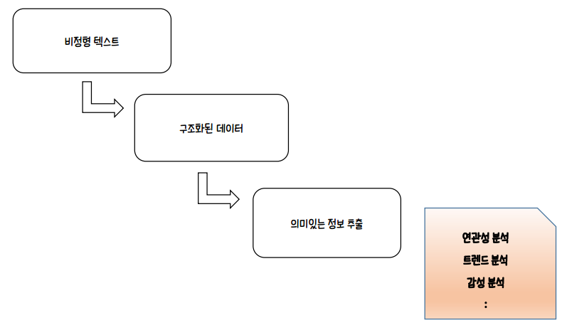
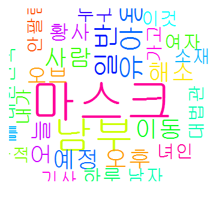

# 텍스트 마이닝1

[TOC]

## 1. 개요

* 텍스트 마이닝은 단어의 출현 빈도, 단어 간 관계성 등을 파악하여 유의미한 정보를 추출하는 것이다. 이는 ‘자연어 처리 기술’을 기반으로 하고 있다.
* 텍스트마이닝(Text mining)은 데이터마이닝의 일부라고 볼 수 있다. 데이터마이닝이 수치데이터와 범주형데이터를 집중적으로 보는 반면에 텍스트마이닝은 텍스트데이터를 중점적으로 다룬다.
* 텍스트데이터를 다루는 것은 수치데이터를 다루는 것과 프로세싱이나 처리방법에서 많이 다르다. 텍스트마이닝을 잘 하기 위해서는 형태소분석기나 구문분석기와 같은 자연어처리 도구를 잘 사용할 수 있어야 하며 그 외에 다루는 언어에 대해서도 잘 알고 있어야 한다.
* 텍스트 마이닝은 많은 양의 비정형 데이터에 접근하고 활용하는데 사용되고 있고, 가치나 인사이트를 찾을 수 있을 뿐 아니라 비정형 데이터를 관리함으로써 실질적인 ROI(Return On Investment)를 이끌어 낼 수도 있다.
* 소셜 미디어는 시장 및 고객 정보를 파악하는데 있어서 점차 그 중요성이 높아지고 있으며 텍스트 마이닝은 많은 양의 비정형 데이터를 분석함으로써 해당 브랜드나 제품에 대한 다양한 의견과 감성반응을 살펴볼 수 있다.
* 텍스트 마이닝을 통해 문서들을 자동으로 분류할 수 있고, 문서나 단어들간의 연관성을 분석할 수 있으며 텍스트에 담겨있는 감성(즉, 평가, 성향)을 예측할 수 있고 시간의흐름에 따른 이슈들의 변환과정을 추적할 수 있다.




## 2. 자연어 처리

> NLP -> KoNLP

>  ‘자연어’가 무엇일까? 우리가 일상생활에서 사용하는 말, 언어이다. 
>
>  자연어 처리 기술을 바탕으로 사람들이 작성한 텍스트를 컴퓨터가 분석하여 중요한 단어나 문장들을 추출할 수 있다. 이를 잘 활용하면 매력적인 뉴스 기사의 헤드라인 작성, 제품에 대한 고객 반응 분석, 우리 브랜드에 대한 고객 생각 등을 알아낼 수 있다.
>
>  한국어는 어순이나 조사 등을 영어처럼 명확하게 끊어지지 않는 부분이 있다. 
>  ‘한국어’라는 단어를 분석해 보면 ‘한국어는’, ‘한국어의’, ‘한국어를’ 등의 표현들은 모두 ‘한국어’라는 핵심 단어를 가지고 있다. 하지만 기계적으로 이 표현들을 각각 다르게 인식할 수도 있으므로 한국어로 된 텍스트를 쪼개는 과정이 영어보다 더 많이 필요하다. 현재 나와 있는 기술만으로도 텍스트 마이닝을 통하여 충분히 유의미한 인사이트를 도출해낼 수 있다.
>
>  자연어 처리는 인간이 사용하는 언어를 컴퓨터가 사용할 수 있게 처리하는 것을 말한다. 애플의 시리(Siri)와 같은 음성인식이나 광학문자판독을 통해서 책에서 글자를 읽어 들이거나 웹 페이지에서 사람이 작성한 글을 로봇을 이용해서 크롤링 하고 해석한 후 어떤 것이 핵심어이고 어떤 것이 주제어인가 등을 알아내기도 하며 글쓴이의 감정이나 상태 등을 알아내기도 한다.

>  자연어 처리는 형태소분석기, 구문분석기와 같은 사람이 작성한 글이나 대화를 컴퓨터를 통해 해석할 수 있게 하는 소프트웨어를 개발하거나 연구하고 그런 것들을 이용해서 실제로 작업하는 것을 말한다.

- 형태소분석기
형태소를 구분하고 무엇인지 알려주는 것이다.
- 구문분석기
주어, 목적어, 서술어와 같은 형태로 품사보다는 단위가 더 높은 논리적 레벨까지를 처리해주는 것이다.
- 잘 알려진 형태소분석기 종류
  - Hannanum: KAIST의 한나눔 형태소 분석기와 NLP_HUB 구문분석기
  - KKMA: 서울대의 꼬꼬마 형태소/구문 분석기 v2..1
  - KOMORAN: Junsoo Shin님의 코모란 v3.3.3
  - Twitter: OpenKoreanText의 오픈 소스 한국어 처리기 v2..2..0 (구 Twitter 한국어 분석기)1-1
  - Eunjeon: 은전한닢 프로젝트의 SEunjeon(S은전)
  - Arirang: 이수명님의 Arirang Morpheme Analyzer 1-2.
  - RHINO: 최석재님의 RHINO v2..5.4

> 형태소 분석으로 어절들의 품사를 파악한 후 명사,동사, 형용사 등 의미를 지닌 품사의 단어를 추출해 각 단어가 얼마나 많이 등장했는지 확인한다.

```R
install.packages("KoNLP")
library(KoNLP)
extractNoun("대한민국의 영토는 한반도와 그 부속도서로 한다")
SimplePos22("대한민국의 영토는 한반도와 그 부속도서로 한다")
SimplePos09("대한민국의 영토는 한반도와 그 부속도서로 한다")
sapply("대한민국의 영토는 한반도와 그 부속도서로 한다", extractNoun, USE.NAMES=F)
```

| S: 기호<br/>F: 외국어<br/>N: 체언(명사, 대명사, 수사)<br/>P: 용언(동사, 형용사)<br/>M: 수식언(관형사, 부사)<br/>I: 독립언(감탄사)<br/>J: 관계언(조사)<br/>E: 어미<br/>X: 접사 |
| :----------------------------------------------------------: |


### 2-1. 자연어 처리 예제

```R
setup_twitter_oauth(api_key,api_secret, access_token,access_token_secret)
key <- "미세먼지"
key <- enc2.utf8(key)
result <- searchTwitter(key, n=100)
DF <- twListToDF(result)
content <- DF$text
content <- gsub("[[:lower:][:upper:][:digit:][:punct:][:cntrl:]]", "", content)
content <- gsub("미세먼지", "", content)
content
word <- extractNoun(content)
cdata <- unlist(word)
cdata
cdata <- Filter(function(x) {nchar(x) < 6 & nchar(x) >= 2.} ,cdata)
wordcount <- table(cdata) 
wordcount <- head(sort(wordcount, decreasing=T),30)
library(wordcloud)
wordcloud(names(wordcount),freq=wordcount,scale=c(5,1),rot.per=0.35,min.freq=2,
          random.order=F,random.color=T,colors=rainbow(2.0))
```




### 2-2. 참고

* [형태소 분석 및 품사 태깅](https://konlpy-ko.readthedocs.io/ko/v0.4.3/morph/)
* [KoNLP를 이용한 한국어 형태소 분석](https://brunch.co.kr/@mapthecity/9)


