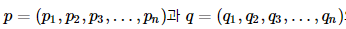

# 텍스트 마이닝2

[TOC]

## 1. 텍스트 전처리와 tm 패키지

### 1-1. 정규 표현식 활용

```R
word <- "JAVA javascript 가나다 12.3 %^&*"
gsub("A", "", word) 
gsub("a", "", word) 
gsub("[Aa]", "", word) 
gsub("[가-힣]", "", word) 
gsub("[^가-힣]", "", word) 
gsub("[&^%*]", "", word) 
gsub("[[:punct:]]", "", word) 
gsub("[[:alnum:]]", "", word) 
gsub("[12.34567890]", "", word) 
gsub("[[:digit:]]", "", word) 
gsub("[^[:alnum:]]", "", word) 
gsub("[[:space:]]", "", word) 
gsub("[[:space:][:punct:]]", "", word)
```


### 1-2. stringr 패키지 활용

```R
install.packages("stringr")
library(stringr)
```


### 1-3. tm 패키지를 이용한 텍스트 전처리

: tm_map() 함수 사용

> 텍스트는 기본적으로 비정형 데이터로서 분석에 불필요한 때로는 분석에 방해가 되는 요소들이 포함되어 있어서 데이터 정제(data cleaning) 작업은 필수이다. tm 패키지에는 텍스트 데이터의 정제작업을 지원하는 다양한 변환함수를 제공한다. getTransformations()이라는 함수를 수행시키면 사용 가능한 변환함수의 리스트를 확인할 수 있으며 이 함수들은 **tm_map()** 함수에 인수로 전달하여 변환작업을 처리할 수 있다. 문서에서 문장 부호를 제거하거나, 문자를 모두 소문자로 바꾸거나, 단어의 어간을 추출해주는 스테밍(stemming)을 적용할 수 있다.

tm_map(
	x, # 코퍼스
	FUN # 변환에 사용할 함수
)


```R
corp2. <- tm_map(corp1,stripWhitespace) # 여러 개의 공백을 하나의 공백으로 변환한다.
corp2. <- tm_map(corp2.,removeNumbers) # 숫자를 제거한다.
corp2. <- tm_map(myCorpus, content_transformer(tolower)) # 영문 대문자를 소문자로 변환한다.
corp2. <- tm_map(corp2.,removePunctuation) # 마침표,콤마,세미콜론,콜론 등 문자 제거한다.
corp2. <- tm_map(corp2.,PlainTextDocument)
stopword2. <- c(stopwords('en'),"and","but") # 기본 불용어 외에 불용어로 쓸 단어 추가
corp2. <- tm_map(corp2.,removeWords,stopword2.) # 불용어 제거하기 (전치사 , 관사 등) 
```


#### 코퍼스?

> 코퍼스(corpus; 말뭉치) : 언어학에서 구조를 이루고 있는 텍스트 집합으로 통계 분석 및 가설 검증, 언어 규칙의 검사 등에 사용된다. 텍스트 마이닝 패키지인 tm에서 문서를 관리하는 기본구조를 Corpus라 부르며, 이는 텍스트 문서들의 집합을 의미한다.
>
> 텍스트 마이닝을 위해 수행해야 할 첫 번째 작업은 비 구조화된 텍스트 즉,  **비정형의 텍스트를 구조화된 데이터로 변환하는 것**이다. 텍스트를 구조화하는 방법 가운데 하나로 코퍼스(단어주머니:bag-of-words)접근법이 일반적으로 많이 사용된다. 
>
> 코퍼스 접근법은 **분석 대상이 되는 개별 텍스트 즉 문서(document)를 단어의 집합(주머니)으로 단순화시킨 표현 방법으로서 단어의 순서나 문법은 무시하고 단어의 출현 빈도만을 이용하여 텍스트를 매트릭스로 표현**한다. 이때 생성되는 매트릭스를 term-document-matrix(TDM) 또는 document-term-matrix(DTM) 라고 한다.


​	분석해야 할 텍스트를 문서들의 집합인 코퍼스 형식으로 변환해야 한다. tm 패키지의 Corpus() 함수를 사용한다. 이 함수는 다양한 소스로부터 읽어 들인 텍스트를 텍스트 마이닝을 위한 Corpus 객체로 변환한다. getSources() 함수를 사용하면 사용 가능한 소스객체의 종류를 파악할 수 있다.


### 1-4. tm 패키지를 이용한 텍스트 마이닝 예제 1

```R
lunch <- c("커피 파스타 치킨 샐러드 아이스크림",
            "커피 우동 소고기김밥 귤",
            "참치김밥 커피 오뎅",
            "샐러드 피자 파스타 콜라",
            "티라무슈 햄버거 콜라",
            "파스타 샐러드 커피"
            )
cps <- VCorpus(VectorSource(lunch))
tdm <- TermDocumentMatrix(cps)
tdm
(m <- as.matrix(tdm))
```


```R
cps <- VCorpus(VectorSource(lunch))
tdm <- TermDocumentMatrix(cps, 
control=list(wordLengths = c(1, Inf)))
tdm
(m <- as.matrix(tdm))
```


```R
rowSums(m)
colSums(m)
```


```R
com <- m %*% t(m) 
# 동시출현(Co-occurrence)이란 한 문장, 문단 또는 텍스트 단위에서 같이 출현한 단어를 가리킨다.
```


#### 동시출현

> 동시출현(Co-occurrence)이란 한 문장, 문단 또는 텍스트 단위에서 같이 출현한 단어를 가리킵니다. 단어의 연결성(collocation)을 찾는 데 활용된다. 이 개념에서 출발한 동시출현 네트워크(Co-occurrence networks)는 특정 텍스트 단위에서 공동으로 출현한 단어의 집합적 상호 연결을 표현하는 방식이다. 
>
> 나타나는 단어를 모두 표시한 뒤, 둘 사이를 선으로 연결해 나가다 보면 단어의 네트워크를 만들 수 있다. qgraph 패키지의 qgraph() 함수를 사용한다.

#### 동시출현 시각화

```R
install.packages("qgraph")
library(qgraph)
qgraph(com, labels=rownames(com), diag=F, 
       layout='spring', edge.color='blue', 
       vsize=log(diag(com)*800))
```


### 1-5. tm 패키지를 이용한 텍스트 마이닝 예제 2

```R
library(tm)
A <- c('포도 바나나 딸기 맥주 비빔밥 여행 낚시 떡볶이 분홍색 듀크 귤')
B <- c('사과 와인 스테이크 배 포도 여행 등산 짜장면 냉면 삼겹살 파란색 듀크 귤 귤')
C <- c('백숙 바나나 맥주 여행 피자 콜라 햄버거 비빔밥 파란색 듀크 귤')
D <- c('귤 와인 스테이크 배 포도 햄버거 등산 갈비 냉면 삼겹살 녹색 듀크')
data <- c(A,B,C,D)
cps <- Corpus(VectorSource(data))
tdm <- TermDocumentMatrix(cps)
inspect(tdm)
m <- as.matrix(tdm)
v <- sort(rowSums(m), decreasing=T)
```


```R
m1 <- as.matrix(weightTf(tdm))
m2. <- as.matrix(weightTfIdf(tdm))
m1;m2
```


#### 단어 가중치

* 단어 가중치 : 문서에서 어떤 단어의 중요도를 평가하기 위해 사용되는 통계적인 수치
  * TF : Term Frequency(단어빈도)
  * IDF : Inverse Document Frequency(역문서빈도)
  * DF : Document Frequency(문서빈도)
  * TFIDF : TF X IDF

> 특정 문서 내에서 단어 빈도가 높을 수록, 전체 문서들엔 그 단어를 포함한 문서가 적을 수록 TFIDF 값이 높아지게 된다. 즉, 문서 내에서 해당 단어의 중요도는 커지게 된다.

#### 단어 가중치 시각화

```R
library(wordcloud)
(v <- sort(rowSums(m), decreasing=T))

wordcloud(names(v), v, min.freq = 2., random.order = FALSE, rot.per = 0.1, scale = c(4, 1), 
colors = c("pink", "blue", "green", "red"))
```


### 1-6. tm 패키지를 이용한 텍스트 마이닝 예제 3

```R
html.parsed <- htmlParse("TextofSteveJobs.html")
text <- xpathSApply(html.parsed, 
                    path="//p", xmlValue)
text
text <- text[4:30]
text
docs <- VCorpus(VectorSource(text))
docs
```


```R
toSpace <- content_transformer(function(x, pattern){return(gsub(pattern, " ", x))})
docs <- tm_map(docs, toSpace, ":")
docs <- tm_map(docs, toSpace, ";")
docs <- tm_map(docs, toSpace, "'")

docs[[17]]
docs[[19]]
docs[[17]]$content
docs[[19]]$content

docs <- tm_map(docs, removePunctuation)
text[17]
docs[[17]]$content
```


```R
docs <- tm_map(docs, content_transformer(tolower))
docs[[17]]$content
docs <- tm_map(docs, removeNumbers)
docs[[17]]$content
docs <- tm_map(docs, removeWords, stopwords("english"))
docs[[17]]$content
docs <- tm_map(docs,
stripWhitespace)
docs[[17]]$content
docs <- tm_map(docs,
stemDocument)
docs[[17]]$content
```


```R
tdm <- TermDocumentMatrix(docs)
tdm

inspect(tdm[50:60, 1:5])

termFreq <- rowSums(as.matrix(tdm))
head(termFreq)
termFreq[head(order(termFreq, decreasing=T))]
```


#### 단어 출현횟수 시각화

> 단어의 출현횟수를 바 그래프로 그린다.

```R
barplot(termFreq[termFreq >= 7], 
        horiz=T, las=1, cex.names=0.8, 
        col=rainbow(16), xlab="word Frequency", ylab="Words")
```


## 2. 문서 간 유사도 분석

> 문서들간에 동일한 단어 또는 비슷한 단어가 얼마나 공통으로 많이 사용 되었나에 따라서 문서간 유사도 분석을 할 수 있다.
> (1) 문서의 각 단어들을 수치화 하여 표현한다. – DTM
> (2) 문서간 단어들의 차이를 계산한다 – 코사인 유사도, 유클리드 거리

### 2-1. 코사인 유사도

> 코사인 유사도(Cosine Similarity)
> 두 벡터 간의 코사인 각도를 이용하여 유사도를 측정한다. 
> 데이터의 코사인 유사도를 계산하여, 만일 코사인 값이 크면, 코사인 함수의 성질에 의해 사잇각은 작아지게 되고, 그에 따라 유사도는 높아지게 된다. 이런 방식으로 데이터 사이의 패턴을 분석할 수 있게 된다.


### 2-2. 유클리드 거리

> 유클리드 거리(Euclidean distance)
> 두 점 사이의 유클리드 거리 공식은 피타고라스의 정리를 통해 두 점 사이의 거리를 구하는 것과 동일하다.
>
> 코사인 거리(Cosine Distance)는 = 1 - 코사인 유사도(Cosine Similarity) 로 계산




### 2-3. 문서 간 유사도 분석 예제

```R
install.packages("proxy")
library(proxy)
dd <- NULL
d1 <- c("aaa bbb ccc")
d2 <- c("aaa bbb ddd")
d3 <- c("aaa bbb ccc")
d4 <- c("xxx yyy zzz")
dd <- c(d1, d2, d3, d4)
cps <- Corpus(VectorSource(dd))
dtm <- DocumentTermMatrix(cps)
(m <- as.matrix(dtm))
com <- m %*% t(m)
com
dist(com, method = "cosine") # 코사인 거리(Cosine Distance) : '1 - 코사인 유사도(Cosine Similarity)'
dist(com, method = "Euclidean") # 유클리드 거리
```


## 3. 텍스트 마이닝의 결과 시각화

> 텍스트 마이닝의 결과를 시각화 할 때 가장 많이 사용되는 것은 워드 클라우드이다. 
> 워드 클라우드는 단어의 개수를 세어 객수의 크기 값에 따라서 단어의 크기를 차등적으로 출력하여 키워드가 되는 단어를 좀 더 강조하여 출력하는 시각화이다.

```R
install.packages(“wordcloud”)
library(wordcloud)
wordcloud(words,freq,scale=c(4,.5),min.freq=3,max.words=Inf, 
          random.order=TRUE, random.color=FALSE, rot.per=.1, 
          colors="black",ordered.colors=FALSE,use.r.layout=FALSE, 
          fixed.asp=TRUE, ...)
```

* scale : 빈도가 가장 큰 단어와 가장 빈도가 작은 단어 폰트 사이 크기, scale=c(5,0.2.)
* rot.per=0.1 : 90도 회전해서 보여줄 단어 비율
* min.freq=3, max.words=100 : 빈도 3이상, 100미만 단어 표현
* random.order=F : True(랜덤배치) / False(빈도수가 큰단어를 중앙에 배치)
* random.color=T : True(색상랜덤) / False(빈도수순으로 색상표현)
* colors=색상이름
* family : 폰트
* savePlot(szWordCloudImageFile, type="png") : WordCloud 결과를 이미지 파일로 저장


