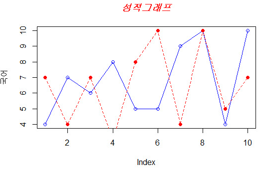

# R 기본 시각화

> 기본 패키지(graphics)

[TOC]


## 0. 시각화 함수의 종류

- **고수준 함수 – plot(), boxplot(), hist(), pie(), barplot()**
- **저수준 함수 – title(), lines(), axis(), legend(), points(), text()**
- 칼라팔레트 함수 – rainbow(), cm.colors(), topo.colors(), terrian.colors(), heat.colors()

### 0-1. pch


### 0-2. lty


## 1. 산포도

```R
국어<- c(4,7,6,8,5,5,9,10,4,10) 
plot(국어)

plot(국어, type="o", col="blue")
title(main="성적그래프", col.main="red", font.main=4) 

수학 <- c(7,4,7,3,8,10,4,10,5,7)
plot(국어, type="o", col="blue")
lines(수학, type="o", pch=16, lty=2, col="red") 
title(main="성적그래프", col.main="red", font.main=4)
```




```R
par(mar=c(1,1,1,1), mfrow=c(4,2))
plot(국어, type="p", col="blue", main="type = p", xaxt="n", yaxt="n")
plot(국어, type="l", col="blue", main="type = l", xaxt="n", yaxt="n")
plot(국어, type="b", col="blue", main="type = b", xaxt="n", yaxt="n")
plot(국어, type="c", col="blue", main="type = c", xaxt="n", yaxt="n")
plot(국어, type="o", col="blue", main="type = o", xaxt="n", yaxt="n")
plot(국어, type="h", col="blue", main="type = h", xaxt="n", yaxt="n")
plot(국어, type="s", col="blue", main="type = s", xaxt="n", yaxt="n")
plot(국어, type="S", col="blue", main="type = S", xaxt="n", yaxt="n")
```


```R
par(mar=c(5,5,5,5), mfrow=c(1,1))
plot(국어, type="o", col="blue", ylim=c(0,12), axes=F, ann=F)

axis(1, at=1:10, lab=c("01","02","03","04", "05","06","07","08","09","10")) # x축 추가
axis(2, at=c(0,2,4,6,8,10)) # y축 추가

lines(수학, type="o", pch=16, lty=2, col="red") 
box() 

title(main="성적그래프", col.main="red", font.main=4) 
title(xlab="학번", col.lab=rgb(0,1,0)) 
title(ylab="점수", col.lab=rgb(1,0,0)) 
legend(1, 10, c("국어","수학"), cex=0.8, col=c("blue","red"), pch=c(16,21), lty=c(1,2))
```


```R
(성적 <- read.table("성적.txt", header=TRUE));
plot(성적$학번, 성적$국어, main="성적그래프", xlab="학번", ylab="점수", xlim=c(0, 11), ylim=c(0, 11)) 
#이미지 파일로 출력
ymax <- max(성적$국어) #성적 데이터 중에서 최대값을 찾는다(y 축의 크기 제핚)
pcols<- c("red","blue","green")
png(filename="성적.png", height=400, width=700, bg="white") # 출력을 png파일로 설정
plot(성적$국어, type="o", col=pcols[1], ylim=c(0, ymax), axes=FALSE, ann=FALSE)
axis(1, at=1:10, lab=c("01","02","03","04","05","06","07","08","09","10"))
axis(2, at=0:5, lab=c(0,2,4,6,8,10))
box()
lines(성적$수학, type="o", pch=16, lty=2, col=pcols[2])
lines(성적$영어, type="o", pch=23, lty=3, col=pcols[3] )
title(main="성적그래프", col.main="red", font.main=4)
title(xlab="학번", col.lab=rgb(1,0,0))
title(ylab="점수", col.lab=rgb(0,0,1))
legend(1, ymax, names(성적)[-1], cex=0.8, col=pcols, pch=c(21,16,23), lty=c(1,2,3))
dev.off() #출력 종료
```


## 2. 바 그래프

```R
barplot(국어)

coldens <- seq(from=10, to=100, by=10) # 막대그래프의 색밀도 설정을 위핚 벡터
xname <- 성적$학번 # X 축 값 설정위핚 벡터
barplot(성적$국어, main="성적그래프", xlab="학번", ylab="점수", border="red", col="green", density=coldens, 
names.arg=xname)
```


```R
성적1<- 성적[3:5] 
barplot(as.matrix(성적1), main="성적그래프", ylab="점수", 
beside=TRUE, col=rainbow(10))

xname <- 성적$학번; # x축 레이블용 벡터
barplot(t(성적1), main="성적그래프", ylab="점수", col=rainbow(3), 
 space=0.1, cex.axis=0.8, names.arg=xname, cex=0.8)
legend(0,28, names(성적1), cex=0.8, fill=rainbow(3));

barplot(t(성적1), main="성적그래프", 
ylab="학번", col=rainbow(3), 
space=0.1, cex.axis=0.8, names.arg=xname,
cex=0.8, horiz=T)
legend(22, 4, names(성적1), cex=0.8, 
fill=rainbow(3));
```


## 3. 히스토그램

```R
hist(성적$수학, main="성적분포-수학", xlab="점수", col = "lightblue",
     border = "pink")

hist(성적$국어, main="성적분포-국어", xlab="점수", ylab="도수", 
     breaks=6, col=rainbow(12), border = "pink")

hist(성적$국어, main="성적분포-국어", xlab="점수", ylab="도수",
     breaks=3, col=rainbow(12), border = "pink")

hist(성적$국어, main="성적분포-국어", xlab="점수", ylab="도수", 
     breaks=6, col=rainbow(12), border = "pink", prob=T)

lines(density(성적$국어, bw=0.5), col="blue", lwd=3)
```

```R
nums <- sample(1:100, 30)
hist(nums)

hist(nums, breaks=c(0,33,66,100))
```


## 4. 파이 그래프

```R
pie(성적$국어, labels=paste(성적$성명, "-", 성적$국어), col=rainbow(10))
pie(성적$국어, labels=paste(성적$성명, "-", 성적$국어), col=rainbow(10), main="국어성적", edges=10)
pie(성적$국어, labels=paste(성적$성명,"\n","(",성적$국어,")"), col=rainbow(10))
```


## 5. 박스 그래프

```R
summary(성적$국어)
boxplot(성적$국어, col="yellow", ylim=c(0,10), xlab="국어", ylab="성적")

성적2 <- 성적[3:5]
boxplot(성적2, col=rainbow(3), ylim=c(0,10), ylab="성적")
```


```R
data <- read.table("온도.txt", header=TRUE, sep=",")
head(data, n=5); 
boxplot(data)
boxplot(data, las = 2)
boxplot(data, las = 2, at = c(1,2,3,4, 6,7,8,9, 11,12,13,14))
chtcols = rep(c("red","sienna","palevioletred1","royalblue2"), times=3); 
boxplot(data, las = 2, at = c(1,2,3,4, 6,7,8,9, 11,12,13,14), col=chtcols) 
grid(col="gray", lty=2, lwd=1)
```


### 5-1. 이상치 판단

> IQR = Q3 - Q1  사분 범위
> Q1(=1분위수)-1.5×IQR 보다 작거나
> Q3(=3분위수)+1.5×IQR 보다 큰 관측 값들을 **이상치**라고 한다.


## 6. 그래프를 파일에 저장하기

```R
# [ 그려지는 그래프를 파일에 저장하는 방법1 ]
png("mytest.png", 500, 400)
그래프를 그린다.
dev.off()

# [ 그래프를 그린 후에 파일에도 저장하는 방법2 ]
그래프를 그린다.
dev.copy(png, “mytest.png”) 또는 dev.copy(pdf, “mytest.pdf”)
dev.off()
```


## Built-in 칼라 팔렛트

> R이 디폴트로 내장(grDevices)하고 있는 칼라 파렛트 함수는 다음과 같다.

* rainbow()
* heat.colors()
* terrain.colors()
* topo.colors()
* cm.colors()
* gray.colors()


## RColorBrewer 패키지의 칼라 팔렛트


