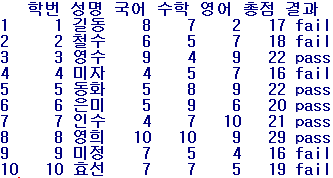

# dplyr 패키지를 이용한 데이터 전처리


## 0. dplyr 패키지란?

> 데이터프레임에 담겨진 데이터들의 전처리에 가장 많이 사용되는 패키지이다.
> 데이터를 빨리 쉽게 가공할 수 있도록 도와주는 R 패키지이며 데이터 전처리 작업에 가장 많이 사용되는 패키지이다. dplyr은 plyr의 차기작으로서, 유연한 데이터 조작의 문법을 제공하며 데이터프레임을 집중적으로 다루는 툴이다. 데이터 조작을 위한 문법으로 체계화를 해서 한번 배워놓으면 쉽다는 점과 더불어, C언어로 만들어서 매우 빠르다.

```R
install.packages("dplyr")
library(dplyr)
```

### 0-1. 데이터 전처리란?

> 주어진 원데이터를 그대로 사용하기보다는 원하는 형태로 변형해서 분석하는 경우가 굉장히 많다. 따라서 분석에 적합하게 데이터를 가공하는 작업을 ’데이터 전처리’라고 한다. 유사한 말로 데이터 가공(Data Manipulation), 데이터 핸들링(Data Handling), 데이터 클리닝(Data Cleanging) 등이 있다. 데이터의 이상치나 결측치에 대한 처리도 이 단계에서 처리한다.


## 1. dplyr 패키지의 주요 함수

| 함수명                      | 역할                                                         | 비고             |
| --------------------------- | ------------------------------------------------------------ | ---------------- |
| filter()                    | Filter rows with condition                                   | {base} subset    |
| slice()                     | Filter rows with position                                    | {base} subset    |
| arrange()                   | Re-order or arrange rows                                     | {base} order     |
| select()                    | Select columns                                               | {base} subset    |
| > select(df, starts_with()) | Select columns that start with a prefix                      |                  |
| > select(df, ends_with())   | Select columns that end with a prefix                        |                  |
| > select(df, contains())    | Select columns that contain a character string               |                  |
| > select(df, matchs())      | Select columns that match a regular expression               |                  |
| > select(df, one_of())      | Select columns that are from a group of names                |                  |
| > select(df, num_range())   | Select columns from num_range a to n with a prefix           |                  |
| rename()                    | Rename column name                                           | {reshape} rename |
| distinct()                  | Extract distinct(unique) rows                                | {base} unique    |
| sample_n()                  | Random sample rows for a fixed number                        | {base} sample    |
| sample_frac()               | Random sample rows for a fixed fraction                      | {base} sample    |
| mutate()                    | Create(add) new columns.<br />mutate() allows you to refer to columns that you've just created. | {base} transform |
| transmute()                 | Create(add) new columns.<br />transmute() only keeps the new columns. | {base} transform |
| summarise()                 | Summarise values                                             | {base} summary   |

### 1-1. filter(), slice()

* filter(dataframe, filter condition 1, filter condition 2, ...)

  > &(AND) 조건으로 row 데이터 부분집합 선별

```R
library(MASS)
table(Cars93$Type)
filter(Cars93, Type == c("Compact"), Max.Price <= 20, MPG.highway >= 30)
```

* filter(dataframe, filter condition 1 | filter condition 2 | ...)

```R
filter(Cars93, Type == c("Compact") | Max.Price <= 20 | MPG.highway >= 30)
```

* slice(dataframe, from, to) : 위치를 지정해서 row 데이터 부분집합 선별하기

> filter()가 조건에 의한 선별이었다면, 위치(position)를 사용해서 부분집합 선별은 slice() 함수를 사용한다.

```R
slice(Cars93, 6:10) 
```


### 1-2. arrange(), select()

* 데이터 프레임 행 정렬하기 (arrange rows of data frame) : arrange()

  * arrange(dataframe, order criterion 1, order criterion 2, ...)

  > 여러개의 기준에 의해서 정렬을 하고 싶으면 기준 변수를 순서대로 나열한다.
  > 기본 정렬 옵셥은 오름차순(ascending)이며, 만약 내림차순(descending) 으로 정렬을 하고 싶다면 desc()를 입력한다

```R
arrange(Cars93, desc(MPG.highway), Max.Price) 
```

* 데이터 프레임 변수 선별하기 : select()
  * select(dataframe, VAR1, VAR2, ...) : 선별하고자 하는 변수 이름을 기입

```R
select(Cars93, Manufacturer, Max.Price, MPG.highway)
select(Cars93, Manufacturer:Price)
select(Cars93, 1:5)
select(Cars93, -(Manufacturer:Price))
```

```R
#select(dataframe, starts_with("xx_name")) : "xx_name"으로 시작하는 모든 변수 선별
select(Cars93, starts_with("MPG"))

#select(dataframe, ends_with("xx_name")) : "xx_name"으로 끝나는 모든 변수 선별
select(Cars93, ends_with("Price"))

#select(dataframe, contains("xx_name")) : "xx_name"을 포함하는 모든 변수 선별
select(Cars93, contains("P"))

#select(dataframe, matches(".xx_string.")) : 정규 표현과 일치하는 문자열이 포함된 모든 변수 선별
head(select(Cars93, matches(".P.")))
head(select(Cars93, matches("P"))) 

#select(dataframe, one_of(vars)) : 변수 이름 그룹에 포함된 모든 변수 선별
vars <- c("Manufacturer", "MAX.Price", "MPG.highway")
head(select(Cars93, one_of(vars)))

#select(dataframe, num_range("V", a:n)) : 접두사와 숫자 범위를 조합해서 변수 선별
V1 <- c(rep(1, 10)); V2 <- c(rep(1:2, 5)); V3 <- c(rep(1:5, 2)); V4 <- c(rep(1:10))
df <- data.frame(V1, V2, V3, V4)
select(df, num_range("V", 2:3)) 
```


### 1-3. rename(), distinct()

* 데이터 프레임 변수 이름 변경하기 : rename()

> dpylr 패키지의 rename() 함수는 rename(dataframe, new_var1 = old_var1, new_var2 = old_var2, ...) 의 형식으로 사용한다. 

```R
names(Cars93) 
Cars93_1 <- rename(Cars93, 제조사=Manufacturer, 모델=Model)
```

* 중복없는 유일한 값 추출 : distinct() 

> distinct(dataframe, 기준 var1, 기준 var2, ...) 의 형식으로 중복없는 유일한(distinct, unique) 값을 추출하고자 하는 기준 변수를 기입해주면 된다.

```R
names(Cars93)
distinct(Cars93, Origin)
distinct(Cars93, Type)
distinct(Cars93, Origin, Type)
```


### 1-4. sample_n(), sample_frac()

* 무작위 표본 데이터 추출 : sample_n(), sample_frac()

> sample_n(dataframe, a fixed number) : 특정 개수만큼 무작위 추출

```R
sample_n(Cars93[, 1:5], 10)
sample_n(Cars93[, 1:5], 10)
```

* sample_frac(dataframe, a fixed fraction) : 특정 비율만큼 무작위 추출

```R
nrow(Cars93)
nrow(Cars93)*0.1
sample_frac(Cars93[ , 1:5], 0.1)
```

* smaple_n(dataframe, n, replace = TRUE) : 복원 추출

```R
sample_n(Cars93[, 1:5], 20, replace = TRUE) # a bootstrap sample of 20 records 
```


## 2. chain() 함수

>  %>% (단축키 shift+ctrl+M)

> 함수 chain() 혹은 간단히 %>%를 이용함으로써 각 조작을 연결해서 한 번에 수행할 수 있다.
> %>%로 연결하면 가장 먼저 데이터 프레임을 지정하면 그 다음부터는 인수를 생략할 수 있을 뿐 아니라 앞선 함수의 결과(데이터 프레임)를 뒤에 오는 함수의 입력 값으로 사용하게 된다.


**"Cars93 데이터프레임에서 차생산국가(Origin), 차종(Type), 실린더개수(Cylinders)별로 차가격(Price)과 고속도로연비(MPG.highway)의 평균을 구하되, 차가격 평균 10 초과 & 고속도로연비 25 초과하는 경우만 선별해서 제시하시오"**

```R
a1 <- group_by(Cars93, Origin, Type, Cylinders)
a2 <- select(a1, Price, MPG.highway)
a3 <- summarise(a2,
                Price_m = mean(Price, na.rm = TRUE),
                MPG.highway_m = mean(MPG.highway, na.rm = TRUE))
a4 <- filter(a3, Price_m > 10 | MPG.highway_m > 25)

filter(
    summarise(
        select(
            group_by(Cars93, Origin, Type, Cylinders),
            Price, MPG.highway),
        Price_m = mean(Price, na.rm = TRUE),
        MPG.highway_m = mean(MPG.highway, na.rm = TRUE)),
    Price_m > 10 | MPG.highway_m > 25)
```

(a) Cars93 데이터프레임에서 %>% 

(b) 제조생산국(Origin), 차종(Type), 실린더개수(Cylinders)별로 %>% 

(c) 차 가격(Price)과 고속도로 연비(MPG.highway) 변수에 대해 %>% 

(d) (결측값은 제외하고) 평균을 구하는데, %>% 

(e) 단, 가격 평균은 10을 넘고 & 고속도로 연비는 25를 넘는 것만 알고 싶다

```R
Cars93 %>% 
group_by(Origin, Type, Cylinders) %>% 
select(Price, MPG.highway) %>% 
summarise(
    Price_m = mean(Price, na.rm = TRUE),
    MPG.highway_m = mean(MPG.highway, na.rm = TRUE)) %>%
filter(Price_m > 10 | MPG.highway_m > 25) 
```

```R
Cars93 %>% select(Manufacturer, Max.Price, MPG.highway) %>% head()
Cars93 %>% filter(Type == c("Compact") | Max.Price <= 20 | MPG.highway >= 30) %>%
select(Manufacturer, Model, Price) %>% tail()
Cars93 %>% filter(Manufacturer == 'Honda') %>% select(Manufacturer, Model, Price) %>% arrange(desc(Price)) 
```

### 2-1. 그룹별 요약 처리(group_by(), summarise())

```R
Cars93 %>% group_by(Manufacturer) %>% summarise(mean_price = mean(Price))
Cars93 %>% group_by(Manufacturer) %>% 
	summarise(mean_price = mean(Price), max_price = max(Price), min_price = mean(Price))
Cars93 %>% group_by(Manufacturer, Model) %>% 
	summarise(mean_price = mean(Price), max_price = max(Price), min_price = mean(Price))
Cars93 %>% group_by(Type) %>% summarise(count = n())
```


### 2-2. 자주 사용하는 요약통계량 함수

| 함수     | 의미     |
| -------- | -------- |
| mean()   | 평균     |
| sd()     | 표준편차 |
| sum()    | 함계     |
| median() | 중앙값   |
| min()    | 최솟값   |
| max()    | 최댓값   |
| n()      | 빈도     |


## 3. 파생변수 추가

```R
score <- read.table("성적.txt", header=T)

score %>% mutate(총점 = 국어 + 영어 + 수학, 평균 = 총점/3)

score %>% 
mutate(총점 = 국어 + 영어 + 수학, 평균 = 총점/3) %>% 
arrange(desc(총점))

score %>%
mutate(총점 = 국어 + 영어 + 수학, 결과 = ifelse(총점 >= 20, "pass", "fail"))
```





## 4. bind_rows()와 bind_cols()

* bind_rows() : 두 개 이상의 데이터 프레임을 행 기준(위 - 아래 - 아래 ...)로 합칠 때 사용하는 함수이며, {base] 패키지의 rbind() 함수와 유사한 기능을 수행한다.
* bind_cols() : 두 개 이상의 데이터 프레임을 열 기준(왼쪽 - 오른쪽 - 오른쪽 ...)로 합칠 때 사용하는 함수이며, {base} 패키지의 cbind() 함수와 유사한 기능을 수행한다.

### 4-1. 특징

* 열(columns)이 서로 동일하지 않아도 행(rows) 기준으로 합칠 수 있음.
* 'id' 매개변수를 사용해 합쳐지기 전 데이터 프레임의 원천을 알 수 있음.
* dplyr 패키지의 처리 속도가 기본 패키지의 rbind() 대비 상대적으로 빠름.


## 5. 조인

> 두 개의 dataframe을 선택된 공통의 변수에 기반하여 결합한다. 
> 결합하는 경우 두 개의 인자의 위치에 따른 4가지의 결합기준을 이용할 수 있다.

* left_join :왼쪽 자료의 항목을 기준으로 결합
* right_join :오른쪽 쪽 자료의 항목을 기준으로 결합
* inner_join :두 자료의 공통 항목만을 결합
* full_join :두 자료의 모든 항목을 결합


## 6. 데이터 정제

> 빠진 데이터(결측치), 이상한 데이터(이상치) 제거하기

* 결측치(Missing Value) : 누락된 값, 비어있는 값
  * 함수 적용 불가, 분석 결과 왜곡하므로 제거 후 분석 실시
  * 결측치 표기 - 대문자 NA

```R
df <- data.frame(sex = c("M", "F", NA, "M", "F"), score = c(5, 4, 3, 4, NA))
# 결측치 확인하기
is.na(df); table(is.na(df)) 
# 변수별로 결측치 확인하기
table(is.na(df$sex)); table(is.na(df$score))
# 결측치 포함된 상태로 분석
mean(df$score); sum(df$score) 
# 결측치 있는 행 제거하기
df %>% filter(is.na(score))
df %>% filter(!is.na(score))
# 결측치 제외한 데이터로 분석하기
df_nomiss <- df %>% filter(!is.na(score))
mean(df_nomiss$score); sum(df_nomiss$score)
df_nomiss <- df %>% filter(!is.na(score) & !is.na(sex))
df_nomiss2 <- na.omit(df) 
mean(df$score, na.rm = T)
sum(df$score, na.rm = T)
summarise()에서 na.rm = T사용하기
exam %>% summarise(mean_math = mean(math)) 
exam %>% summarise(mean_math = mean(math, na.rm = T))
exam %>% summarise(mean_math = mean(math, na.rm = T), 
sum_math = sum(math, na.rm = T), 
median_math = median(math, na.rm = T))
mean(exam$math, na.rm = T) 
exam$math <- ifelse(is.na(exam$math), 55, exam$math)
table(is.na(exam$math))
mean(exam$math)
```

* 이상치(Outlier) - 정상범주에서 크게 벗어난 값

```R
# 이상치 확인하기
table(outlier$sex)
table(outlier$score)
outlier$sex <- ifelse(outlier$sex == 3, NA, outlier$sex)
outlier$score <- ifelse(outlier$score > 5, NA, outlier$score)
# 이상치를 제외하고 분석
outlier %>%
filter(!is.na(sex) & !is.na(score)) %>%
group_by(sex) %>%
summarise(mean_score = mean(score))
```


