# ggplot2 패키지를 활용한 데이터 시각화

## 1. ggplot2 패키지

> ggplot2는 그래프 기능을 제공하는 또 다른 유용한 패키지이다.
> Hadley Wickham 교수에 의해 2005년부터 개발되고 있으며 ‘Grammar of Graphics’의 개념을 적용하여 기본 R 그래픽스에서 제공하는 대부분의 작업을 효과적으로 수행한다.

* ggplot2의 장점
  * 동일한 문법으로 다양한 그래프를 그릴 수 있다.
  * 비교적 쉽게 높은 수준의 그래프를 그릴 수 있다.
  * 데이터를 다루고 이해하는데 좋다.

* Plot의 구성요소
  * A set of layers
  * A set of scales
  * A coordinate system
  * A facetting specification

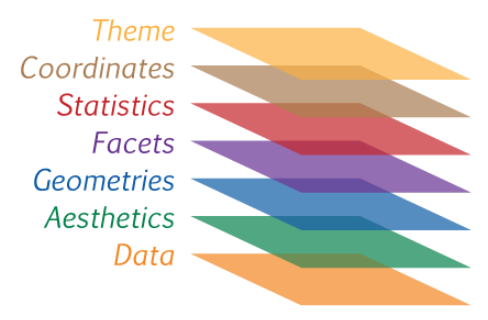

> ggplot2는 ‘Grammar of Graphics’ 을 적용하여 다음과 같은 다섯가지 사항으로 그림을 그린다.
>
> 각 변수는 개별의 열(column)로 존재한다.
> 각 관측치는 행(row)으로 구성한다.
> 각 표는 단 하나의 관측기준에 의해서 조직된 데이터를 저장한다.
> 만약 여러 개의 표가 존재한다면, 적어도 하나이상의 열(column)이 공유되어야 한다.

### 1-1. Data

그래프를 그리려는 데이터로 구조는 데이터 프레임이고 데이터의 기록 방식은 long-farmat에 기반한 tidy data여야 한다.

### 1-2. (Aesthetic)Mapping

데이터의 요소와 그래프의 요소를 대응시키는 과정으로 그리려고 하는 그래프가 필수적으로 요구하는 대응요소만 만족시키면 된다. 하나의 변수가 여러 가지 시각적 요소에 대응될 수도 있다.

### 1-3. Geometric Object

어떤 형태의 그래프를 그릴지 지정해야 한다. ggplot2에서는 이것을 Geometric Object, 줄여서 geom이라고 한다.

### 1-4. Position

그래프의 형태를 지정했으면 그래프에서 각 도형이 어떤 식으로 배치될 지를 결정할 수 있다. 이 옵션이 바로 position이다. 막대그래프나 선 그래프라면 누적 그래프를 그리거나 할 때 position 옵션을 조정해서 형태를 바꿀 수 있다.

### 1-5. Statistical Transformation

마지막으로 값이 어떻게 그래프에 반영되는지 결정하는 옵션이 있다. Statistical Transformation, 줄여서 stat 옵션이다. 히스토그램과 같이 구간 내에 존재하는 값의 개수를 세거나 밀도를 계산하는 등, 주어진 값을 변형시켜서 그래프에 반영시킬 때 사용한다.


## 2. 그래프 그리는 과정

1. 배경 설정하기

```R
# x축 displ, y축 hwy로 지정해 배경 생성
ggplot(data = mpg, aes(x = displ, y = hwy))
```

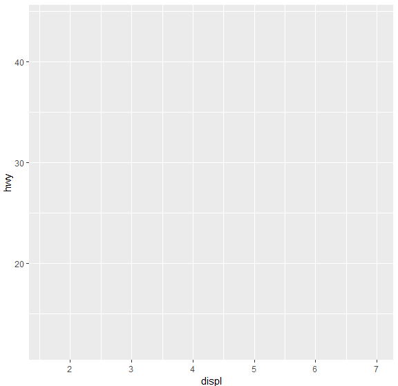

2. 그래프 추가하기

```R
# 배경에 산점도 추가
ggplot(data = mpg, aes(x = displ, y = hwy)) + geom_point()
```

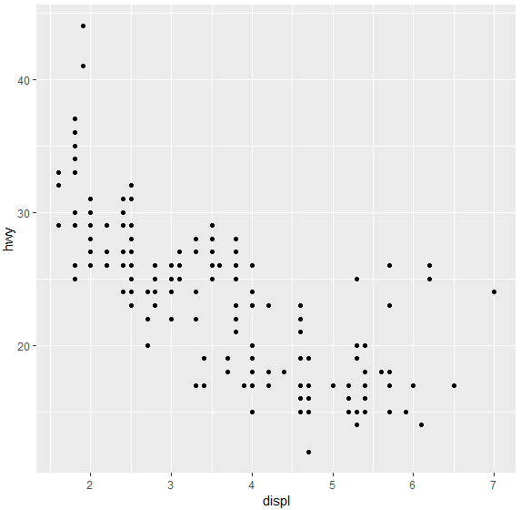

3. 축 범위를 조정하는 설정 추가하기

```R
# x축 범위 3~6으로 지정
ggplot(data = mpg, aes(x = displ, y = hwy)) + 
geom_point() + xlim(3, 6)
```

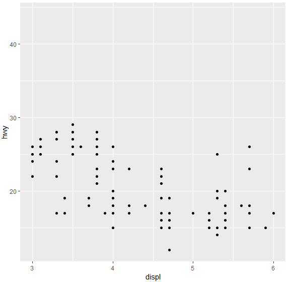

4. 축 범위를 조정하는 설정 추가하기

```R
# x축 범위 3~6, y축 범위 10~30으로 지정
ggplot(data = mpg, aes(x = displ, y = hwy)) + 
geom_point() + xlim(3, 6) + ylim(10, 30)
```

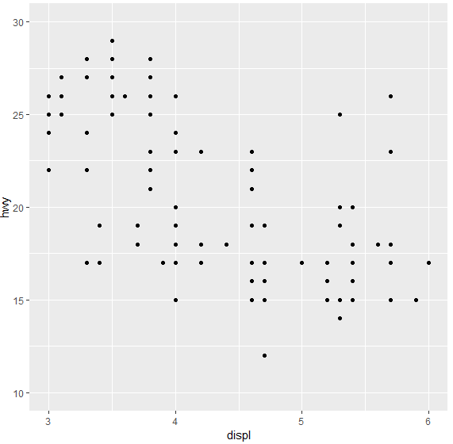

5. 컬러와 점 모양 추가하기

```R
ggplot(data = mpg, aes(x = displ, y = hwy)) + 
geom_point(shape=21, size=6, colour="blue") + 
xlim(3, 6) + ylim(10, 30) 
```

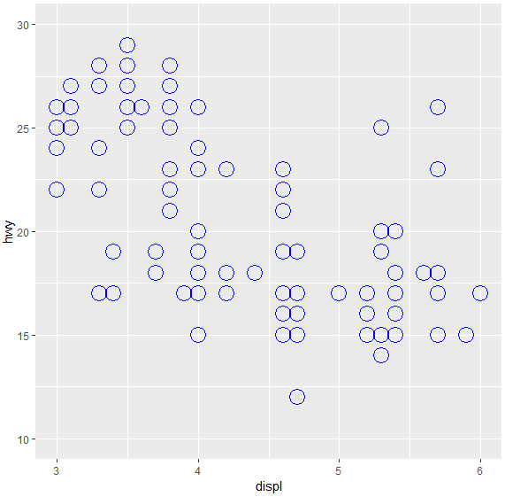

6. drv 변수별로 칼라 설정하기

```R
ggplot(data = mpg, aes(x = displ, y = hwy, col=drv)) 
+ geom_point()
```

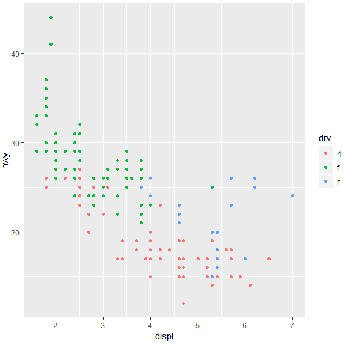

## 3. 다양한 그래프 그리기

```R
df_mpg <- mpg %>% group_by(drv) %>% summarise(mean_hwy = mean(hwy))
# 집계 막대 그래프
ggplot(data = df_mpg, aes(x = drv, y = mean_hwy)) + geom_col()
# 빈도 막대 그래프
ggplot(data = mpg, aes(x = drv)) + geom_bar()
# 선 그래프
ggplot(data = economics, aes(x = date, y = unemploy)) + geom_line()
# 상자 그림
ggplot(data = mpg, aes(x = drv, y = hwy)) + geom_boxplot()
```

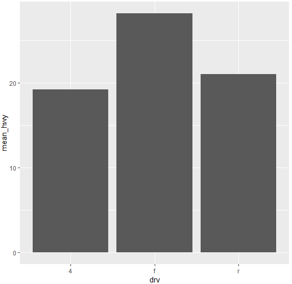

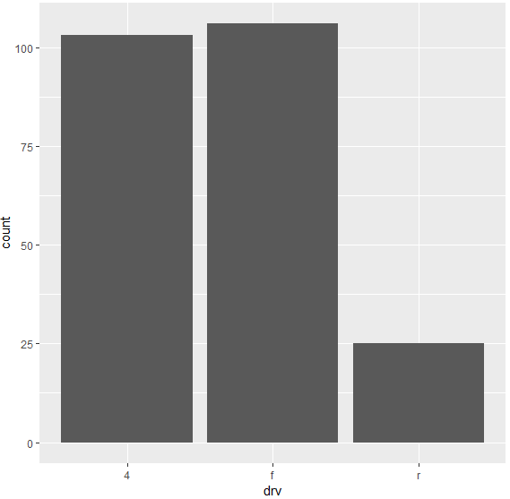

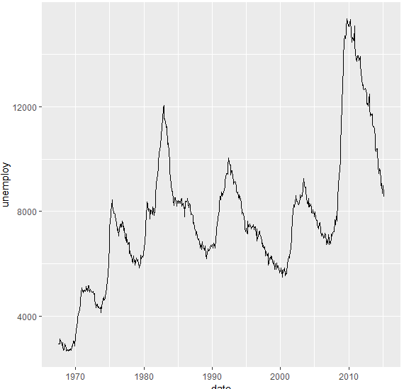

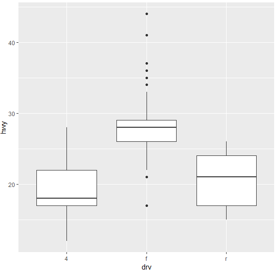


## 4. 인터랙티브 그래프 만들기

```R
install.packages("plotly")
library(plotly)

p <- ggplot(data = mpg, aes(x = displ, y = hwy, col = drv)) + geom_point()
ggplotly(p)

p <- ggplot(data = diamonds, aes(x = cut, fill = clarity)) + 
 geom_bar(position = "dodge")
ggplotly(p)
```

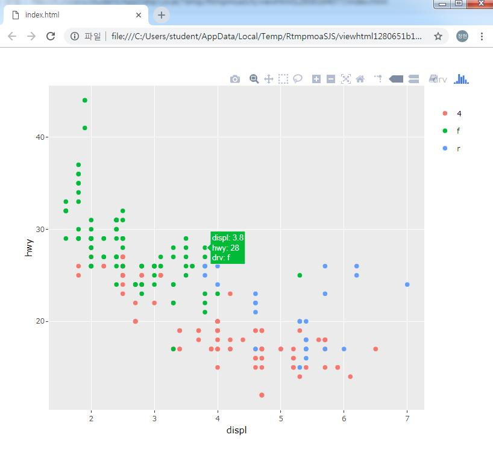


