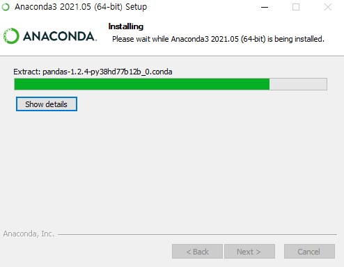

# Anaconda3 설치하기

> https://www.anaconda.com/products/individual 에서 다운로드한다.

* 다운로드한 파일(Anaconda3-2021.05-Windows-x86_64.exe)을 더블클릭하여 설치를 시작한다.

* 다음과 같이 체크한 후에 Install 버튼 클릭 시 시스템에 따라서 서브 창이 출력될 수도 있다. 이 때는 확인 버튼을 클릭한다.

* 설치가 진행된 후 Next 버튼을 클릭한다.

* 읽어보지 않아도 되는 내용이므로 두 개 모두 채크박스를 해제한 후에 Finish 버튼을 클릭한다.

* 윈도우즈 운영체제의 시작 버튼을 클릭하면 다음과 같이 A 항목에 Anaconda3 메뉴가 추가된 것을 볼 수 있다.

### 추가

* html 파일의 기본 프로그램이 메모장으로 되어 있는 시스템에서는 기본프로그램을 *chrome 브라우저*로 변경해야 한다. 적당한 html 파일을 선택한 후에 마우스 오른쪽 버튼을 클릭하고 출력된 팝업 메뉴에서 속성이라는 메뉴를 클릭한다.

