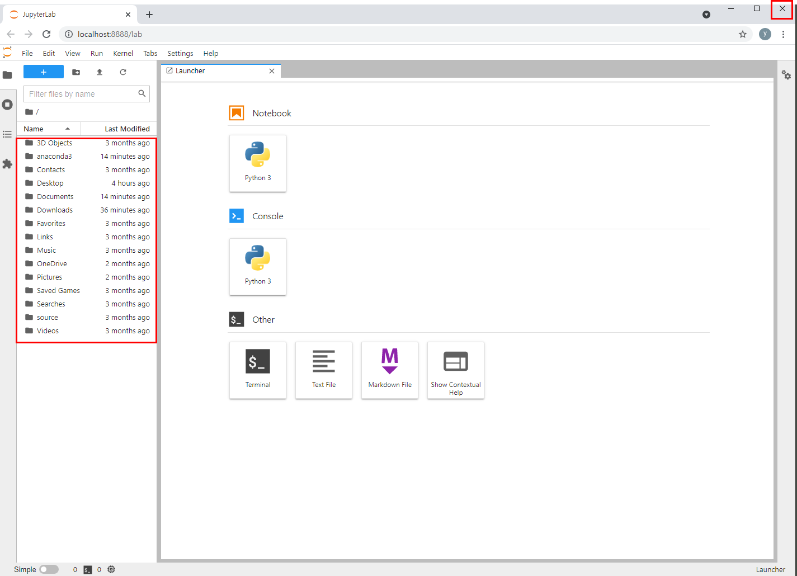

# jupyter lab 기동

* 시작 메뉴에서 Anaconda Prompt 를 선택하여 Anaconda Prompt 창을 출력한다.

* 다음과 같이 Anaconda Prompt 창이 출력된다.

* 다음과 같이 jupyter lab 을 실행시켜서 jupyter lab 을 기동시킨다.

* jupyter lab 은 jupyter notebook 과 비슷한 개발 환경이다. 브라우저를 통해서 개발 페이지를 제공한다. 자동으로 인식하게 되는 현재 디렉토리 위치는 시스템 사용자명 디렉토리이다.
  확인만 하고 브라우저 창을 종료한다.

* jupyter lab 이 잘 기동되는 것을 확인했으니 jupyter lab 을 기동시킨 Anaconda Prompt 창에 와서 ctrl + c 를 여러 번 입력해서 jupyter lab 를 강제로 종료한다.

* jupyter notebook --generate-config 명령을 실행시켜서 설정파일을 생성한다.

* 사용하는 시스템의 사용자 디렉토리에 이동해서 .jupyter 라는 폴더를 찾는다. 이 폴더안에 jupyter_notebook_config.py 가 존재하며 이 파일을 메모장으로 오픈한다.

* 대략 385행으로 이동해서 이동한다.

* 다음과 같이 수정하고 저장한다. 제일 앞에 있는 주석기호(#)도 꼭 해제한다.

* 다시 Anaconda Prompt 창에 와서 jupyter lab 을 기동시킨다. 기동시키는 화면에서 출력되는 시작 디렉토리가 변경된 것을 확인한다.

* 다음과 같이 왼쪽 패널이 깨끗한 것을 볼 수 있다. 오른쪽 패널의 Python 3 버튼을 클릭한다.

* 그러면 다음과 같이 소스를 작성하고 실행시킬 수 있는 노트북 화면이 출력되고 Untitled.ipynb 라는 명칭으로 노트북 소스의 파일이 생성되는 것을 볼 수 있다.

* Untitled.ipynb 이라는 파일 명을 선택한 후에 마우스 오른쪽 버튼을 클릭하면 다음과 같은 팝업 메뉴가 출력된다. Rename 이라는 메뉴를 선택하여 파일명을 first.ipynb 로 변경한다.

# jupyter lab 실행

* 소스 작성 셀(박스)안에 간단한 *파이썬 코드*를 작성한다.

* 셀을 선택한 후에 상단에 있는 실행(run) 버튼을 클릭하면 실행 결과가 바로 아래에 출력된다.
* 이때 탭 타이틀 끝에 검은색 서클이 출력되는 것은 이 소스가 수정된 이후로 저장되지 않은 것은 뜻한다. 저장할 때는 플로피 디스크 이미지를 클릭한다. 

* 저장버튼을 누르면 탭 타이틀 끝이 x버튼으로 변경된 것을 볼 수 있다.
* x 버튼을 클릭하면 first.ipynb 파일의 소스탭이 사라지고 다음과 같이 메인 런처 화면이 출력되는 것을 볼 수 있다.

### 종료

> 맛보기 파이썬 코드의 실행을 성공적으로 완료하면 다시 jupyter lab 창을 종료하고 Anaconda Prompt 창에 와서 ctrl + c 를 여러 번 입력해서 jupyter lab 를 강제로 종료한다.

### 형식

> first.ipynb 파일을 메모장으로 열어보면, key : value 쌍의 JSON형식임을 알 수 있다.

