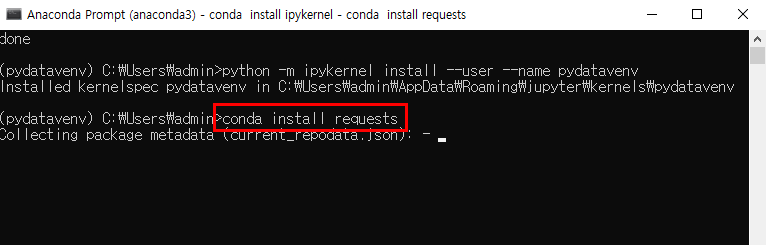

# Anaconda에 가상환경 만들기

> 파이썬 3.8 기반의 가상환경 pydatavenv 를 생성하는 명령을 실행한다.

* conda create --name **pydatavenv** python=3.8

* y 를 입력하고 엔터키를 누른다.

* 다음 명령을 실행시켜서 pydatavenv 라는 이름으로 가상환경이 잘 만들어졌는지 확인한다.

> conda info --envs

* pydatavenv 라는 이름으로 만든 가상환경을 활성화한다.

> conda activate pydatavenv
>
> conda install ipykernel

* y 를 입력하고 엔터키를 누른다.

* python -m ipykernel install --user --name pydatavenv 명령을 실행시켜서
  pydatavenv 라는 가상환경을 jupyter lab 의 커널로 등록한다.

* Anaconda Prompt 창을 한 개 더 오픈하고 jupyter lab 를 기동시킨다.

* 다음과 같이 Python3 버튼 옆에 새로 추가한 pydatavenv 라는 커널에 대한 버튼이 추가된 것을 확인할 수 있다.

* pydatavenv 라는 커널 버튼을 클릭하면 pydatavenv 라는 커널 기반의 노트북 화면이 하나 출력된다. 파일명을 second.ipynb 로 변경하고 소스작성 셀에 10 * 20 을 입력한후 실행 버튼 클릭 시 200이 결과로 출력되는지 확인한다.

# pydatavenv 가상환경에 추가패키지 설치하기

* conda install requests

* conda install pillow

* conda install bs4

* conda install selenium

* conda install lxml

* conda install html5lib

* pip install tweepy

