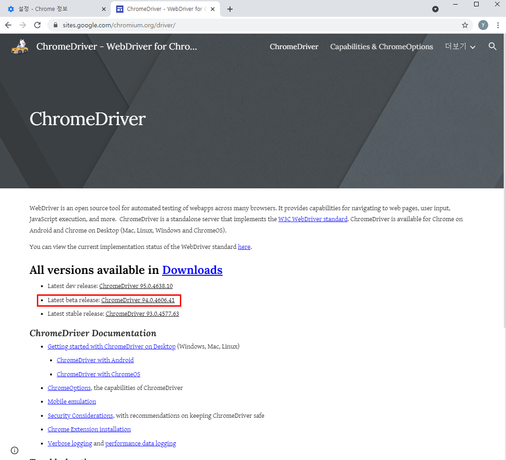
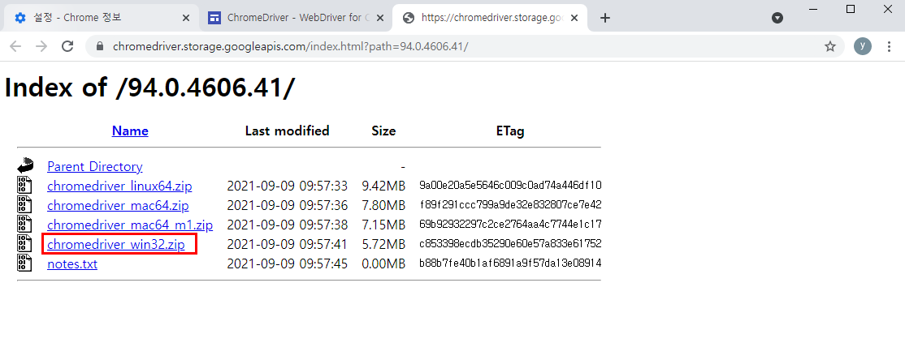
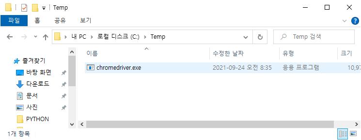

# 크롬 드라이버 다운로드

* 먼저 사용중인 크롬 브라우저의 버전을 확인한다.

> Chrome 창 > 설정 > Chrome 정보

* https://sites.google.com/chromium.org/driver/ 에서 버전이 같은 것을 다운로드한다.

* 다운로드한 chromedriver_win32.zip의 압축을 해제하여 chromedriver.exe 파일을 c:\Temp 폴더에 저장한다.(만일 c:\Temp 폴더가 존재하지 않으면 생성한다.)

