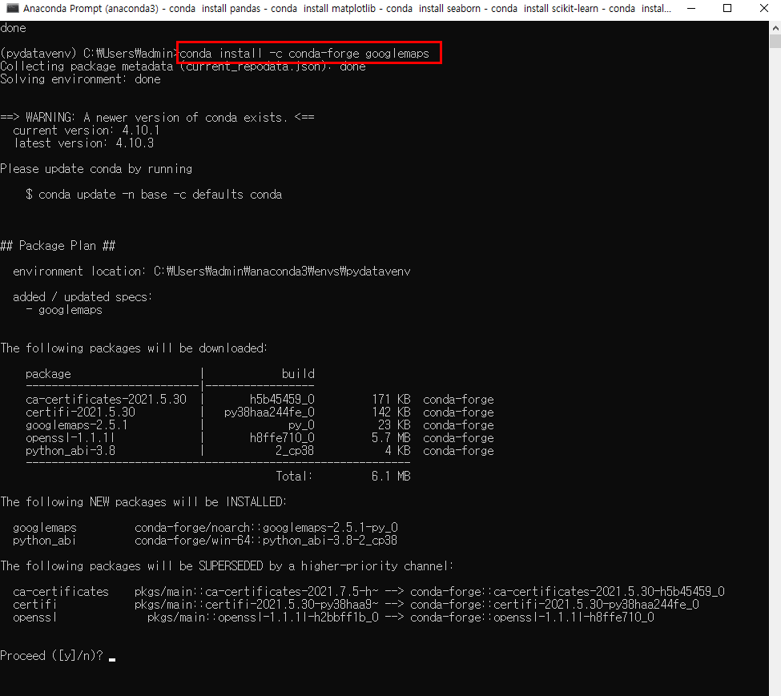

# 추가 패키지 설치1

* Anaconda Prompt 창에서 가상환경으로 들어간다.

  > conda activate pydatavenv

* 다음으로 추가 패키지들을 설치한다.

> conda install pandas

* 'Proceed ([y]/n)?' 문구가 나오면 y를 입력한 후 넘어간다.

> conda install matplotlib

> conda install seaborn

> pip install folium

> conda install scikit-learn

> conda install xlrd

> conda install -c conda-forge googlemaps

> conda install openpyxl

