# 추가 패키지 설치2

* Anaconda Prompt 창에서 가상환경으로 들어간다.

> conda activate pydatavenv

* 다음과 같이 추가 패키지들을 설치한다.

> conda install opencv

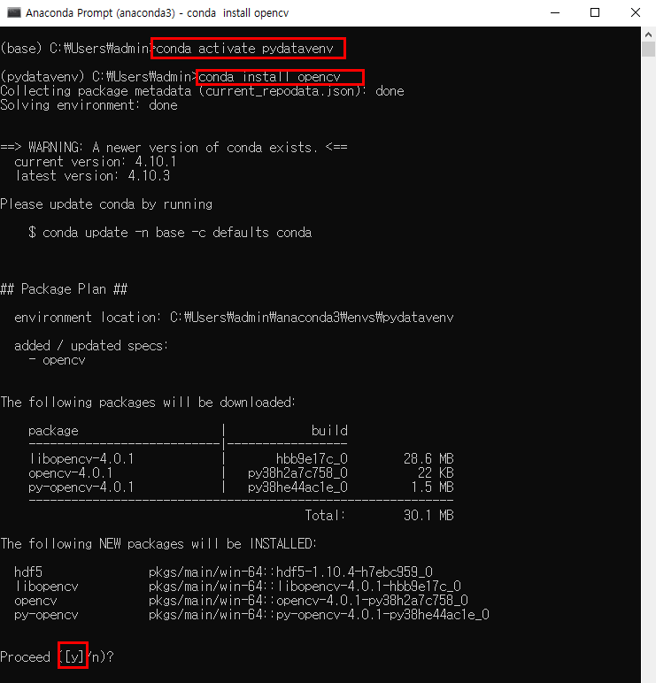

> conda install missingno

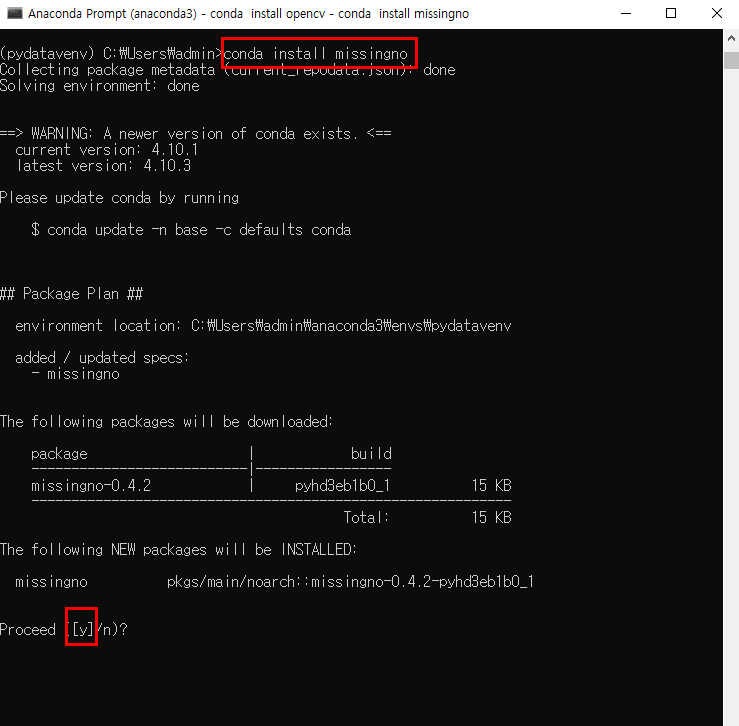

> pip install statsmodels

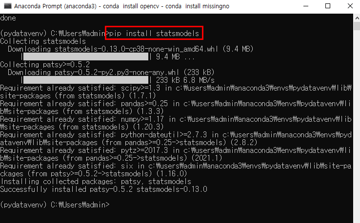

> pip install konlpy

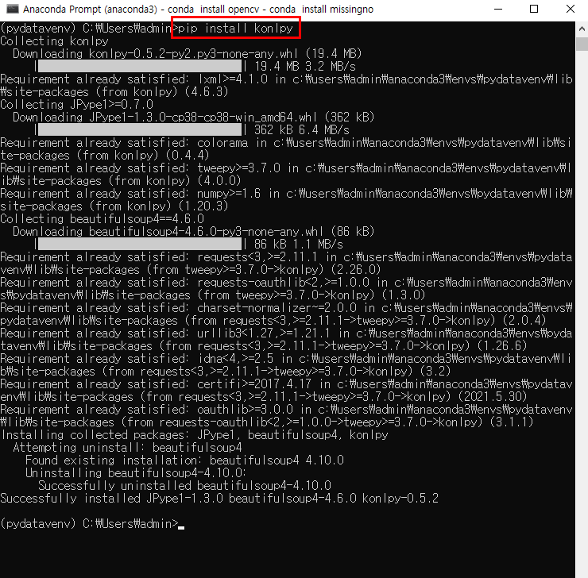

* 다음 사이트에 가서 파이썬 버전과 시스템(32비트,64비트)에 알맞은 파일을 다운로드한다. 다운로드 폴더는 사용자 디렉토리로 하면 편하다.

> https://www.lfd.uci.edu/~gohlke/pythonlibs/#jpype

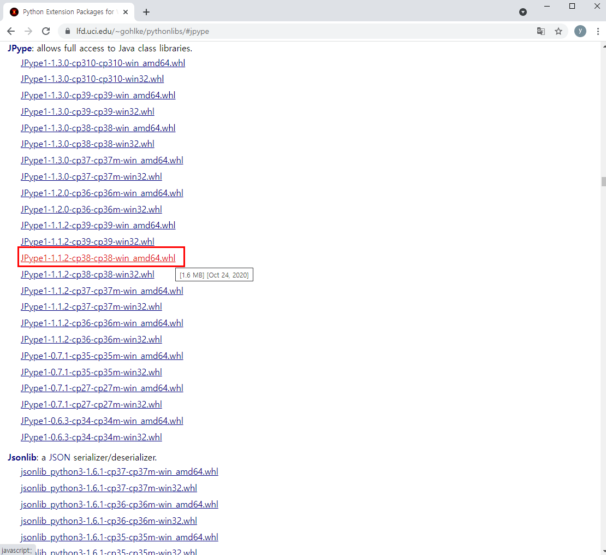

> dir *.whl
>
> pip install JPype1-1.1.2-cp38-cp38-win_amd64.whl

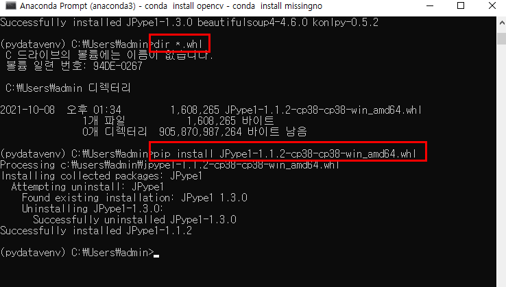

> pip install wordcloud

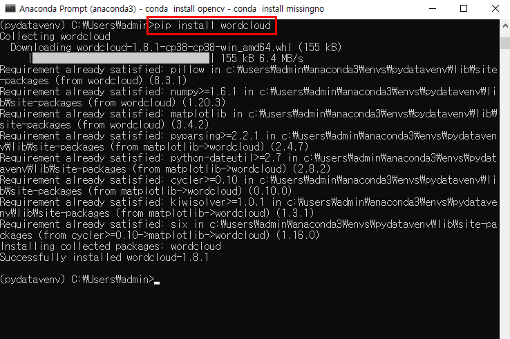

> pip install nltk

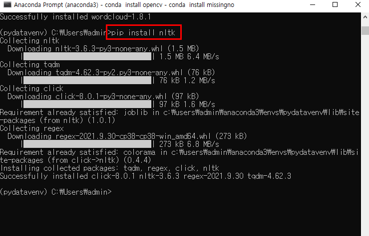

> pip install hgtk

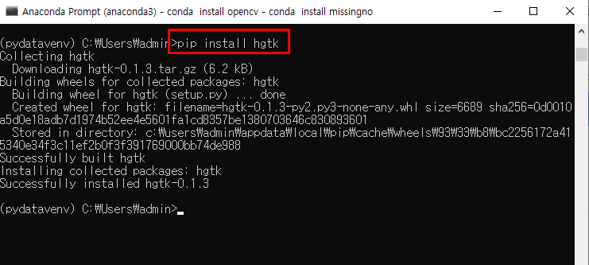

> pip install network

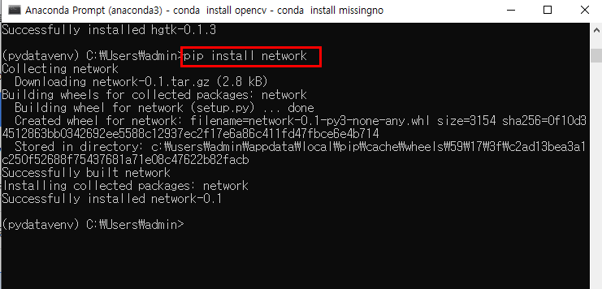

> pip install apriori apyori

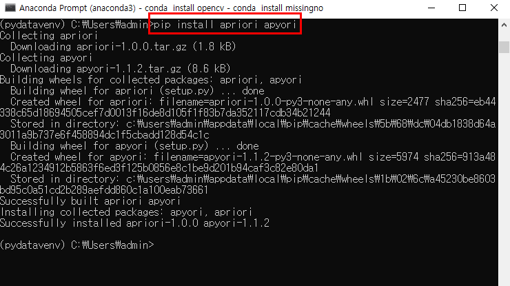

> pip install mlxtend

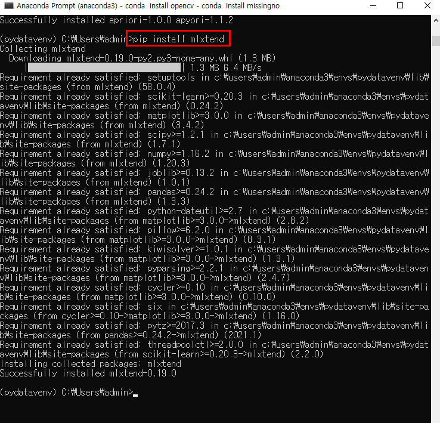