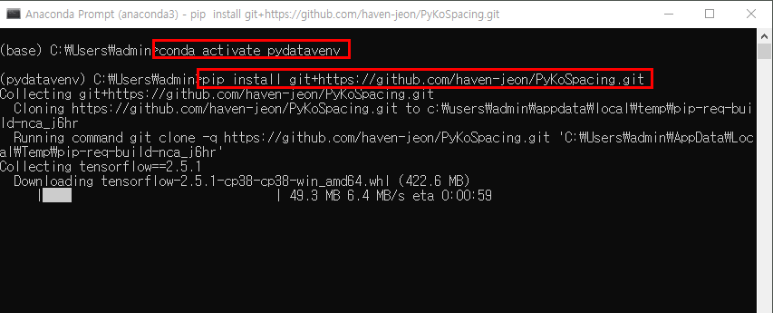
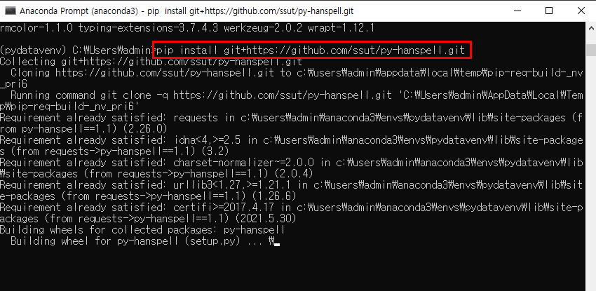
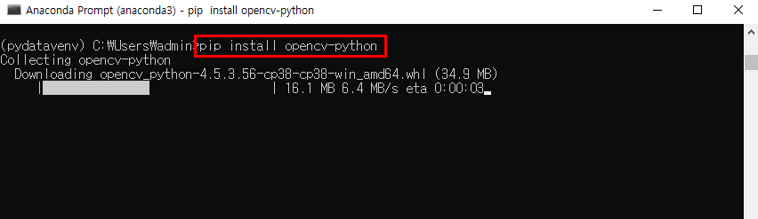

# 추가 패키지 설치3

- Anaconda Prompt 창에서 가상환경으로 들어간다.

> conda activate pydatavenv

- 다음과 같이 추가 패키지들을 설치한다.

> pip install git+https://github.com/haven-jeon/PyKoSpacing.git

> pip install git+https://github.com/ssut/py-hanspell.git

> pip install opencv-python

