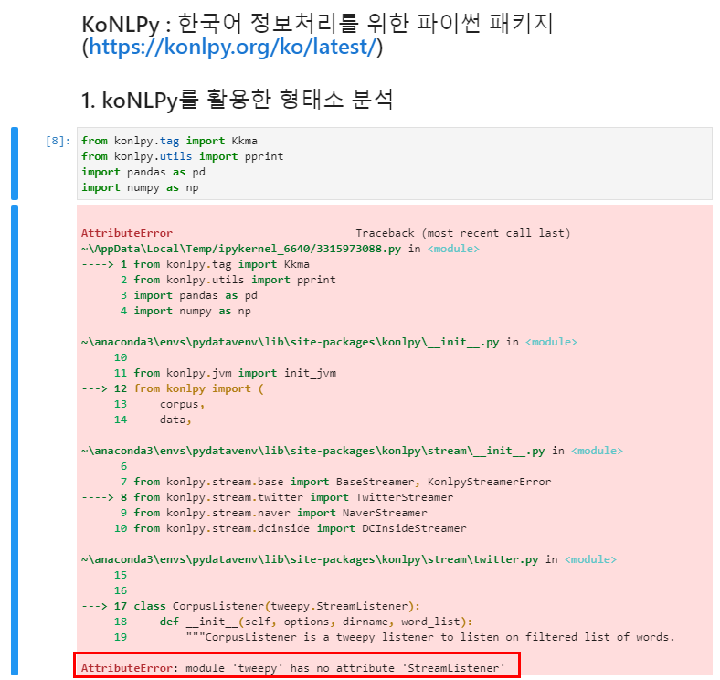
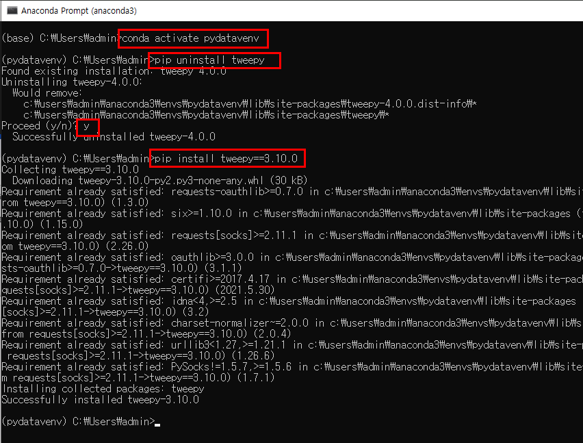
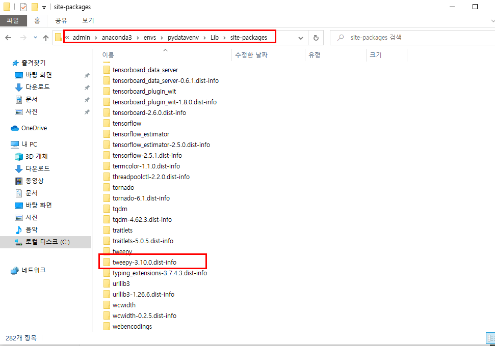

# 패키지 설치 후 오류발생

* 발생한 오류

  > AttributeError: module 'tweepy' has no attribute 'StreamListener'

# 해결방법

1. 아나콘다 프롬프트를 기동시킨다.
2. pydatavenv를 활성화한다.
   * conda activate pydatavenv
3. tweepy를 삭제한다.
   * pip uninstall tweepy
4. 새로운 특정 버전의 tweepy를 재설치한다.
   * pip install tweepy==3.10.0

# 원인분석

> 패키지의 버전이 맞지 않아서 실행하는 데에 발생한 오류이다. 이때에는 버전을 맞춰서 재설치해준 후 jupyter lab을 재기동하여 실행한다.

