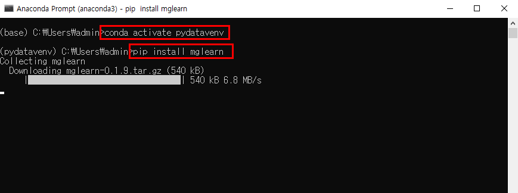
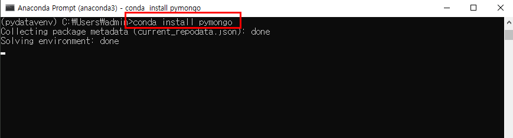
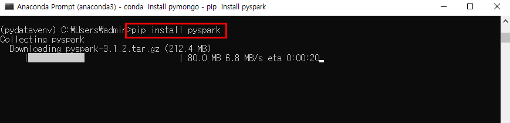

# 추가 패키지 설치4

- Anaconda Prompt 창에서 가상환경으로 들어간다.

> conda activate pydatavenv

- 다음과 같이 추가 패키지들을 설치한다.

> pip install mglearn

> conda install pymongo

> pip install mariadb

> pip install pyspark

