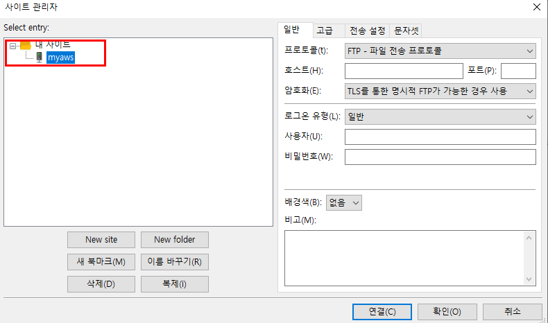
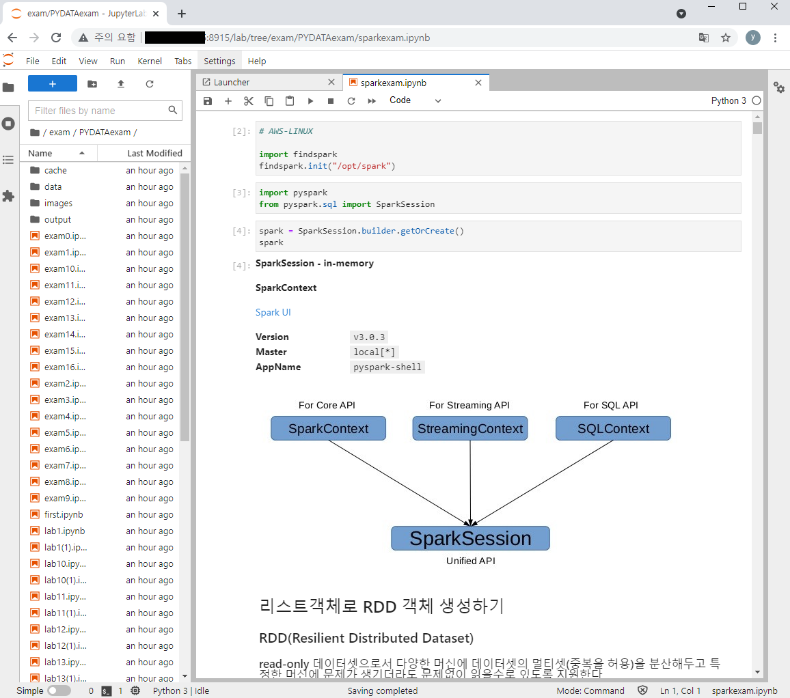

# FileZilla 설치

> AWS 의 서버로 파일을 전송할 때는 FileZilla 라는 프로그램을 사용한다.

* 제공된 FileZilla 를 설치한 후에 실행시키면 다음과 같은 윈도우가 출력된다. 확인 버튼을 클릭한다.

* 그러면 다음과 같이 업데이트 확인 위도우가 출력되는데… 이번에는 업데이트를 하지 않겠으며 그냥 닫기 버튼을 클릭한다.

* 다음과 같이 FileZilla 화면이 출력된다.

* 파일 메뉴에서 사이트 관리자 메뉴를 클릭한다.

* 아래의 New site 버튼을 클릭하면 내사이트 아래에 새로운 항목이 추가되는데 이름을 myaws 로 변경한다.

* 통신하는데 사용되는 통신 규약인 프로토콜을 SFTP 로 선택한다.

* 조마다 정해져 있는 IP 주소를 입력한다. 로그온 유형에서 키파일을 선택한다.
* 사용자 이름에 본인의 PUTTY 계정(lab01~lab16)을 입력하고 키파일에는 제공된 PPK 파일을 찾아서 설정한 후에 연결 버튼을 클릭한다.

* 다음과 같이 비밀번호를 기억하겠는지를 묻는 창이 출력되는데 비밀번호 저장이 선택된 상태에서 확인 버튼을 클릭한다.

* 접속 성공이다. 나의 AWS 서버의 홈 디렉토리가 보여질 것이다. /home/lab01~/home/lab16

* 홈디렉토리 아래에 exam 이라는 폴더를 만들고 선택하여 들어간다. 
* 이 안에 mybox 에서 내려받은 requirements.txt 와 spec-file.txt 를 왼쪽에서 선택하여 드래그 해서 옮긴다. 또한 소스디렉트리에 존재하는 PYDATAexam 폴더도 찾아서 오른쪽으로 드래그 하여 복사한다.(이건 시간이 좀 걸린다.)

# AWS 서버에서 jupyter lab 기동시키기

* AWS 서버에서 jupyter lab 을 기동하기 위해 다음 명령을 입력해서 실행시킨다. 주의할 것은 현재 디렉토리가 ~/exam/PYDATAexam 이어야 하며 아나콘다의 기본 가상환경이어야 한다.

> jupyter lab --ip=0.0.0.0 --no-browser --port=개인포트번호

* jupyter lab --ip=0.0.0.0 --no-browser --port=개인포트번호

> http://조마다부여된IP주소:개인포트번호/lab/
>
> 비밀번호는 모두 동일하다

