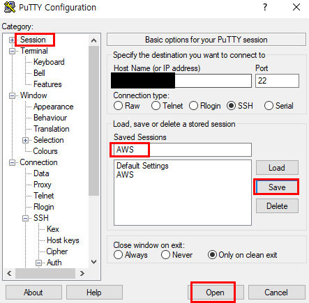

# 서버 접속을 위한 사전 준비

* 원격 서버 접속을 위해 암호화 키를 개인 보관하고 윈도우 환경에서 원격 콘솔프로그램인 PuTTY를 다운로드
  * *.ppk 암호화 키 보관
  * [사이트](https://www.putty.org/)를 통해 PuTTY 64-bit 다운로드

* HostName에 서버 IP 입력한다.

* SSH 메뉴 확장 후 Auth에서 암호화 키를 업로드한다.

* 바로 Open 버튼을 누르지 말고 Session으로 돌아와 설정 내용을 저장한다.
  * 설정 내용을 저장해 놓으면 프로그램을 열 때마다 재설정할 필요 없다.
  * Open 버튼 클릭 후 최초 접속 시 예(Y) 클릭

* 부여 받은 ID를 입력해 서버에 접속(별도의 PW필요 없음)

