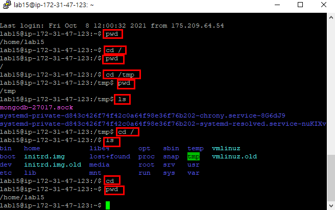

# 명령어

* pwd : 현재 위치하고 있는 디렉터리를 출력
* ls : 현재 디렉터리의 파일 리스트 출력
* cd 디렉터리명: 지정된 디렉터리로 이동
  * cd : 어떤 디렉터리에 존재하든 내 계정의 홈 디렉터리로 이동
    * 홈디렉터리 : 로그인 시 자동으로 들어가게 되는 디렉터리
* rm  파일명 : 지정된 파일을 삭제
* mkdir 디렉터리명: 디렉터리 생성

 -> At&T Bell 연구소

Ctrl + D : 로그아웃
