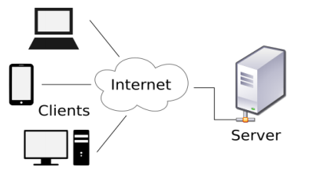
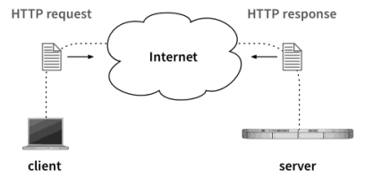
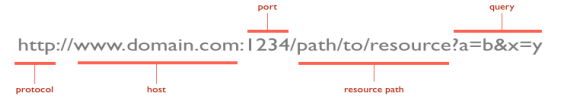
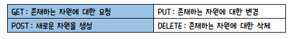
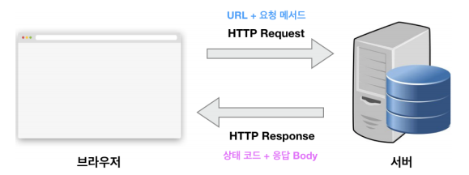
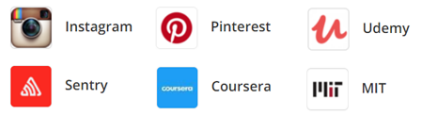
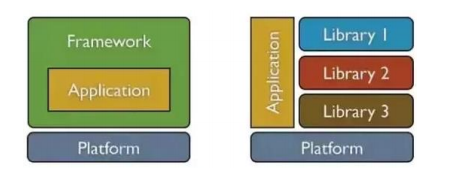
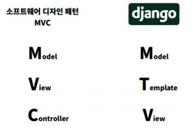
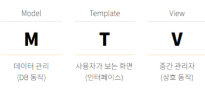
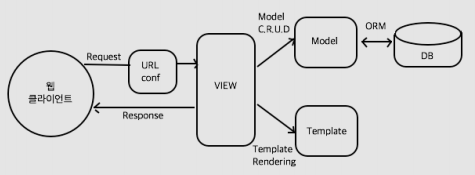

# 웹의 기본 이해

> 웹은 보통 월드 와이드 웹(**WWW : World Wide Web**)이라고도 하며, 인터넷이라는 연결을 통해 여러 컴퓨터가 연결되어 서로 정보를 나누는 연결망들을 의미한다.

### 1. 정보를 제공하는 컴퓨터와 정보를 받아가는 컴퓨터

* 서버
  * 정보를 제공하기 위해 고정된 주소(도메인, 고정 IP 등)를 차지하며 방문하는 컴퓨터들에게 필요한 정보를 제공한다.
  * 우리가 접속하는 웹 사이트들이 이에 해당한다.
* 클라이언트
  * 정보를 제공받기 위해 서버를 찾아 접속하는 컴퓨터이다.
  * 보통은 고정된 주소 없이 인터넷 연결을 통해 서벗에 접근한다.
  * 일반적으로 우리가 웹 브라우징을 위해 쓰고 있는 컴퓨터들이 이에 해당한다.

### 2. 웹 프로그램의 구조 별 개념

* 프론트엔드
  * **프론트엔드는 보통 사용자들이 보는 화면의 모습을 결정한다.**
  * 보통 **HTML, CSS, JavaScript** 프로그래밍으로 구성된다.
  * 클라이언트의 웹 브라우저에서 코드가 실행되거나 그려진다.
* 백엔드
  * **백엔드는 사용자가 접속하면 그에 맞는 데이터를 보내주기 위해 여러가지 처리를 하는 부분을 담당한다.**
  * **Django** 기반의 Python 프로그래밍이나 데이터베이스 등이 여기에 속한다.
  * 프론트엔드 코드 조각들을 가지고 있다가 사용자에게 적절하게 처리해서 보내주는 역할을 한다.
  * 보통 서버에서 프로그램이 실행된다.(CGI, PHP, ASP, Servlet, JSP, NodeJS, Spring MVC)

### 3. 서버-클라이언트 간 통신 방향 별 개념

* 요청(Request)
  * **클라이언트가 서버로 원하는 정보를 받기 위해 필요한 정보를 보내는 과정이다.**
  * 보통은 클라이언트의 IP와 접속하고 있는 브라우저 프로그램이나 모바일 여부, 요청하는 URL과 방식, 그리고 필요한 경우 서버가 처리하기 위한 데이터들을 보낸다.
* 응답(Response)
  * **요청을 받은 서버가 받은 데이터를 처리하여 사용자에게 정보를 내려주는 과정이다.**
  * 응답에는 여러가지 형태의 데이터가 내려갈 수 있는데, 보통 웹사이트에 접속했을 때 보여지는 화면들은 응답에 HTML, CSS, JavaScript 코드가 포함되어 웹 브라우저가 해석하고 실행하여 화면에 그려주게 된다. (JSON, XML, ...)

# HTTP 프로토콜 (통신규약)

> HTTP(Hypertext Transfer Protocoa)
>
> 프로토콜이란 상호 간에 정의한 규칙을 의미하며 특정 기기 간에 데이터를 주고받기 위해 정의되었다.
>
> 웹에서는 브라우저와 서버 간에 데이터를 주고받기 위한 방식으로 HTTP 프로토콜을 사용하고 있다.
>
> HTTP 프로토콜은 일반적으로 TCP/IP 통신 위에서 동작하며 기본 포트는 80번이다.

* URL

* HTTP 요청 메서드

* HTTP 상태코드(200 : OK, 404 : Not Found Error, 500 : Internal Server Error)

  * 2xx : 성공
  * 3xx : 리다이렉션
  * 4xx : 클라이언트 에러
  * 5xx : 서버 에러

  

# Django, Python 장고

> 장고는 파이썬으로 작성된 **오픈 소스 웹 애플리케이션 프레임워크**로, 모델 - 뷰 - 컨트롤러 패턴을 따르고 있다. 현재는 **장고 소프트웨어 재단**에 의해 관리되고 있다.

* 장고 공식 웹 사이트 URL : https://www.djangoproject.com/

* 장고로 개발된 웹 사이트

  

### 1. 라이브러리와 프레임워크

* 라이브러리(API)

  > 재사용이 필요한 기능으로 반복적인 코드 작성을 없애기 위해 언제든지 필요한 곳에서 호출하여 사용할 수 있도록 Class나 Function으로 만들어진 것이다.

* 프레임워크

  > 프레임워크만으로 실행되지 않으며 기능 추가를 해야 하고 프레임워크에 의존하여 개발해야 되며 프레임워크가 정의한 규칙을 준수해야 한다.

### 2. 장고 프로그램의 개발 패턴

* 장고 프로그래밍에서 사용되는 개발 패턴은 MVC(Model View Controller) 패턴이다.
* MVC는 SW 공학에서 사용되는 SW 개발 패턴으로 이 패턴을 성공적으로 사용하면 사용자 인터페이스로부터 비즈니스 로직을 분리하여, 애플리케이션의 시각적인 요소나 그 이면에서 실행되는 비즈니스 로직을 서로 영향없이 쉽게 유지 보수할 수 있는 애플리케이션을 만들 수 있다.
* MVC에서 Model은 애플리케이션에서 처리하는 데이터를 나타내며 View는 사용자 인터페이스 요소를 나타내고 Controller는 데이터와 비즈니스 로직 사이의 상호동작을 관리한다. 
* 요청과 응답의 동작으로 이루어지는 웹은 MVC 패턴을 기반으로 웹 애플리케이션 개발 시 요청 로직과 응답 로직을 나누어 개발해서 요청 요직은 Controller로 응답 로직은 View로 그리고 처리 데이터는 Model로 개발하여 확장성과 유지보수성을 향상시킬 수 있게 되어 이미 많은 사이트들이 이 MVC 패턴을 적용하여 개발되고 운용되고 있다.
* 장고 프레임 워크에서는 View를 Template, Controller는 View라고 표현하며, MVC를 MTV라고 한다. 
* Model은 데이터베이스에 저장되는 데이터의 영역 Template은 사용자에게 보여지는 영역 View는 실질적으로 프로그램 로직이 동작하여 적절한 처리 결과를 Template에게 전달하는 역할을 수행한다.

### 3. 장고의 처리 흐름

> 웹 클라이언트의 요청을 받아 장고에서 MTV 모델에 따라 처리하는 과정이다

- 클라언트로부터 요청을 받으면 URLconf 모듈을 이용하여 URL을 분석한다.
- URL 분석 결과를 통해 해당 URL에 매칭되는 뷰들 실행한다.
- 뷰는 자신의 로직을 실행하고, 데이터베이스 처리가 필요하면 모델을 통해 처리하고 그 결과를 반환 받는다.- 뷰는 자신의 로직 처리가 끝나면 템플릿을 사용하여 클라이언트에 전송할 HTML 파일을 생성한다.
- 뷰는 최종 결과로 HTML 파일을 클라이언트에게 보내 응답한다.

