# 가상환경?

> 파이썬에서 가상환경(virtual environment)은 하나의 PC에서 프로젝트 별로 독립된 파이썬 실행 환경(runtime/interpreter)을 사용할 수 있도록 해준다.

* 가상 환경을 사용하지 않으면 PC 내의 모든 프로젝트에서 운영체제에 설치된 하나의 파이썬 런타임을 사용하게 되고 동일한 위치에 외부 패키지를 설치하고 서로 공유하게 된다. 

* 이럴 경우, 하나의 프로젝트에서 설치한 패키지의 버전이 다른 프로젝트에서 설치한 동일 패키지의 다른 버전과 충돌을 일으킬 소지가 생기기 때문에, **프로젝트 별로 또는 구현하려는 기술별로 독립된 가상 환경을 구성하여 사용하는 것이 권장**된다.

* 파이썬에서 외부 패키지를 설치할 때는 일반적으로 pip이라는 패키지 매니저를 사용하는데, 기본적으로 운영체제에 파이썬이 설치된 위치의 site-packages 디렉터리에 안에 설치된다.

* 파이썬의 가상 환경을 이용하면 프로젝트 별로 따로 패키지를 설치하고, 다른 프로젝트로 부터 격리시킬 수 있기 때문에 시스템 전역 패키지 설치로 인한 불필요한 이슈를 방지할 수 있다.

* 파이썬 3.3 부터는 **venv 모듈**이 내장되기 때문에 별도 패키지 설치없이 파이썬만 설치되어 있으면 바로 가상 환경 구성이 가능하게 되었다.

# 가상환경 만들기

1. 폴더 생성

> C:\yyj\python_venv

2. 명령프롬프트 창

> **C:\yyj\python_venv** 폴더로 옮겨 다음 명령을 입력하여 가상환경, djanbovenv를 생성한다.

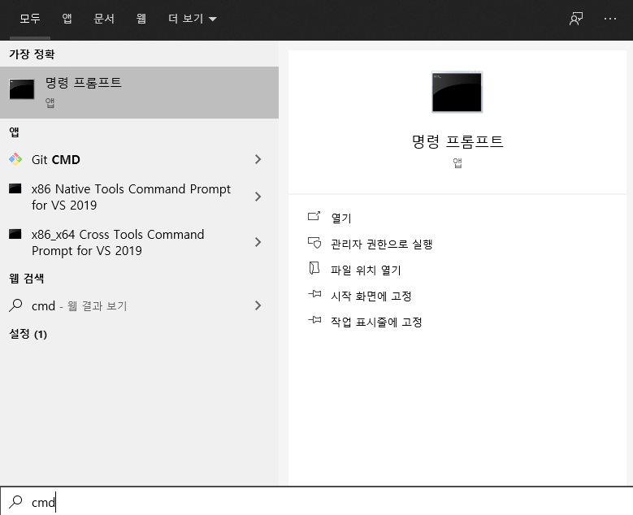

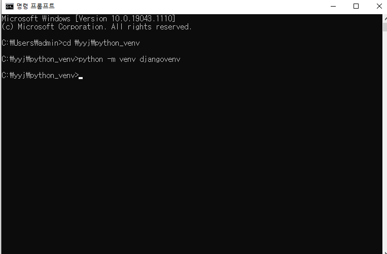

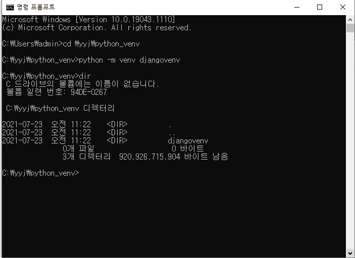

3. 생성된 djangovenv폴더의 Scripts라는 폴더로 옮겨서 activate 프로그램을 실행하여 가상환경을 활성화 한다.

> C:\yyj\python_venv>**cd djangovenv\Scripts**
>
> C:\yyj\python_venv>cd djangovenv\Scripts>**activate**

4. djangovenv라는 가상환경을 활성화하면 다음과 같이 명령 프롬프트 맨 앞에 **(djangovenv)**가 붙은 것을 확인할 수 있다.

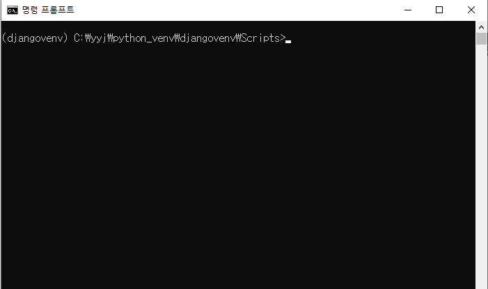

5. 가상환경을 활성화한 상태에서 이 가상환경 안에 장고 개발 환경을 설치하기 위해 **pip**명령을 실행한다.

> (djangovenv) C:\yyj\python_venv\djangovenv\Scripts>**pip install django**

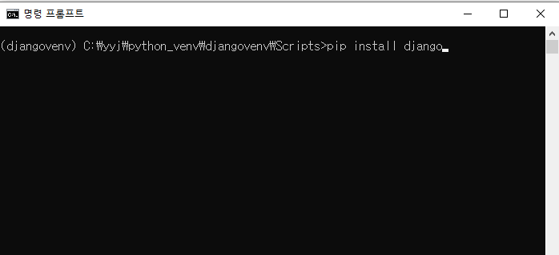

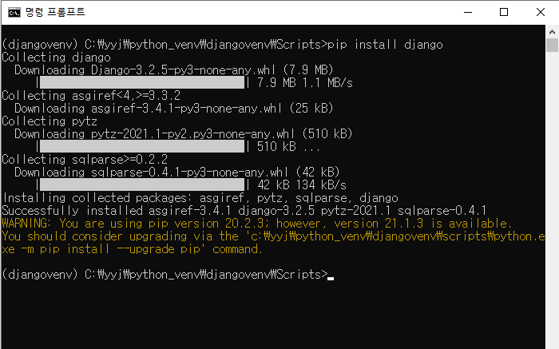

6. 위의 화면은 장고 개발환경이 설치되는 화면이다.

> 시스템에 설치된 pip의 버전 관련한 경고 오류 -> 다음 명령을 실행시켜 업그레이드 한다.
>
> (djangovenv) C:\yyj\python_venv\djangovenv\Scripts>**python -m pip install --upgrade pip**

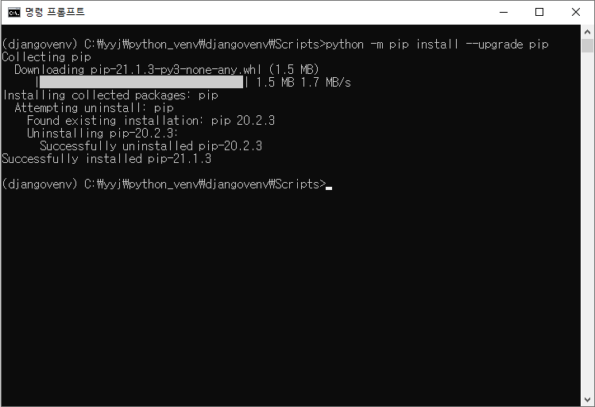

# 가상환경 안에 장고 개발 환경 설치하기

### 장고 프로젝트 만들기

1. 폴더생성

> C:\yyj\DJANGOexam

2. 명령프롬프트 창에서 C:\yyj\DJANGOexam 폴더로 이동해서 다음 명령을 입력하여 학습용 장고 프로젝트를 생성한다.

> (djangovenv) C:\yyj\python_venv\djangovenv\Scripts>**cd \yyj\DJANGOexam**
>
> (djangovenv) C:\yyj\DJANGOexam>**django-admin sratrproject studyproject**

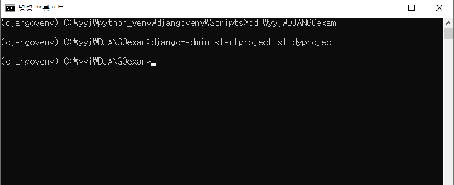

3. 생성된 studyproject 폴더로 이동해서 **python manage.py runserver** 를 입력하여 장고에 내장된 서버를 기동시킨다.

> (djangovenv) C:\yyj\DJANGOexam>**cd studyproject**
>
> (djangovenv) C:\yyj\DJANGOexam>studyproject>**python manage.py runserver**

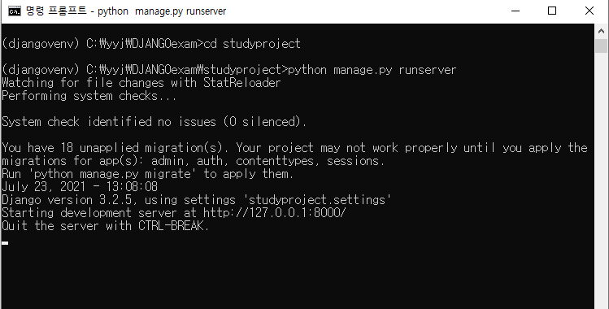

4. 크롬 브라우저에서 http://localhost:8000/ 을 입력하여 장고의 기본 웹 페이지가 출력되는 것을 확인한다.

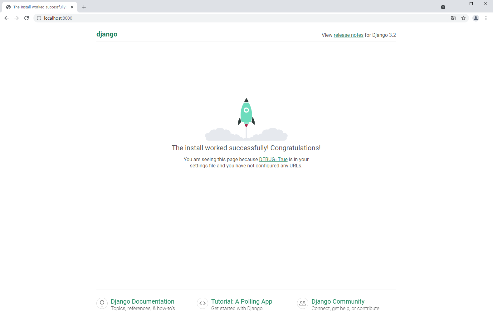

위 화면이 뜬다면 성공!!

5. cmd 창에서 **ctrl+c**를 입력하여 서버를 종료한다.

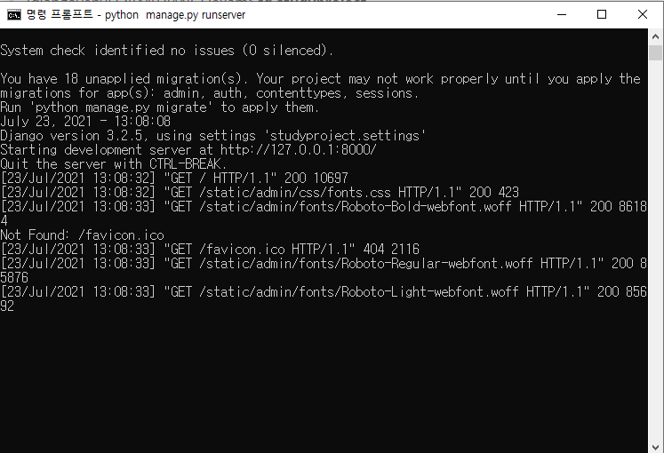

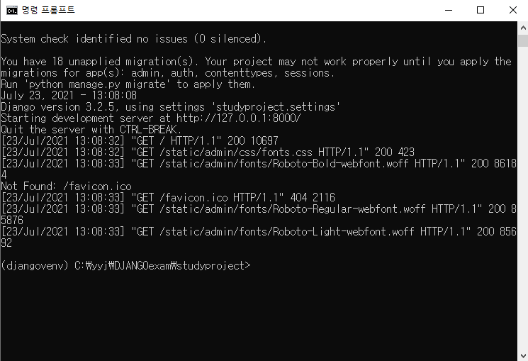

