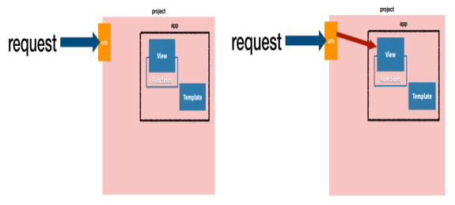
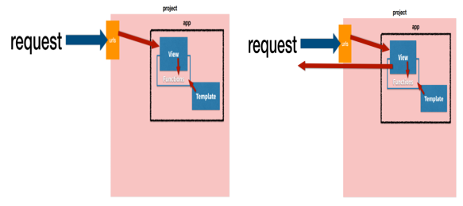
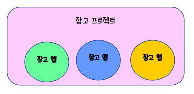

# Views와 Templates

* urls.py

> 프로젝트 폴더(메인)와 앱 폴더(서브)

* views.py

> 앱 폴더

* templates\xxxx.html

> 앱 폴더

# 장고를 이용한 웹 서버 프로그래밍

| 파일               | 설명                                                         |
| ------------------ | ------------------------------------------------------------ |
| urls.py            | 요청 시 사용될 URL 문자열의 패스와 호출될 뷰의 함수를 결정한다.(라우팅을 정한다고 한다.) |
| views.py           | GET 방식 요청을 처리할 것인지, POST 방식 요청을 처리할 것인지 결정하고 요청에 대한 기능을 수행하도록 위에서 설정한 함수에 로직을 구현한다. |
| templates/xxx.html | 수행한 결과를 클라이언트로 응답하는 기능의 템플릿을 구현한다. |

> 기동된 **서버를 종료**할 때에는 Teminal 창에서 **Ctrl+C**를 입력한다.

# 장고로 구현하는 웹 사이트 구성

