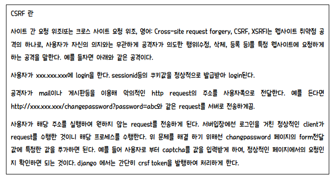
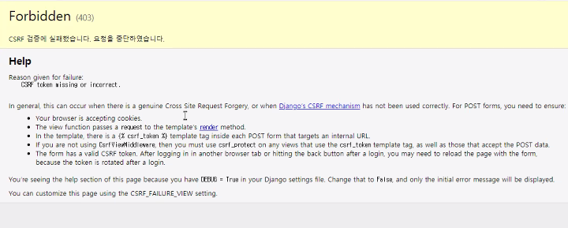

request.GET ➡ dict

request.POST ➡ dict

# query 문자열

* 웹 클라이언트인 브라우저에서 웹 서버에서 URL 문자열을 가지고 요청할 때 추가로 전달되는 name과 value로 구성되는 문자열
* W3C에서 정한 표준 규격
  * name=value&name=value&...로 구성
  * 영문자와 숫자는 그대로 구성되지만 이외의 문자들은 *%16진수코드값*으로 변환되어 구성된다.
  * 공백은 `+` 문자 또는 `%20` 또는 `%2C`로 변환되어 구성된다.


### query 문자열이 웹서버로 전달되는 방식

* GET 방식 (default)
  * Query 문자열 없이 요청할 때, 자동으로 GET 방식으로 전달된다.
  * 페이지 이동 시
    * 브라우저에서 URL 문자열을 직접 입력해서 요청한다.
    * 링크가 설정된 텍스트나 이미지를 클릭해서 요청한다.
    * `location.href` 속성으로 요청한다.
    * `<form>` 태그로 요청한다.
  * 요청 시 사용되는 URL 문자열 뒤에 `?` 기호와 함께 추가되어 전달된다.
  * Query 문자열이 외부로 보여지고, 길이에도 제한(서버마다 다름)이 있다.
  * 예) 검색어 등
* POST 방식
  * 페이지 이동 시
    * `<form>` 태그로 요청한다.
  * 요청 시 바디 안에 담겨서 전달된다.
  * Query 문자열이 외부로 보여지지 않고, 길이에도 제한이 없다.
  * 예) 로그인(회원가입), 긴 문자열 등

▶ **POST 방식 보다 GET 방식이 더 가볍게 전달하는 방식이다.**


### POST 방식의 CSRF

> 보안적으로 해결하기 위해, token 정보가 정당한 요청인지 확인하는 방법

```html

```



* POST 방식으로 전달할 때 CSRF를 안할 경우 에러 발생!!



