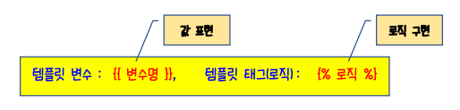
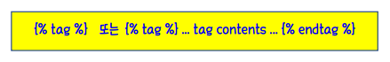

# Django 템플릿



> Django의 템플릿 언어(template language)는 강력함과 편리함 사이의 균형을 잡고자 설계되었다.
>
> 템플릿 언어를 사용하면 HTML 작업을 훨씬 수월하게 할 수 있다.
>
> 변수, 필터, 태그, 주석 4가지 기능을 제공한다.


## 1. 템플릿 변수

* 템플릿변수를 사용하면 뷰에서 템플릿으로 객체를 전달할 수 있다. 
* {{ 변수 }}와 같이 사용한다.
* 점(.) 은 변수의 속성에 접근할 때 사용한다. 
* {{ section.title }} 뷰에서 보내온 section객체의 title 속성을 출력한다.
* 변수명으로 데이터 값 추출이 안되는 경우 공백으로 처리된다


## 2. 템플릿 필터

* 템플릿필터는 변수의 값을 특정 형식으로 변환할 때 사용한다. 
* 변수 다음에 파이프(|)를 넣은 다음 적용하고자 하는 필터를 명시한다.
* 여러 개의 필터를 연속적으로 사용할 수 있다.
  *  `{{ text|escape|linebreaks }}`는 텍스트 컨텐츠를 이스케이프한 다음, 행 바꿈을 `<p>` 태그로 바꾸기 위해 종종 사용되곤 한다.
* 몇몇 필터는 : 문자를 통해 인자를 취한다.
    * 필터 인자는 `{{bio|truncatewords:30 }}`과 같이 사용하는데, 이것은 bio 변수의 처음 30 단어를 보여준다.
    * 필터 인자에 공백이 포함된 경우에는 반드시 따옴표로 묶는다.
* 장고는 30개 정도의 내장 템플릿 필터를 제공하는데, 자주 사용되는 템플릿 필터를 다음과 같다.

    * default
      * 변수가 false 또는 비어 있는 경우, 지정된 default를 사용한다.
      * `{{ value|default:"nothing" }}`
        value가 제공되지 않았거나 비어 있는 경우, 위에서는 ‚nothing‚을 출력한다.
    * length
      * 값의 길이를 반환한다. 문자열과 목록에 대하여 사용할 수 있다.
      * `{{ value|length }}`
        value가 ['a', 'b', 'c', 'd']라면, 결과는 4가 된다.
    * upper
      * `{{ story.headline|upper }}`
        'story.headline'의 값을 대문자 형식으로 변환한다.


## 3. 템플릿 태그




> HTML 자체는 프로그래밍 로직을 구현할 수 없지만, 템플릿 태그를 사용하면 if문, for문처럼 흐름을 제어할 수 있다.

* `` 로 구성한다. 

* ``와 같이 단독으로 사용할 수 있는 템플릿 태그들도 있지만, `` 처럼 뒤에 `` 템플릿 태그를 반드시 닫아주어야 하는 것들도 있다.
* 장고에는 20개가 넘는 템플릿 태그가 내장되어 있으며 내장 태그 레퍼런스에서 읽어볼 수 있다.


### 3-1. for

> 배열의 각 원소에 대하여 반복처리 해준다.

```html
<ul>

 <li>{{ student.name }}</li>

</ul>
```


### 3-2. if / else

> 변수가 true이면 블록의 컨텐츠를 표시한다.
>
> if 태그 내에 템플릿 필터 및 각종 연산자를 사용할 수 있다.

```html

 총 학생 수 : {{ student_list|length }}

 학생이 없어요!

```

```html

 Number of athletes: {{ athlete_list|length }}

 Athletes should be out of the locker room soon!

 No athletes.

```

```html

<h1> 이름과 주소를 작성하지 않았군요ㅜㅜ</h1>

<h1>당신의 이름은 {{name}} 이고 주소는 {{address}} 이군요</h1>

```


### 3-3. block 및 extends

> 중복되는 html 파일 내용을 반복해서 작성해야 하는 번거로움을 줄여준다.

```html

{{ section.title }}

<h1>{{ section.title }}</h1>

<h2>
    <a href="{{ story.get_absolute_url }}">
		{{ story.headline|upper }}
	</a>
</h2>
<p>{{ story.tease|truncatewords:"100" }}</p>


```


## 4. 템플릿 주석

> HTML 문서 상에서 주석이 필요할 때 사용하며, 장고에서는 두 가지 형식의 코멘트 형식을 제공한다.

```html
<!--한 줄-->
{# 주석 내용 #} 
<!--개행 허용되지 않음.-->

<!--여러 줄-->


<!--주석 내용-->

```

