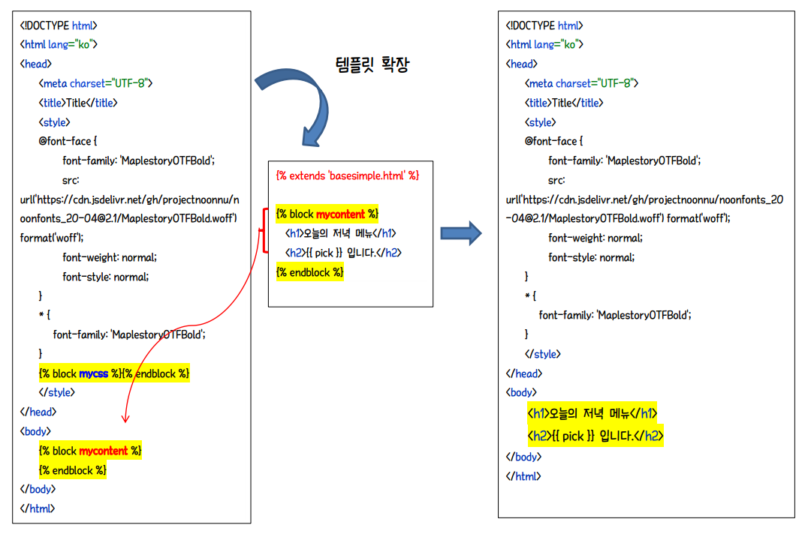
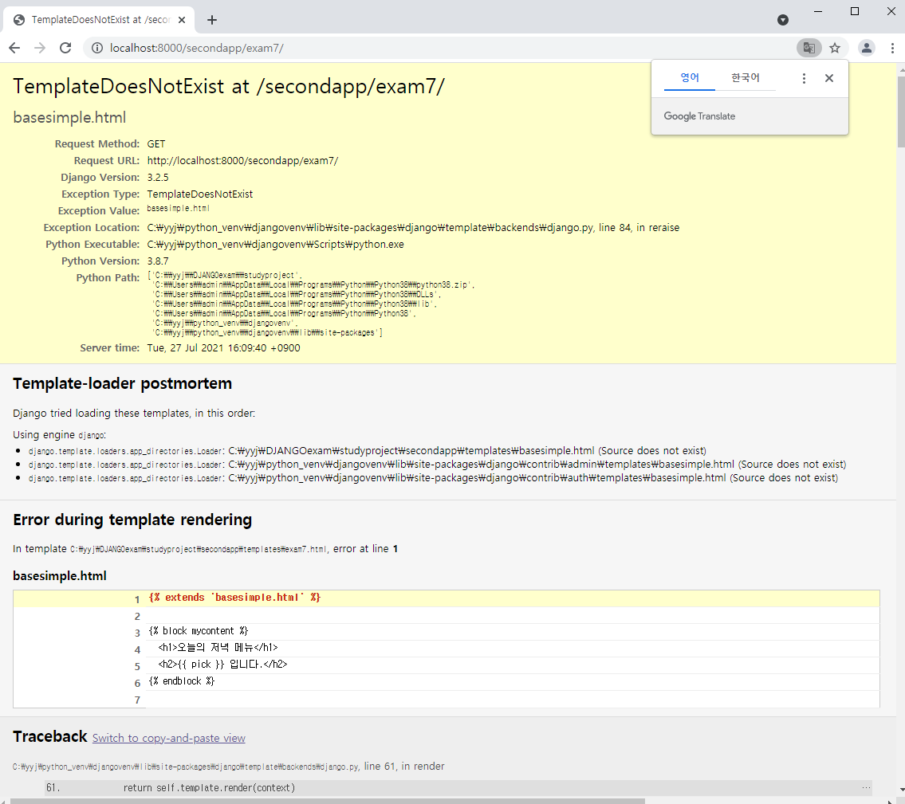
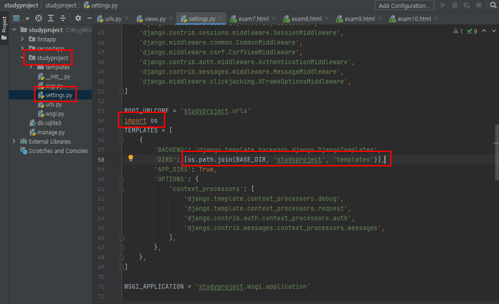

# `basesimple.html`로 템플릿 확장하기

**이때, 파일을 제대로 연동하지 않으면 다음과 같은 에러가 발생한다.**

> 브라우저에서 http://localhost:8000/secondapp/exam7/ 요청시 다음 오류가 발생하게 된다.
>
> 그 이유는 `basesimple.html` 을 찾지 못했기 때문이다. 
>
> 이를 해결하려면 다음과 같이  `studyproject/settings.py` 에서 확장하려는 베이스 템플릿 파일이 존재하는 폴더 정보를 설정해 주어야 한다.

