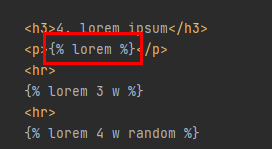

## exam7

> random으로 선택하기

```python
# 테스트 전에 dir 설정할것
def exam7(request):
    foods = ['족발', '햄버거', '치킨', '초밥']
    pick = random.choice(foods)
    context = {
        'pick': pick,
    }
    return render(request, 'exam7.html', context)
```


## exam8

> in 속성

```python
def exam8(request) :
    query = 'q' in request.GET
    if query :
        result = request.GET['q']
    else:
        result = 'q=xxx 형식으로 쿼리를 보내지 않았슈'
    context = {
        'result': result,
    }
    return render(request, 'exam8.html', context)
```


# input 태그

## exam9

> input 태그의 type="checkbox" 사용시 name 값을 같게 해서 그룹핑 해줘야 한다.


# path 설정

## exam10

> 쿼리 전달 시, 변수를 전달해야만 하는 경우
>
> 변수를 전달하지 않은 경우, 404 에러 발생!!


```python
def exam10(request, name):
    context = {
        'name': name,
    }
    return render(request, 'exam10.html', context)
```


## exam11

> path에서 변수 타입 지정하기
>
> 지정 안하면 문자열이 기본 타입!!


# tag

> 유용한 장고 템플릿 태그들 및 내장 변수

## exam13

```python
def exam13(request):
    foods = ['짜장면', '초밥', '차돌짬뽕', '콩국수']
    empty_list = []
    messages = 'Life is short, You need Python'
    datetime_now = datetime.now()
    context = {
        'foods': foods,
        'empty_list': empty_list,
        'messages': messages,
        'datetime_now': datetime_now,
    }
    return render(request, 'exam13.html', context)
```

1. 반복문

> forloop.counter


2. 조건문

> forloop.first/forloop.last


# filter

> 변형(filtering) : 변수의 내용을 제한하는 기능

3. length filter


* 리스트의 길이 관련

```python
<p> {{ foods }} </p>
<p> {{ foods|length }} </p>
<p> {{ foods.0 }} </p>
<p> {{ foods.0|length }} </p>
<p> {{ foods.1 }} </p>
<p> {{ foods.1|length }} </p>
```


4. lorem ipsum(로렘입숨)

> 의미 없는 단어들의 묶음을 출력하는 기능




5. 글자수 제한

> 문자열
>
> 단어 갯수 제한/문자 갯수 제한 + 축약형(...) ▶ 축약형 포함 숫자


6. 글자 관련 필터


7. 연산 필터

> add(덧셈), divisibleby(나눈 결과의 boolean)


# 날짜 관련 템플릿

8. 날짜 표현

> now + 장고에 내장된 날짜 표현
>
> { % now "Y y m n M d j w D l z" % } : 자릿수 표현


------


### *[추가 장고 템플릿 태그](https://docs.djangoproject.com/en/3.2/ref/templates/builtins/)*


