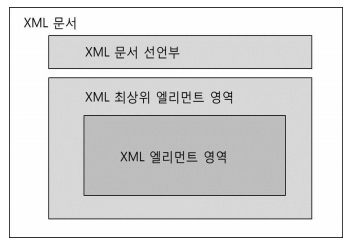
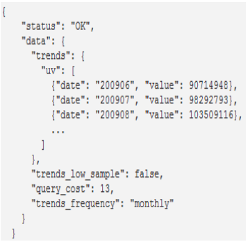
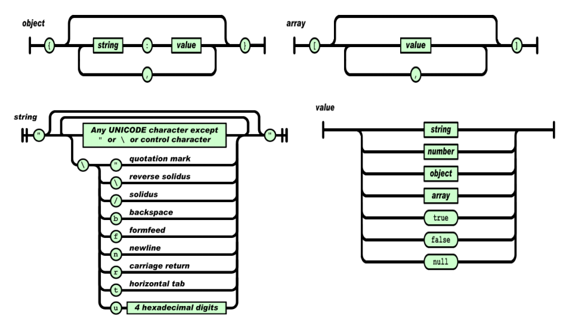
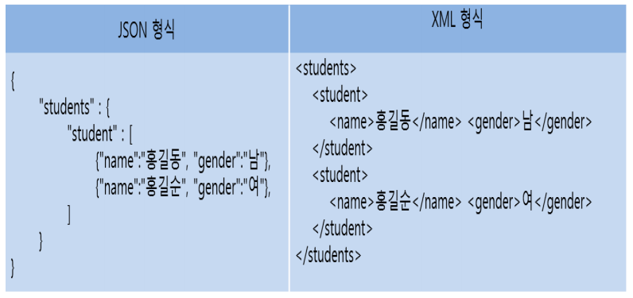

# XML

> Extensible Markup Language

* XML 문서
  * XML 선언부를 제외하고는 기존 HTML5의 기본 구조와 사용 방법이 거의 유사하다.
  * XML 문서 선언부
    * 반드시 맨 앞에 명세하고, XML 문서 유형을 지정한다.
    * XML 문서 구조를 정의한 DTD(또는 XML Schema) 선언, 스타일을 정의한 CSS 연결에 대한 선언도 명세
  * 하나의 최상위 엘리먼트의 <시작태그>로 시작해서 </종료태그>로 끝난다.
  * 최상위 엘리먼트를 포함하여 XML 문서의 모든 태그들은 자유롭게 정의한다.
  * 엘리먼트의 시작 태그 안의 속성도 자유롭게 정의한다.

# JSON

> ​	JSON(제이슨, JavaScript Object Notation)은, 인터넷에서 자료를 주고 받을 때 그
> 자료를 표현하는 방법이다. 자료의 종류에 큰 제한은 없으며, 특히 컴퓨터 프로그램의
> 변수값을 표현하는 데 적합하다. 형식은 자바스크립트의 구문 형식을 따르지만, 
> 프로그래밍 언어나 플랫폼에 독립적이므로 C, C++, C#, 자바, 자바스크립트, 펄, 파이썬
> 등 많은 언어에서 이용할 수 있다.

* JSON 문법은 자바스크립트 표준인 ECMA-262 3판의 객체 문법에 바탕을 두며, 인코딩은 유니코드로 한다. 
* 표현할 수 있는 기본 자료형으로는 수, 문자열, 참/거짓, null이 있고, 집합 자료형으로는 배열과 객체가 있다.

### JSON의 장점

- JSON은 텍스트로 이루어져 있으므로, 사람과 기계 모두 읽고 쓰기 쉽다.
- 프로그래밍 언어와 플랫폼에 독립적이므로, 서로 다른 시스템갂에 객체를 교홖하기에 좋다.
- JSON은 개방형 표준이며, 읽기 및 쓰기가 쉽고 가볍다.

# XML과 JSON 비교

