# AJAX

> AJAX(Asynchronous JavaScript and XML)

* 고전적인 웹의 통신 방법은 웹페이지의 일부분을 갱신하기 위해 페이지 전체를 다시 로드 해야 했다.
* AJAX의 핵심은 **재로드(refresh 재갱신)하지 않고 웹페이지의 일부분만을 갱신**하여 웹서버와 데이터를 교환하는 방법이다. 즉, **빠르게 동적 웹페이지를 생성하는 기술**이다.

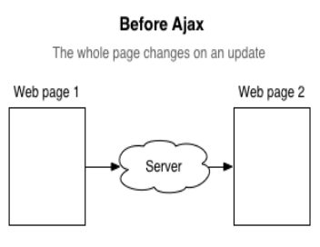

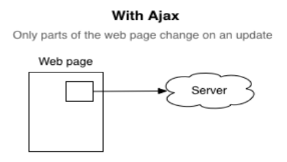

### 고전적 웹 통신과 AJAX 웹 통신

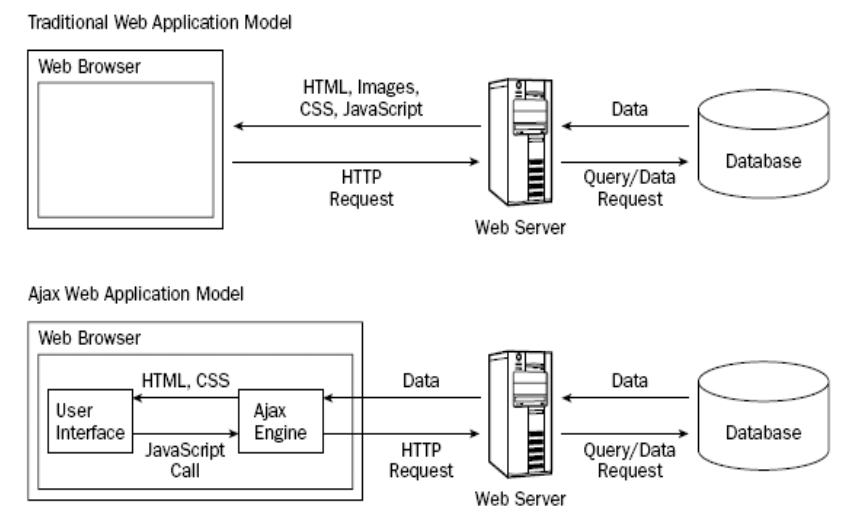

* 고전적 웹 통신(동기)

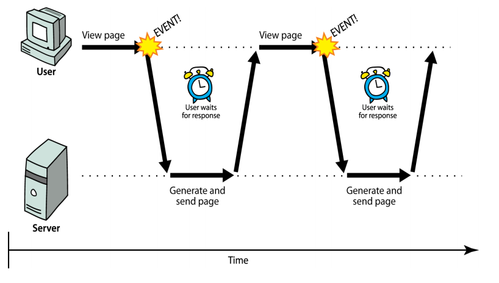

* 고전적 웹 통신(비동기)

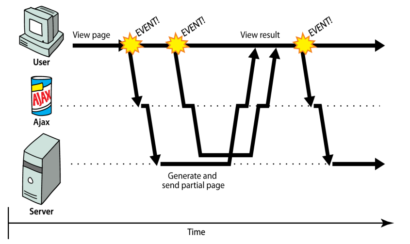

* AJAX의 동작 과정

① 이벤트 발생에 의해 이벤트핸들러 역할의 JavaScript 함수를 호출한다.
② 핸들러 함수에서 XMLHttpRequest 객체를 생성한다. 요청이 종료되었을 때 처리할 기능을 콜백함수로 만들어 등록한다. 
③ XMLHttpRequest 객체를 통해 서버에 요청을 보낸다.
④ 요청을 받은 서버는 요청 결과를 적당한 데이터로 구성하여 응답한다.
⑤ XMLHttpRequest 객체에 의해 등록된 콜백함수를 호출하여 응답 결과를 현재 웹 페이지에 반영한다.

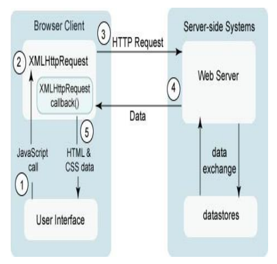

# AJAX(2)

## XMLHttpRequest 객체

* 서버 측과의 비동기 통신을 제어하는 것은 XMLHttpRequest 객체의 역할이다.
* XMLHttpRequest 객체를 이용함으로써 지금까지 브라우저가 실행해 온 서버와의 통신 부분을 JavaScript가 제어할 수 있게 된다.
* XMLHttpRequest 객체 생성 : **new XMLHttpRequest()**

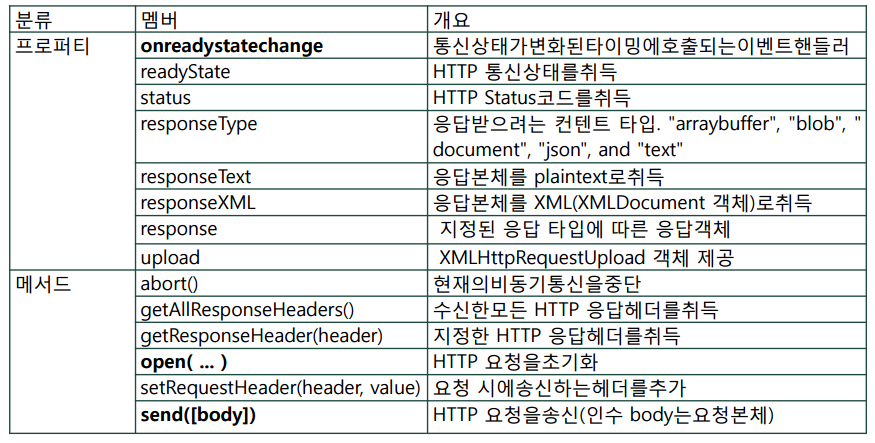

## FormData

* FormData 객체는 폼의 각 필드와 값을 나타내는 키/값 쌍들의 집합을 쉽게 구성할 수 있는 방법을 제공하며, 이를 이용하면 데이터를 "multipart/form-data" 형식으로 XMLHttpRequest의 send() 메소드를 사용하여 쉽게 전송할 수 있다.

  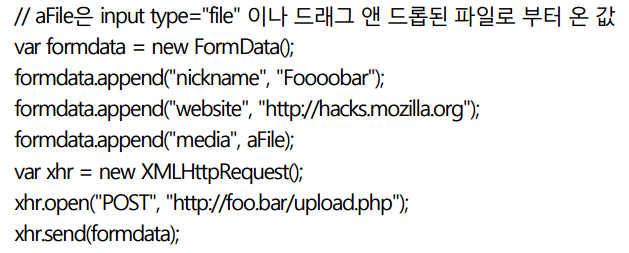

* HTML form 엘리먼트의 DOM 객체는 폼의 데이터를 FormData 객체로 얻개 해주는 getFormData() 메소드를 제공한다.

  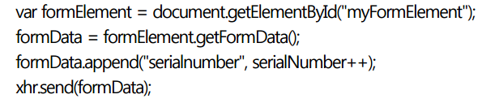

## redyState 값

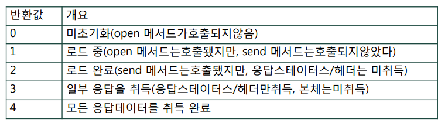

[XMLHttpRequest 객체에서 제공되는 이벤트 관련 속성]

* onloadstart
* onprogress
* onabort
* onerror
* onload
* ontimeout
* onloadend
* onreadystatechange

## open()과 send() 메서드

* **open(HTTP 메서드, URL [, 비동기 모드 통신 여부])**
  * HTTP 메서드 : 요청 방식(GET, POST, PUT, DELETE)
  * URL : AJAX로 요청하려는 서버의 대상 페이지
  * 비동기 모드 통신 여부 : true(비동기 통신), false(동기 통신)
* **send([요청 파라미터])**
  * POST의 경우 Query 문자열을 인수로 지정
  * ArrayBufferView, Blob, Document, DOMString, FormData, numm이 올 수 있다.

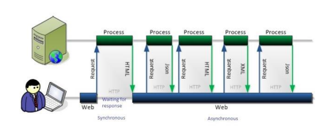

## jQuery의 AJAX 지원 API

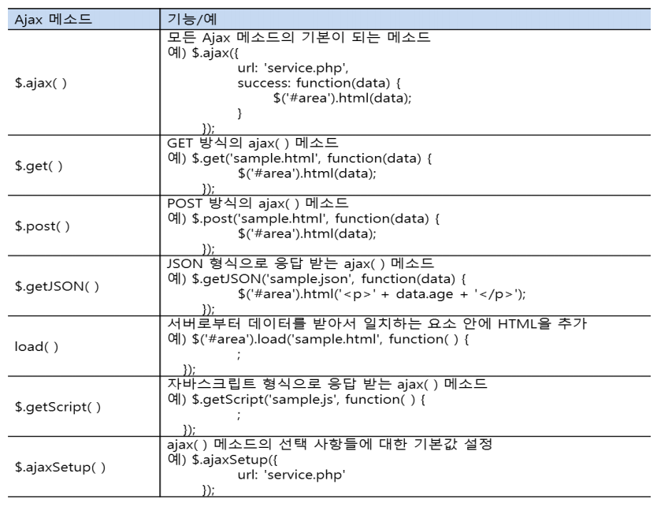

* $.ajax() 메서드

  * 모든 AJAX 메서드가 내부적으로 사용하는 기본 메서드

  * AJAX 요청을 기본적으로 부분부터 직접 설정하고 제어할 수 있어 다른 AJAX 메서드로 할 수 없는 요청도 수행 가능

  * $.ajax() 메서드의 기본 형식

    

    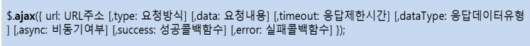

* $.ajax() 메서드 선택 항목들(options)을 맵 형식으로 명세

  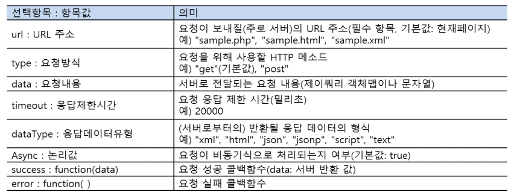

* $.getJSON() 메서드

  * GET 요청 방식으로 서버로부터 JSON 형식의 데이터를 요청

    

  * $.getJSON 메서드 입력 인자

    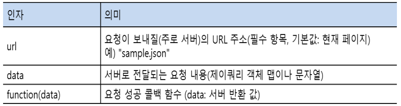

* $.load() 메서드

  * 서버로부터 데이터를 받아오는 가장 간단한 메서드로 많이 이용

  * 서버로부터 데이터를 받아 메서드를 실행하는 대상 엘리먼트에 직접 추가 -> 복잡한 선택 사항을 설정하지 않고도 빠르고 간단하게 웹 페이지의 동적 갱신이 가능

  * 요청이 성공하면 메서드가 실행되는 대상 엘리먼트 내용이 서버에서 응답 받은 HTML5 마크업 데이터로 대체

    

  * $.load() 메서드 선택 항목

    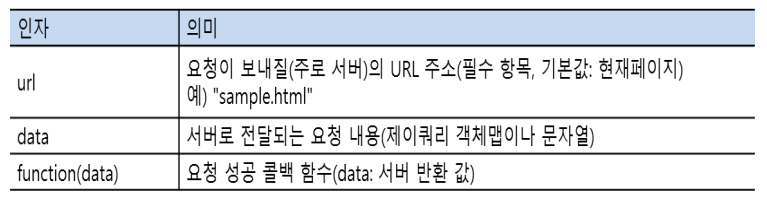

## SOP(Same Origin Policy)

> 브라우저에서 보안상의 이슈로 **동일 사이트의 지원(Resource)만 접근**해야 한다는 제약이다. AJAX는 이 제약에 영향을 받으므로 Origin 서버가 아니면 AJAX로 요청한 컨텐츠를 수신할 수 없다.

## CORS(Cross Origin Resource Sharing)

> 초기에는 Cross Domain이라고 하였다.
>
> 동일 도메인이 포트만 다른 경우, 로컬 파일인 경우 등으로 인해 Origin으로 용어가 통일 되었다.
>
> Origin이 아닌 다른 사이트의 자원을 접근하여 사용한다는 의미이다.
>
> Open API의 활성화와 공공 DB의 활용에 의해서 CORS의 중요성이 강조되고 있다.
>
> HTTP Header에 CORS와 관련된 항목을 추가한다.

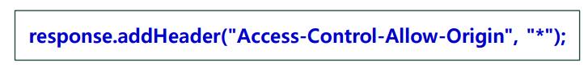

