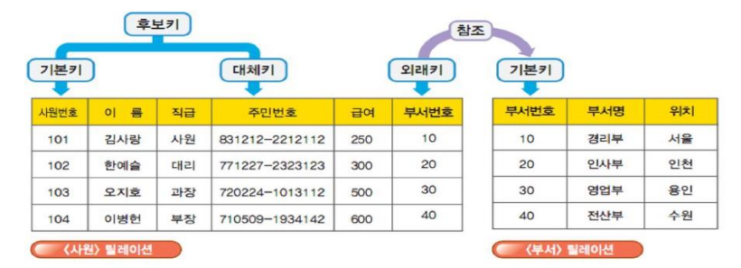

# DataBase 개요

## 데이터의 분류

> 정형 데이터, 반정형 데이터, 비정형 데이터

* 정형 데이터(structured data)

  * 구조화된 데이터, 즉 미리 정해진 구조에 따라 저장된 데이터

  * 예) 엑셀의 스프레드시트(csv), 관계 데이터 베이스의 테이블

    

* 반정형 데이터(semi-structured data)

  * 구조에 따라 저장된 데이터이지만 데이터 내용 안에 구조에 대한 설명이 함께 존재

  * 구조를 파악하는 파싱(parsing) 과정이 필요

  * 보통 파일 형태로 저장

  * 예) 웹에서 데이터를 교환하기 위해 작성하는 HTML, XML, JSON 문서나 웹 로그, 센서 데이터 등

    

* 비정형 데이터(unstructured data)

  * 정해진 구조가 없이 저장된 데이터

  * 예) 소설 데이터의 텍스트, 영상, 이미지, 워드나 PDF 문서와 같은 멀티미디어 데이터

    

## 데이터와 정보

* 데이터 : 컴퓨터 사용 시  불규칙하게 만들어지는 다양하고 많은 값들
* 정보 : 체계적이고 조직적으로 관리하고 사용되는 데이터, 여러 가지 값들로 표현되는 데이터를 의미 있고 가치 있는 형태로 가공해 놓은 것

## 데이터베이스와 데이터베이스 관리 시스템

* 데이터베이스 : 특정 조직 내에서 다수의 사용자들이 공유해 사용할 수 있도록 통합하고 저장한 운영 데이터의 집합체
* 데이터베이스 관리 시스템(DBMS) : 데이터베이스를 생성하여 안정적이고 효율적으로 운영하는 데 필요한 기능들을 제공하는 소프트웨어

* 데이터베이스 관리 시스템(DBMS)의 종류

## 데이터베이스 사용자

> 일반 사용자, 응용 프로그래머, 데이터베이스 관리자

##  데이터베이스 특징

* 데이터의 중복을 최소화 할 수 있다.
  * 데이터베이스를 이용하면 업무의 흐름에 따라 데이터를 통합 및 분리하여 관리할 수 있게 되므로 이러한 중복성을 줄일 수 있다.
* 데이터의 일관성을 유지할 수 있다.
  * 데이터의 불일치성(inconsistency)을 미리 방지하여 데이터를 정확하게 만들고 사용자에게 신뢰할 만한 정보를 제공할 수 있다.
* 데이터의 무결성을 유지할 수 있다.
  * 무결성(integrity) : 데이터베이스에 정확한 데이터가 유지되고 있음을 보장하는 것으로, 데이터베이스에서 가장 중요한 개념이다.
  * 제약조건에 맞지 않는 데이터는 아예 입력되지 않도록 방지하는 기능을 제공해 데이터베이스의 무결성을 유지한다.

## 파일 시스템(File System)

> 파일 시스템 데이터를 관리함에 있어 파일을 읽고 쓰는 애플리케이션에 종속적이다.
>
> 호환성이 없고 데이터 종속성이 있고 데이터 중복성이 있다는 문제점이 있다.

* 데이터의 독립성을 유지할 수 있다.
  * 독립성 : 데이터의 표현 방법이나 저장 위치가 변하더라도 응용 프로그램에는 아무런 영향을 미치지 않는 것이다.
  * 데이터베이스의 경우 데이터를 테이블 구조로 관리하기 때문에 독립성을 더욱 강화할 수 있다.
* 데이터의 공유성을 최대화할 수 있다.
  * 데이터베이스는 공동작업에 맞게 구조적으로 설계되며 통합된 체계에 의해 저장된 값들이 유지/관리 되어야 하며, 조직의 구성원들은 응용 프로그램을 통해 데이터베이스에 저장된 공유 데이터들로부터 각자의 업무에 필요한 정보를 생성할 수 있다.
* 데이터의 보완성을 최대화 할 수 있다.
  * 데이터베이스 시스템의 성능을 평가하는 중요한 요소로, 최근 대부분의 데이터베이스 시스템은 이러한 보완 기능을 제공한다.
* 데이터를 표준화하여 관리할 수 있다.
  * 데이터를 사용 목적 등의 유형별로 분류해 데이터의 형식이나 길이, 이름 등을 설정할 수 있다.

## 데이터 모델의 개요

> 개념적 데이터 모델과 논리적 데이터 모델

## E-R 모델링

다음은 관계 데이터 모델을 ERD 표기법 중 **정보 공학 표기법**으로 나타낸 것이다.

> [ERD 작성 무료 웹](https://aquerytool.com/)

## 관계형 데이터베이스

> 관계형 데이터 모델 사용은 현재까지 가장 안정적이고 효율적인 데이터베이스로 알려져 있다.
>
> 개체를 테이블로 사용하고 개체들 간의 공통 속성을 이용해 서로 연결한다.
>
> 자료의 구조가 단순한 업무에 적합하다.

## 관계형 데이터베이스 구성 요소

* 테이블 : 릴레이션 혹은 엔티티, 열(Column)과 행(Row)으로 구성된다.
* 필드 : 속성 혹은 컬럼, 열에 해당하며 데이터 값을 기억하는 기억 단위이다.
* 레코드 : 투플, 테이블의 행에 해당하며 카디널리티이다.
* 후보 키 : 한 테이블 내에서 데이터 레코드를 고유하게 식별할 수 있는 필드
* 기본 키 : 후보 키 중에서 대표로 선정된 키
* 외리 키 또는 참조 키 : 관계가 설정된 다른 테이블의 기본 키를 참조하는 키

## 데이터 제약 조건(무결성)

* 개체 무결성
  * 기본 키로 제약조건을 지정한 속성은 공백(NULL) 값이나 중복된 값을 가질 수 없다.
* 참조 무결성
  * 외래 키를 통해 릴레이션은 참조할 수 없는 외래 키 값을 가질 수 없도록 함으로써 두 테이블 간의 데이터 무결성을 유지하는 것이다.
  * 외래 키 값은 NULL이거나 참조 릴레이션의 기본 키 값과 동일해야 한다.

## 정규화

> 불필요한 데이터의 중복을 피하고 이상현상을 방지하기 위해 테이블을 분해(decomposition)하는 과정이다. 함수적 종속이 중요한 역할을 한다.

* 데이터 중복의 문제점

  * 데이터를 중복 저장하는 경우에는 데이터 변경에 의해 원하지 않던 결과가 발생할 수 있다.
  * 이를 이상현상(anomaly)이라 한다.
  * 이상현상의 종류 : 삽입이상, 삭제이상, 수정이상
    * 삽입이상(insertion anomaly)
      * 임의의 값을 생성해서 넣어야 할 때, 데이터를 삽입할 수 없거나 원치 않는 데이터를 삽입하는 경우
    * 삭제이상(deletion anomaly)
      * 삭제되지 말아야 할 정보까지 함께 삭제되는 현상
    * 수정이상(update anomaly)
      * 중복된 정보의 일부만 수정하여 정보의 불일치(inconsistency)가 발생하는 현상
  * 해결방안으로, 테이블의 열 데이터를 분리하여 department 테이블을 생성한다.

  

## 관계 유형

> 표현방법 : 일대일, 일대다, 다대다

* 일대일(One to One) 관계 (1:1)

* 일대다(One to Many) 관계(1:N)

