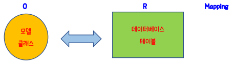

# Django 모델(Model)

> Django에서 모델은 데이터 서비스를 제공한다. Django의 모델은 각 Django App 안에 기본적으로 생성되는 **models.py** 모듈 안에 정의하게 된다. models.py 모듈 안에 **하나 이상의 모델 클래스**를 정의할 수 있으며, 하나의 모델 클래스는 데이터베이스에서 하나의 테이블에 해당된다.

* Django 모델은 "django.db.models.Model" 의 자식 클래스이며, 모델의 필드는 클래스의 속성(Attribute)로 표현되고 테이블의 컬럼에 해당한다.
* Primary Key(기본키)가 지정되지 않으면, 모델에 Primary Key 역활을 하는 id 필드가 자동으로 추가되며 DB 테이블 생성 시 자동으로 값이 1씩 증가되는 id 컬럼이 생성된다.
* Django 에서 필드는 모델을 생성할 때 필수적인 요소이며 필드를 clean, save, delete 등과 같이 모델 API 와 동일한 이름으로 생성하지 않도록 주의해야 한다.

* 모델 클래스에 필드를 정의하기 위해 인스턴스 변수가 아닌 **클래스 변수**로 정의하며, 변수에는 테이블의 컬럼의 메타 데이터를 정의한다.
* 필드를 정의하는 각각의 클래스 변수는 models.CharField(), models.IntegerField(), models.DataTimeField(), models.TextField() 등이 각 필드 타입에 맞는 Field 클래스 객체를 생성하여 할당한다.
* Field 클래스는 여러 종류가 있는데, 생성자 함수 호출 시 필요한 옵션들을 지정할 수 있다.

## 필드 타입

> 모델의 필드에는 다음과 같이 다양한 타입들이 있다. 모든 필드 타입 클래스들은 "Field" 클래스의 자손 클래스들이다.

| 필드 타입     | 설명                                                         |
| ------------- | ------------------------------------------------------------ |
| CharField     | 제한된 문자열 필드. 최대 길이를 max_length옵션에 지정해야 한다. 문자열의 특별한 용도에 따라 CharField 파생 클래스로서, 이메일 주소를 체크하는 **EmailField**, IP 주소를 체크하는 **GenericIPAddressField**, 콤마로 정수를 분리한 **CommaSeparatedIntegerField**, 특정 폴더의 파일 패스를 표현하는 **FilePathField**, URL을 표현하는 **URLField** 등이 있다. |
| TextField     | 대용량 문자열을 갖는 필드.                                   |
| IntegerField  | 32비트 정수형 필드. 정수형 사이즈에 따라 **BigIntegerField**, **SmallIntegerField** 를 사용할 수 있다. |
| BooleanField  | true/false 필드. Null을 허용하기 위해서는 **NullBooleanField**를 사용한다. |
| DateTimeField | 날짜와 시간을 갖는 필드. 날짜만 가질 경우는 **DateField**, 시간만 가질 경우는 **TimeField**를 사용한다. auto_now_add(생성)과 auto_now(수정)을 true로 설정하면 생성 또는 수정 시 기본 타임존 시간으로 변경된다. |
| DecimalField  | 소수점을 갖는 decimal 필드.                                  |
| BinaryField   | 바이너리 데이터를 저장하는 필드.                             |
| FileField     | 파일 업로드 필드.                                            |
| ImageField    | FileField의 파생 클래스로서 이미지 파일인지 체크하는 필드.   |

위와 같은 필드 타입 클래스 이외에, Django 프레임워크 테이블 간 혹은 필드 간 관계(Relationship)을 표현하기 위해 **ForeignKey, ManyToManyField, OneToOneField**클래스를 제공하고 있다.

특히 ForeignKey는 모델 클래스 간의 Many-To-One(혹은 One-To-Many) 관계를 표현하기 위해 흔히 사용된다.

## 필드 옵션

> 모델의 필드는 필드 타입에 따라 여러 옵션(혹은 Argument)를 가질 수 있다.

| 필드 옵션                      | 설명                                                         |
| ------------------------------ | ------------------------------------------------------------ |
| null(Field.null)               | null=True이면, Empty 값을 DB에 NULL로 저장한다. DB 테이블에서 NULL이 허용되는 필드가 된다. (예: models.IntegerField(null=True)) |
| blank(Field.blank)             | blank=False이면, Required 필드가 된다. blank=True이면, Optional 필드이다. (예: models.DateTimeFiled(blank=True)) |
| primary_key(Field.primary_key) | 해당 필드가 Primary Key임을 표시한다. (예: models.CharField(max_length=10, primary_key=True)) |
| unique(Field.unique)           | 해당 필드가 테이블에서 Unique함을 표시한다. 해당 컬럼에 대해 Unique Index를 생성한다. (예: models.IntegerField(unique=True)) |
| default(Field.default)         | 필드의 디폴트값을 지정한다. (예: models.CharField(max_length=2, default="WA")) |

## DB Migration

> Django에서 Model 클래스를 생성하고 난 후, 해당 모델에 상응하는 DB 테이블을 데이터베이스에서 생성할 수 있다. Python 모델 클래스의 수정(및 생성)을 DB에 적용하는 과정을 **Migration**이라 부른다. 

* 이는 Django가 기본적으로 제공하는 ORM(Object-Relational Mappint) 서비스를 통해 진행된다.

* Django 모델 클래스로부터 테이블을 생성하기 위해서는 크게 Migration을 준비하는 과정과 이를 적용하는 과정으로 나뉜다.

* DB Migration을 수행하려면 해당 앱이 settings.py 파일 안의 INSTALLED_APPS 리스트에 등록되어 있어야 한다.

