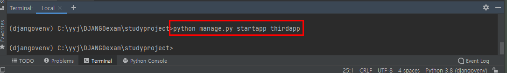
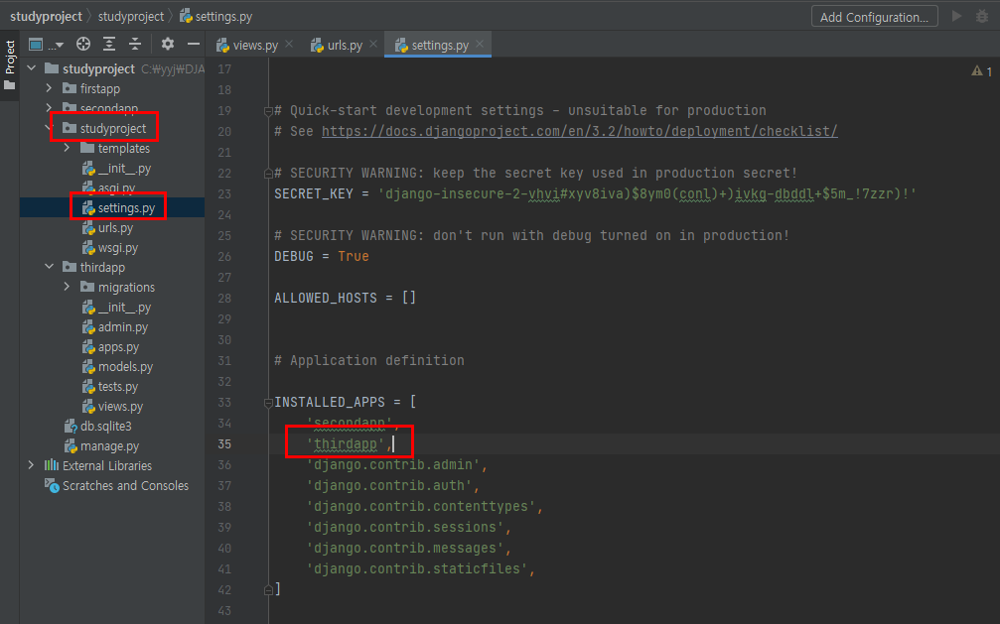
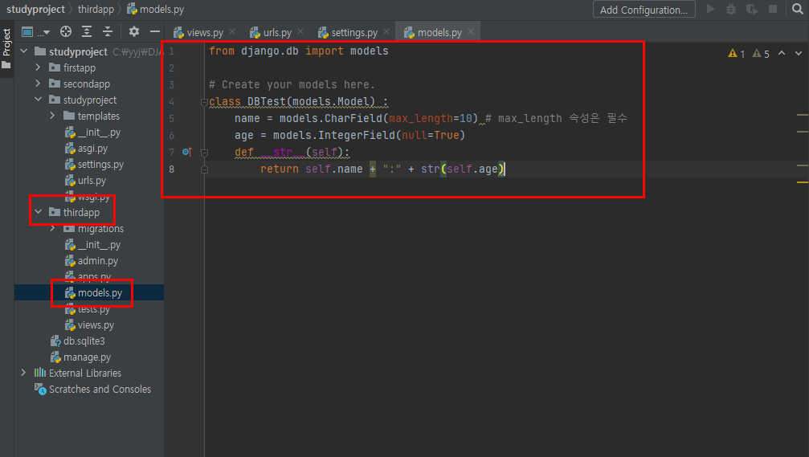
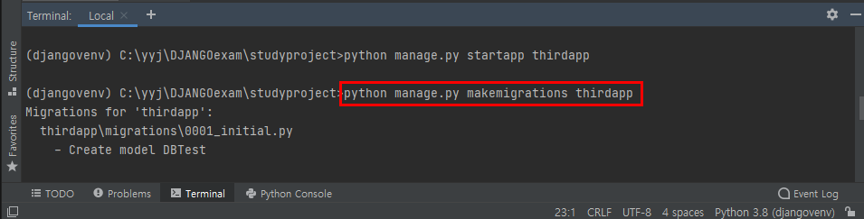
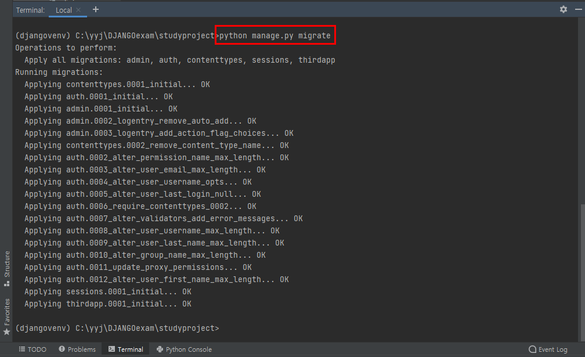
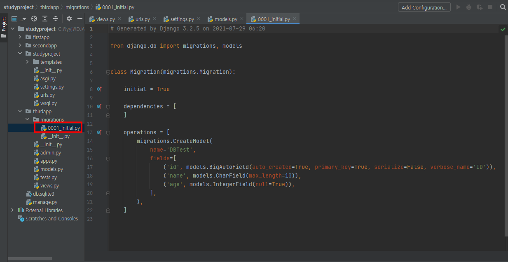

# DB Migration

* thirdapp을 생성하고 thirdapp을 등록한다. (반드시 생성하고 나서 등록한다.)

  > python manage.py startapp thirdapp





* thirdapp 폴더의 models.py를 오픈하여 다음 내용을 작성한다.

```python
from django.db import models

# Create your models here.
class DBTest(models.Model) :
    name = models.CharField(max_length=10) # max_length 속성은 필수
    age = models.IntegerField(null=True)
    def __str__(self):
        return self.name + ":" + str(self.age)
```




**모델 소스를 읽고 생성될 DB 테이블의 SQL을 수행하기 위한 파이썬 소스 생성** : migrations/0001_initial.py

> python manage.py makemigrations thirdapp




**생성된 SQL을 실행시켜 SQLite에 테이블 생성**

> python manage.py migrate






