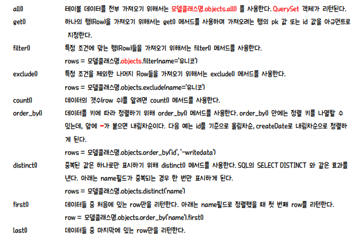
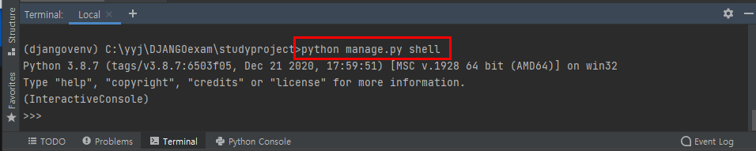
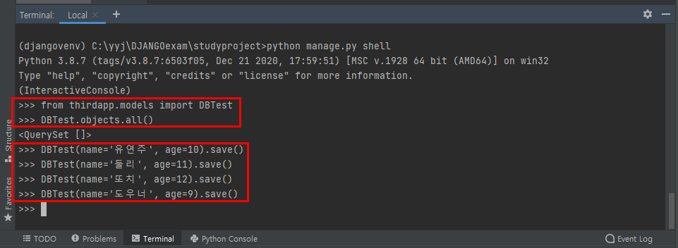
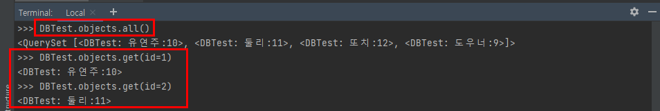
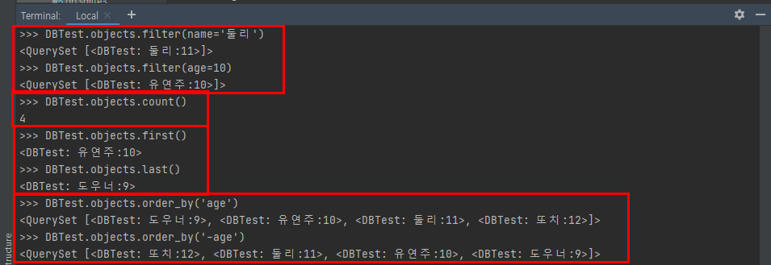
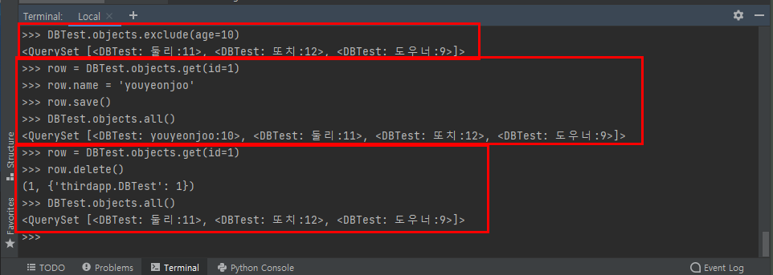

# Django Model API

> 앞의 Django 모델처럼 모델 클래스를 정의하게 되면, Django는 데이터를 추가/갱신하고 읽어 들일 수 있는 다양한 데이터베이스 API들을 자동으로 제공한다. 이러한 기능은 Django가 ORM 서비스를 기본적으로 제공함에 따른 것으로 데이터베이스를 편리하게 핸들링할 수 있게 도와준다.

## INSERT

> 데이터를 삽입하기 위해서는 먼저 테이블에 해당하는 모델(Model Class)로 부터 객체를 생성하고, 그 객체의 **save()** 메서드를 호출한다. save() 메서드가 호출되면, SQL의 INSERT가 실행되어 테이블에 데이터가 추가된다.

## SELECT

> Django는 디폴트로 모든 Django 모델 클래스에 대해 **objects**라는 Manager(django.db.models.Manager) 객체를 자동으로 추가한다. Django에서 제공하는 이 Manager를 통해 특정 데이터를 필터링 할 수도 있고 정렬할 수도 있으며 기타 여러 기능들을 사용할 수 있다. 데이터를 읽어오기 위해서는 Django 모델의 Manager 즉 **모델클래스.objects**를 사용한다.

Django Model API에는 기본적으로 제공하는 여러 쿼리 메서드들이 있는데, 자주 사용되는 주요 메서드는 다음과 같다.

쿼리 메서드들은 실제 데이터 결과를 직접 리턴하는 것이 아니라 **쿼리 표현식(Django에서 QuerySet)**을 리턴하는데, 여러 메서드들을 체인처럼 연결하여 사용할 수 있다.

여러 체인으로 연결되면 최종적으로 리턴 된 쿼리가 해석되어 DB에는 실제 하나의 쿼리를 보내게 된다.

> **row = 모델클래스명.object.filter(name='유연주').order_by('-writedate').first()**

## UPDATE

> 데이터를 수정하기 위해서는 먼저 수행할 행(Row)객체를 얻은 후, 변경할 필드들을 수정한다. 마지막에 save() 메서드를 호출하면, SQL의 UPDATE 명령이 실행되어 테이블의 데이터가 갱신된다.

## DELETE

> 데이터를 삭제하기 위해서는 먼저 삭제할 행(Row)객체를 얻은 후, delete() 메서드를 호출한다.

## Django 모델에서 API를 테스트 해보기

> 터미널에서 python manage.py shell을 실행시키고 인터랙티브 파이썬 실행 모드를 기동시킨다.

