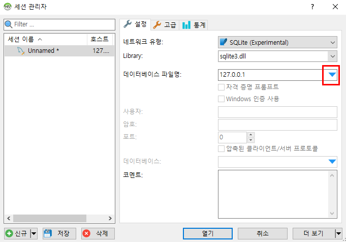

# HeidiSQL

> HeidiSQL은 이전에 'MySQL Front'로 알려졌던 제품으로서 MySQL, MariaDB 그리고 SQLite 등 DBMS를 직접 접속하여 사용하려는 경우에 선택할 수 있는 DBMS 클라이언트 무료 프로그램이다.

* 신규 버튼을 클릭하면 다음 화면의 서브 윈도우가 출력된다.

* 네트워크 유형에서 SQLite 항목을 선택한다.

* Library에 sqlite3.dll을 설정하고(자동), 데이터베이스 파일명으로 studyproject의 db.sqlite3를 찾아서 설정한다.

* 세션 이름을 Unnamed에서 SQLite로 바꾼다.

* db라는 이름의 데이터베이스가 생성되어 있는 것을 확인할 수 있다.
* db라는 이름의 데이터베이스에는 [python manage.py migrate 명령의 실행에 의해서 생성된 테이블들](https://github.com/yeonjooyou/TIL/blob/master/django/13_migration.md)이 여러 개 존재하며, 그 중에서 제일 아래에 있는 thirdapp_dbtest가 [DBTest라는 모델 클래스에 의해 생성된 테이블](https://github.com/yeonjooyou/TIL/blob/master/django/14_model_API.md)이다.
* 오른쪽에서 이 테이블의 컬럼 사양을 체크해 볼 수 있다.

* 데이터라는 버튼을 클릭하면 thirdapp_dbtest 테이블에 저장된 데이터들을 직접 확인할 수 있다.

