# thirdapp_emp

## csv파일을 불러와서 thirdapp_emp라는 테이블 만들기

* 다음 메뉴들을 클릭해서 새로운 테이블을 여기서 직접 생성할 수 있다.

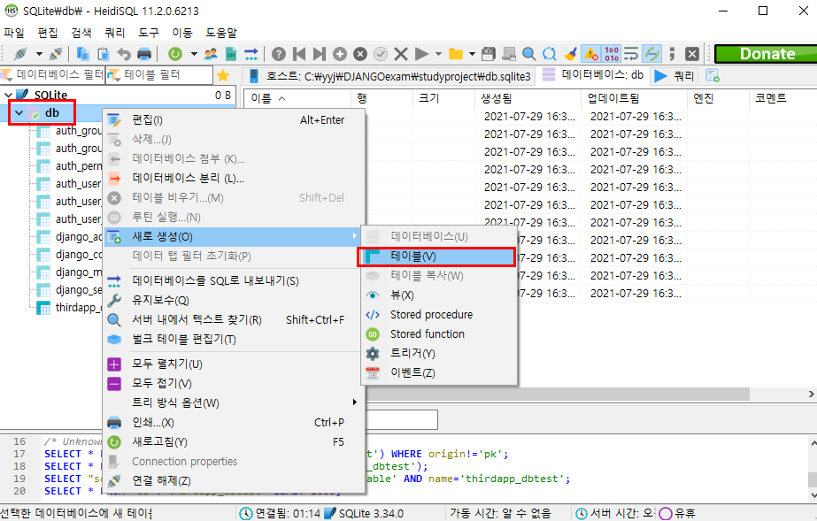


* 다음과 같이 **thirdapp_emp**라는 테이블을 생성한다.

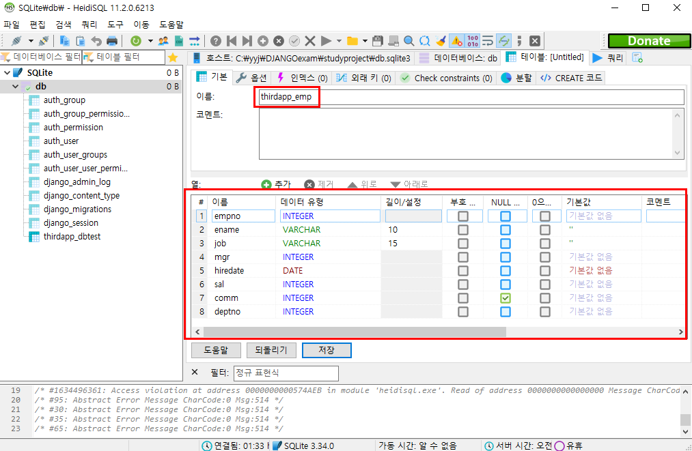

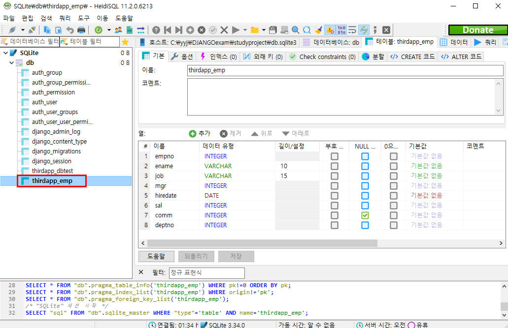


* 생성된 테이블에 csv 파일의 내용을 다음과 같이 저장한다.

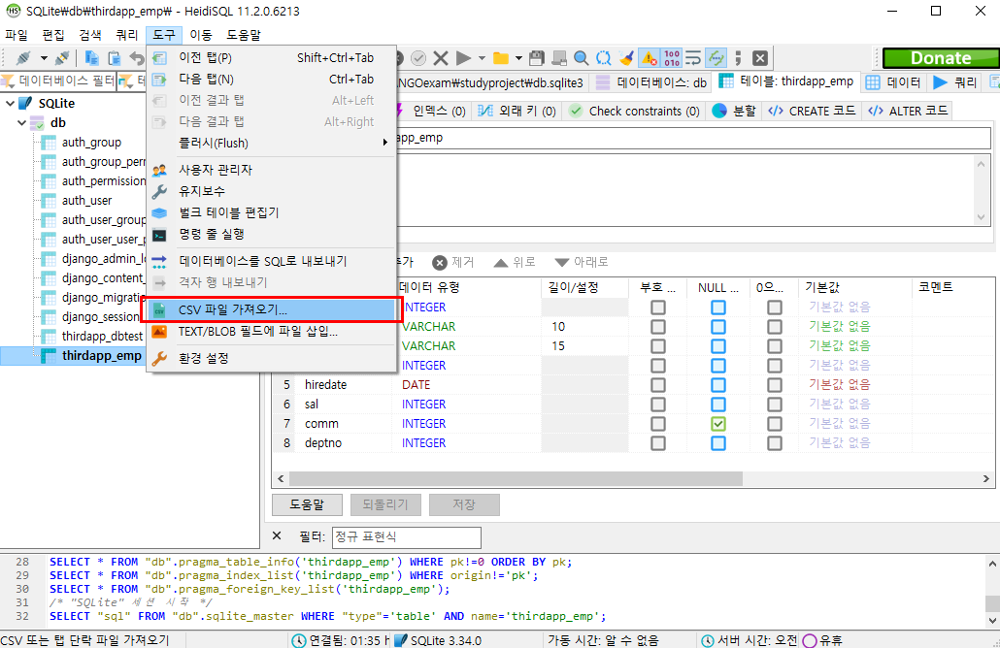

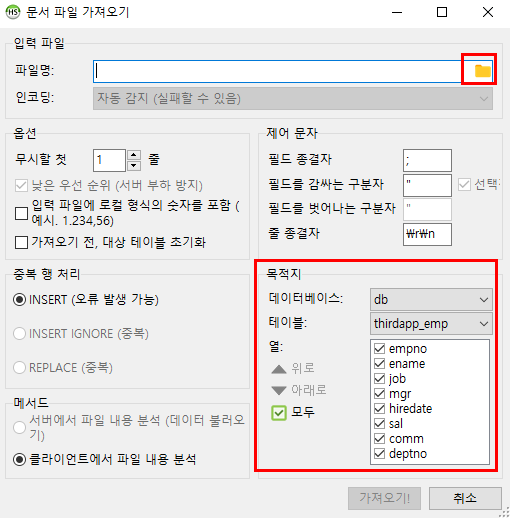

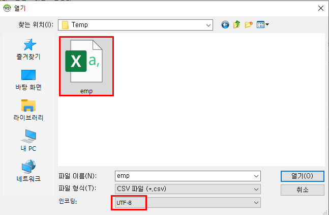

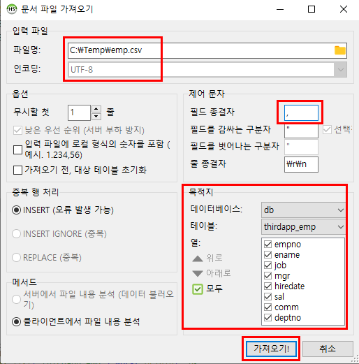

> emp.csv의 경우 데이터 구분자가 `,`이므로 `;`로 설정 되어있던 필드 종결자를 `,`로 변경한다.


* emp.csv 파일의 내용이 thirdapp_emp 테이블에 저장된 것을 볼 수 있다.

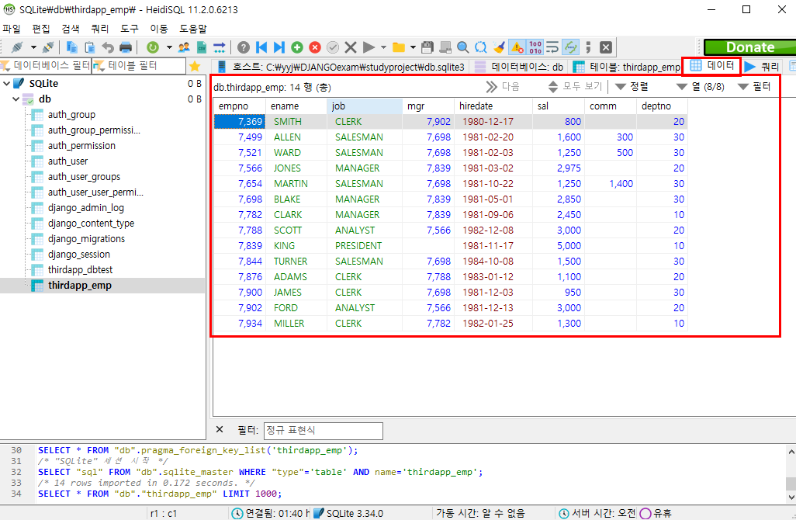


## 파이썬 프로그램에서 테이블 다루기

* thirdapp_emp 테이블의 내용을 파이썬 프로그램에서 다루기 위해 thirdapp의 models.py 파일에 다음과 같이 Emp라는 클래스를 생성한다.

```python
class Emp(models.Model) :
    empno = models.IntegerField(primary_key=True)
    ename = models.CharField(max_length=10)
    job = models.CharField(max_length=15)
    mgr = models.IntegerField()
    hiredate = models.DateField()
    sal = models.IntegerField()
    comm = models.IntegerField(null=True)
    deptno = models.IntegerField()

    def __str__(self):
        return str(self.empno)+","+self.ename +","+str(self.hiredate)+\
               ","+ str(self.sal) + ","+ str(self.deptno)
```

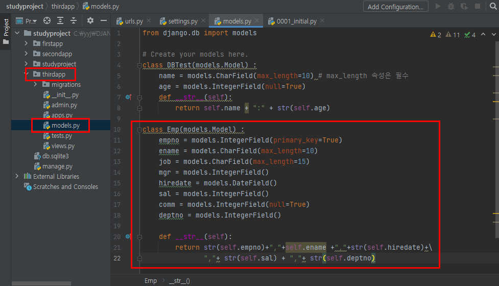

> 여기서, 문자열로 변환 해주는 작업인 str()이 꼭 필요하다.


* djangovenv 가상환경 기반의 터미널에서 python manage.py shell 명령을 실행시키고 인터랙티브 실행모드를 기동시킨 후에 다음 명령들을 실행시켜본다.

```shell
python manage.py shell

from thirdapp.models import Emp
Emp.objects.all()
```

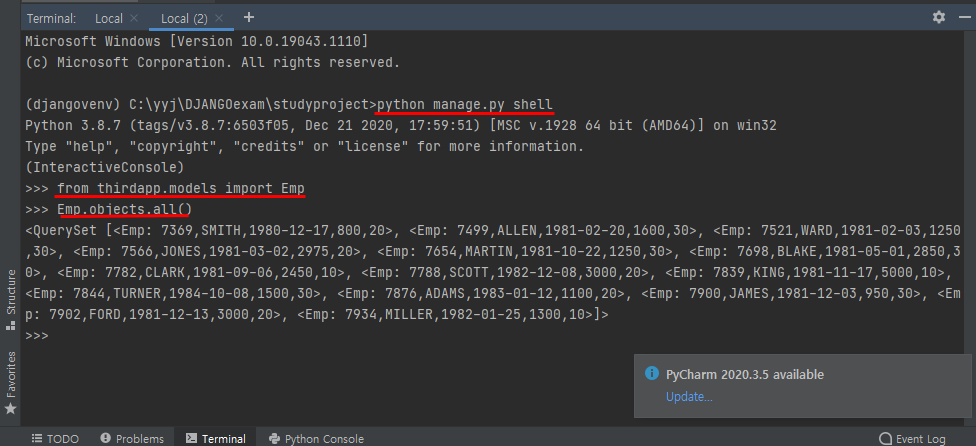


```shell
for d in Emp.objects.all() :
	print(d)
	
```

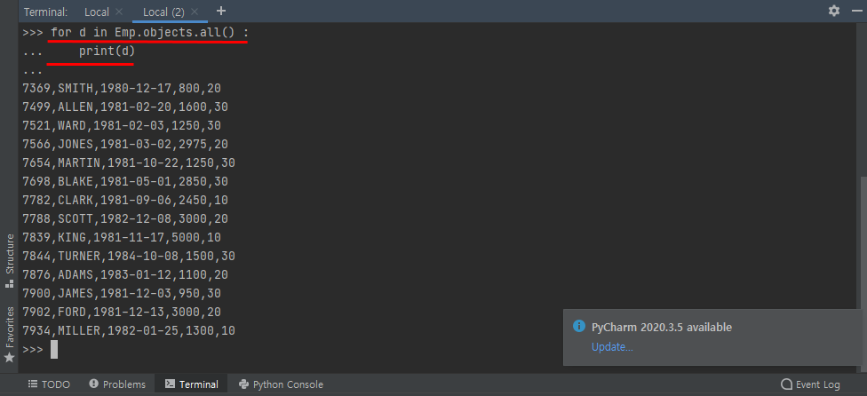


```shell
for d in Emp.objects.order_by('hiredate') :
	print(d)
	
```

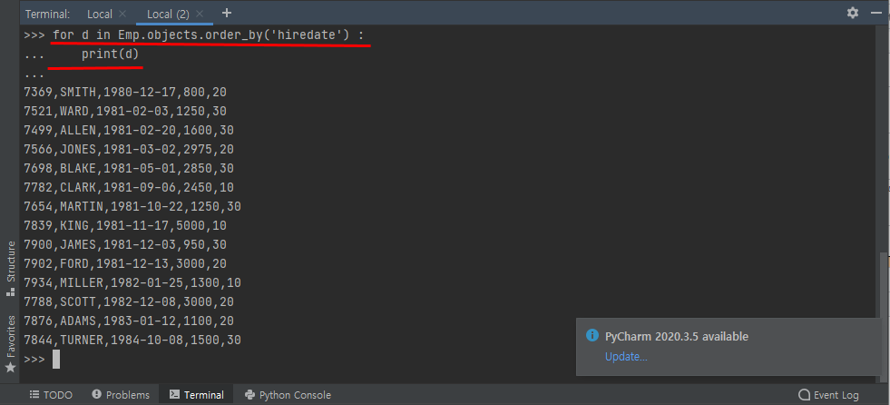


```shell
for d in Emp.objects.order_by('-sal') :
	print(d)
	
```

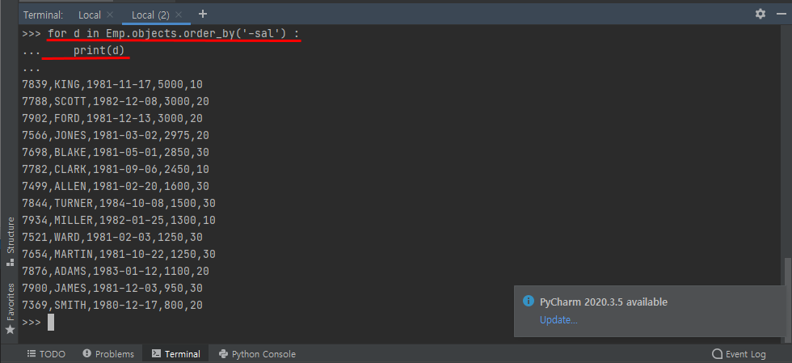

