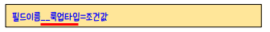
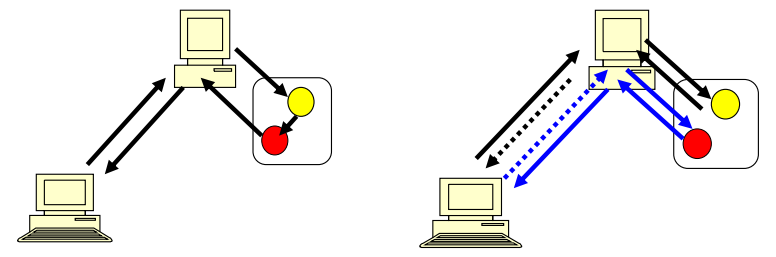

# 필드 룩업(Field Lookups)

> 출처 : https://docs.djangoproject.com/en/3.2/topics/db/queries/
>
> 여기서 Entry, Blog 등은 위의 사이트에서 소개하는 내용의 모델 클래스들이다.

> 필드 룩업은 SQL의 WHERE 절(추출 조건)에 해당하는 부분으로, QuerySet 객체의 메서드인 filter(), exclude(), get()에 키워드 인자 형태로 전달된다.

* 필드 룩업의 기본적인 형태는 다음과 같다.



* 예를 들어, 2006년 이전에 발행된 Enty 객체들의 쿼리셋을 가져오려면 다음과 같다.

  * Entry.objects.filter(pub_cate`__lte`='2006-01-01')

  * 여기서 `lte` 는 less than or equal to라는 의미이다.

  * 위 명령의 SQL문은 다음과 같다.

    ```sql
    SELECT * 
    FROM blog_entry 
    WHERE pub_date <= '2006-01-01';
    ```

* 룩업에 들어가는 필드이름은 검색하려는 모델의 필드이름이며, 예외적으로 ForignKey 필드의 경우에는 필드이름에 `_id` 가 들어간다.

* 외래키 필드를 검색하는 경우에는 조건값으로 외래키 필드가 참조하고 있는 레코드의 기본키 필드 값을 전달해주어야 한다.

* 예를 들어, 다음은 Blog 테이블의 기본키 값이 4인 레코드를 참조하고 있는 모든 Entry 테이블의 레코드들의 쿼리셋을 반환한다.

  * Entry.objects.filter(blog_id=4)
  * 잘못된 룩업 타입을 전달한 경우, TypeError가 발생한다.


## 자주 사용하는 룩업 타입

* `exact` : 완전히 일치하는 값 검색

  * Entry.objects.get(headline**__exact**="Cat bites dog")
  * 위 명령은 Entry 테이블에서 headline 변수가 정확히 "Cat bites dog"인 레코드를 가져온다.
  * 필드 룩업을 사용할 때, 룩업 타입 즉 `__`와 그 이후 부분을 지정하지 않으면, 자동으로 exact를 사용한 매치를 실행한다.
    * Blog.objects.get(**id__exact**=4)
    * Blog.objects.get(**id**=4)

* `iexact` : 대소문자를 구분하지 않는 exact

  * Blog.objects.get(**name__iexact**="beatles blog")
  * Beatles blog, beatles Blog, BEAtles BlOg 등등이 모두 매치된다.

* `contains` : 조건값을 포함한 값과 매치된다. 대소문자를 구분한다.

  * Entry.objects.get(**headline__contains**='Lennon')

  * 위 명령은 아래 SQL문과 같다.

    ```sql
    SELECT * 
    FROM Entry 
    WHERE headline 
    LIKE '%Lennon%';
    ```

* `icontains` : 대소문자를 구분하지 않는 contains

* `startswith`, `endswith` : 각각 조건값으로 시작, 끝나면 매치된다. 대소문자를 구분한다.

* `istartswith`, `iendswith` : 대소문자를 구분하지 않는 startswith, endswith


## 다양한 필드 룩업의 예

> *(기존)*
>
> 함수명()
>
> 함수명(값) # 포지셔널 아규먼트(순서에 의해서 값이 전달)
>
> 함수명(변수명=값) # 키워드 아규먼트
>
> *(필드 룩업 타입)*
>
> 함수명(변수명__xxx=값)

```she
e = Entry.objects.filter(pub_date__year=2006)
e = Entry.objects.exclude(pub_date__year=2006)


e = Entry.objects.filter(headline__startswith='What')
	.exclude(pub_date__gte=datetime.date.today())
	.filter(pub_date__gte=datetime.date(2005, 1, 5))
e1 = Entry.objects.filter(headline__startswith='What')
e2 = e1.exclude(pub_date__gte=datetime.date.today())
e3 = e1.filter(pub_date__gte=datetime.date(2005, 1, 5))


one_entry = Entry.objects.get(pk=1)
```

* get() 을 이용할 경우 매치되는 값이 없으면 **모델클래스.DoesNotExist** 가 발생하게 된다. 
* get() 에 매치된 결과가 여러 개일 경우에도 에러가 발생한다. 이 경우 발생하는 에러는 **모델클래스.MultipleObjectsReturned** 이다.


## 쿼리 제한하기

> Python의 슬라이싱 문법을 통해서 쿼리셋에 들어갈 데이터를 제한할 수 있다. SQL의 LIMIT과 OFFSET 문과 같은 역할을 한다.(음수 슬라이싱은 지원하지 않는다.)

```shell
Entry.objects.all()[:5]
Entry.objects.all()[5:10]
Entry.objects.all()[:10:2]
# 하나의 값을 가져오려면 인덱싱을 해준다. 가져오려는 인덱스의 값이 없을 경우 IndexError 를 일으킨다.
Entry.objects.order_by('headline')[0]
```


## redirect와 render



