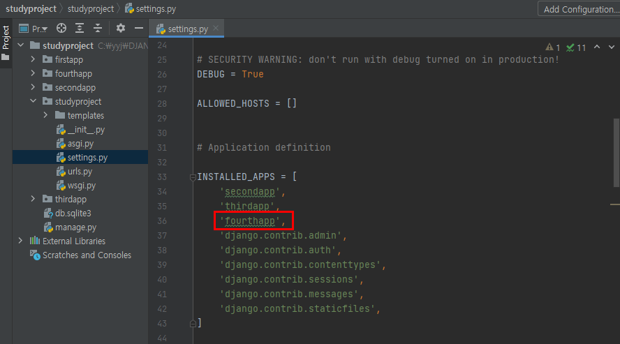
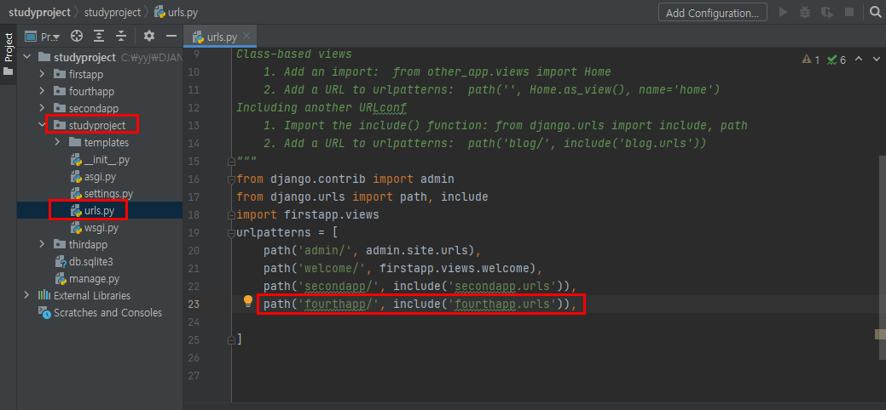
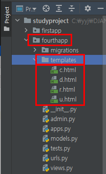
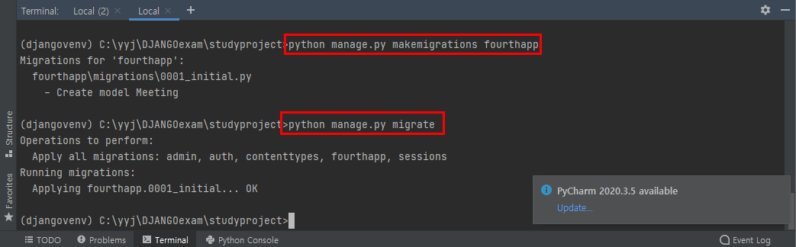
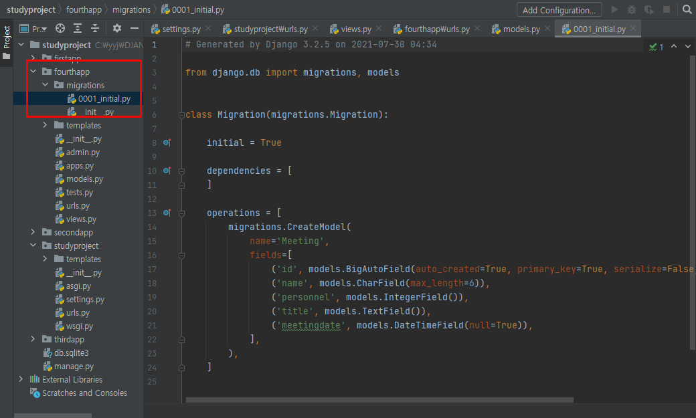
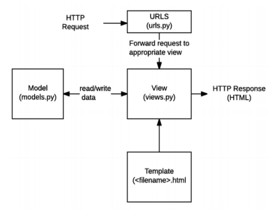
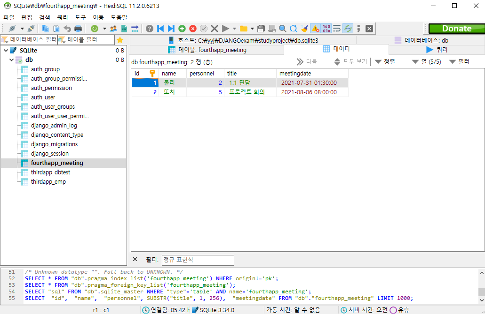
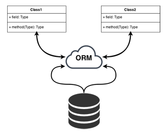
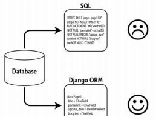

# fourthapp_CRUD

> meeting 예약하는 CRUD 과정

## CRUD

> DB 연동 시 처리하는 기능들

| 이름      | 조작 | SQL 문 |
| --------- | ---- | ------ |
| Create(C) | 생성 | INSERT |
| Read(R)   | 읽기 | SELECT |
| Update(U) | 갱신 | UPDATE |
| Delete(D) | 삭제 | DELETE |


## 소스 구축

* fourthapp 생성

> Terminal창에서 **python manage.py startapp fourthapp**을 입력하여 생성한다.


* fourthapp 등록

> studyproject>studyproject>settings.py에서 fourthapp을 등록한다.




* fourthapp의 패스 등록

> studyproject>studyproject>urls.py에 패스 등록을 한다.




* fourthapp에 templates 폴더 생성하고 html 파일들을 복사

> CRUD에 해당하는 4개의 파일을 폴더 생성 후 복사한다.




* views.py 소스에 뷰함수 추가

> studyproject>fourthapp>views.py

```python
from django.shortcuts import render, redirect
from fourthapp.models import Meeting


def c(request) :
    if request.method == 'POST' :
        name = request.POST.get('name')
        personnel = request.POST.get('personnel')
        title = request.POST.get('title')
        meetingdate = request.POST.get('meetingdate')
        meeting = Meeting(name=name,personnel=int(personnel), title=title, meetingdate=meetingdate)
        meeting.save();
        context = { "msg" : "저장 완료되었어용"  }
    else :
        context = None
    return render(request, 'c.html', context)

def r(request, id=0) :
    if id == 0 :
        meetings = Meeting.objects.all()
        context = {"meetings": meetings}
    else :
        try:
            meeting = Meeting.objects.get(id = id)
            context = {"meeting": meeting}
        except Meeting.DoesNotExist:
            context = {"msg": str(id) + '번 데이터가 없어용ㅜ'}
    return render(request, 'r.html', context)

def u(request, id) :
    if request.method == 'POST' :
        meeting = Meeting.objects.get(id=id)
        meeting.name = request.POST.get('name')
        meeting.personnel = request.POST.get('personnel')
        meeting.title = request.POST.get('title')
        meeting.meetingdate = request.POST.get('meetingdate')
        meeting.save();
        context = { "msg" : "수정 완료되었어용"  }
    else :
        meeting = Meeting.objects.get(id=id)
        context = {"meeting": meeting}
    return render(request, 'u.html', context)

def d(request, id) :
    try :
        meeting = Meeting.objects.get(id=id)
        meeting.delete()
        context = {"msg": '삭제 되었어용'}
        #return redirect("R1")
    except Meeting.DoesNotExist :
        context = {"msg": str(id)+'번 데이터가 없어서 삭제하지 못했어용'}
    return render(request, 'd.html', context)
```


* fourthapp에 urls.py 파일을 생성한 후 패스 정보를 담고 있는 파일 내용 삽입

> studyproject>fourthapp>urls.py

```python
from django.urls import path
from . import views
urlpatterns = [
    path('C/', views.c, name='C'),
    path('R/', views.r, name='R1'),
    path('R/<int:id>/', views.r, name='R2'),
    path('U/<int:id>/', views.u, name='U'),
    path('D/<int:id>/', views.d, name='D'),
]
```


* models.py 소스에 모델 클래스 소스 추가

> studyproject>fourthapp>models.py

```python
from django.db import models

class Meeting(models.Model) :
    name = models.CharField(max_length=6)
    personnel = models.IntegerField()
    title = models.TextField()
    meetingdate = models.DateTimeField(null=True)

    def __str__(self):
        return self.name + ":" + str(self.personnel) + ":" +self.title + ":" + str(self.meetingdate)
```


* makemigrations 및 migrate

> **python manage.py makemigrations fourthapp**
>
> **python manage.py migrate**






## 파일 간의 관계



> MTV 패턴
>
> * Model : 데이터 저장 형태 설정
> * Template : 유저에게 보여지는 화면 설정
> * View : 데이터를 처리해서 가공
> * (+) URLconf(URL 설계) : 가공한 데이터를 유저가 보는 화면으로 넘김


## 생성된 예약 테이블




# ORM(Object-Relation Mapping)

> OOP 프로그래밍에서 RDBMS를 연동할 때, 데이터베이스와 OOP 프로그래밍 언어 간의 호환이 되지 않는 데이터를 변환하는 프로그래밍 기법



* 장점
  * SQL문을 몰라도 DB 연동이 가능하다.
  * SQL의 절차적인 접근이 아닌 객체지향적인 접근으로 인해 생산성이 증가한다.
* 단점
  * ORM만으로 완전한 서비스를 구현하기 어렵다.



