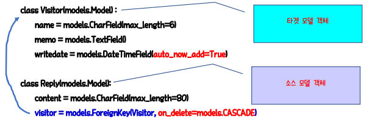

# Django의 Relationships

> 관계형 데이터베이스 시스템의 핵심은 **테이블 간의 관계 설정**이라고 할 수 있다. Django는 데이터베이스 관계의 가장 흔한 유형인 *다대일(Many-to-One), 다대다(Many-to-Many), 일대일(One-to-One)*관계를 구현할 수 있는 기능을 제공한다.

## 다대일 관계(Many-to-One relationships)

> 한 테이블에 있는 두 개 이상의 레코드가 다른 테이블에 있는 하나의 레코드를 참조할 때, 두 모델간의 관계를 다대일 관계라고 한다.


* Order 테이블의 customer_id 필드는 Customers 테이블의 기본 키(Primary Key)인 ID 필드를 참조하고 있다. 이 때, Order 테이블의 customer_id 필드를 **외래 키(Foreign Key) 필드**라고 한다.


## ForeignKey

> Django에서 다대일 관계를 설정할 때는 아래와 같이 Foreign Key를 사용해야 한다. 다른 필드 타입과 마찬가지로 모델 클래스의 속성으로 입력하며, 연결 대상이 될 모델 객체를 위치인자로 전달해주어야 하고, on_delete 옵션을 필수로 입력해주어야 한다.

```python
class 모델이름(models.Model) :
    필드이름 = models.ForeignKey(연결대상모델, on_delete=삭제옵션)
```

```python
# Customer Table
class Customer(models.Model) :
    name = models.CharField(max_length=50)
    
# Order Table
class Order(models.Model) :
    customer = models.ForeignKey(Customer, on_delete=models.CASCADE) # 테이블 생성 시 해당 컬럼엔 _id가 붙는다.
    productname = models.CharField(max_length=50)
```


### ForeignKey 필드의 이름

> Foreign Key 필드의 필드이름은 자유롭게 설정할 수도 있지만, 연결대상이 되는 모델 클래스명을 모두 소문자로 바꾸어 정하는 것을 권장한다.

```python
customer = models.ForeignKey(Customer)
manufacturer = models.ForeignKey(Manufacturer)
```


### on_delete 옵션

> on_delete는 참조되는 레코드(부모 레코드)를 삭제할 때, 그 레코드를 참조하는 레코드(자식 레코드)들에 대한 행동을 정의한다.

| 옵션                     | 설명                                                         |
| ------------------------ | ------------------------------------------------------------ |
| models.CASCADE           | 레코드가 삭제 시 이 레코드를 외래키로 참조하고 있는 모든 레코드들을 함께 삭제한다. |
| models.PROTECT           | 외래키가 참조하고 있는 레코드를 삭제하지 못하게 만든다. 삭제를 시도하면 ProtectedError를 발생시킨다. |
| models.SET_NULL          | 외래키가 참조하고 있는 레코드가 삭제되면, 외래키 필드의 값이 null이 된다. 외래키 필드에 null=True 옵션이 있을 때만 가능하다. |
| models.SET_DEFAULT       | 외래키가 참조하고 있는 레코드가 삭제되면, 외래키 필드의 값이 기본값으로 바뀐다. default 옵션이 설정되어 있을 때만 가능하다. |
| models.DO_NOTHING        | 아무 작업도 하지 않는다.                                     |
| models.SET(값 또는 함수) | SET() 함수에 값이나 호출이 가능한 객체를 전달할 수 있으며, 외래키가 참조하고 있는 레코드가 삭제되면 전달된 값 또는 객체를 호출한 결과로 외래키 필드를 채운다. |


### 다대일 관계의 참조와 역참조

* 위의 Orders, Customers 테이블[테이블 보기] 을 예로 들면, Customer 모델은 Order 모델의 타겟모델이다.
* 소스모델의 인스턴스에서 타겟모델의 인스턴스를 가져오려면 아래와 같이 관계가 정의된 속성의 이름을 붙여준다.
  * o = Order.objects.get(id=1)
  * o.customer # 1번 주문을 한 고객을 가져온다. -> 2번
* 여기서 반대로 타겟 인스턴스에서 소스 인스턴스를 역참조하려면 아래와 같이 한다.
  * c = Customer.objects.get(id=2)
  * c.order_set.all() # 소스모델의 이름은 Order 이므로, 역참조 매니저의 이름은 order_set 이 된다.
* 이것의 결과로 1번 고객에 연결된 모든 Order 모델의 인스턴스들이 쿼리셋으로 리턴된다.


#### 참조-역참조 요약

|                   | ManyToOneField             | OneToOneField      |
| ----------------- | -------------------------- | ------------------ |
| 참조(소스➡타겟)   | source.attname             | source.attname     |
| 역참조(타겟➡소스) | target.lowersourcename_set | target.lowersource |




# Model Relation


## 테이블 구성

### relationapp_employee의 테이블


### relationapp_department의 테이블


### relationapp_location의 테이블


### 테이블의 ERD

> [AqueryTool로 ERD 그리기](https://aquerytool.com/)


## 테이블의 데이터 구성


