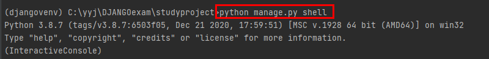
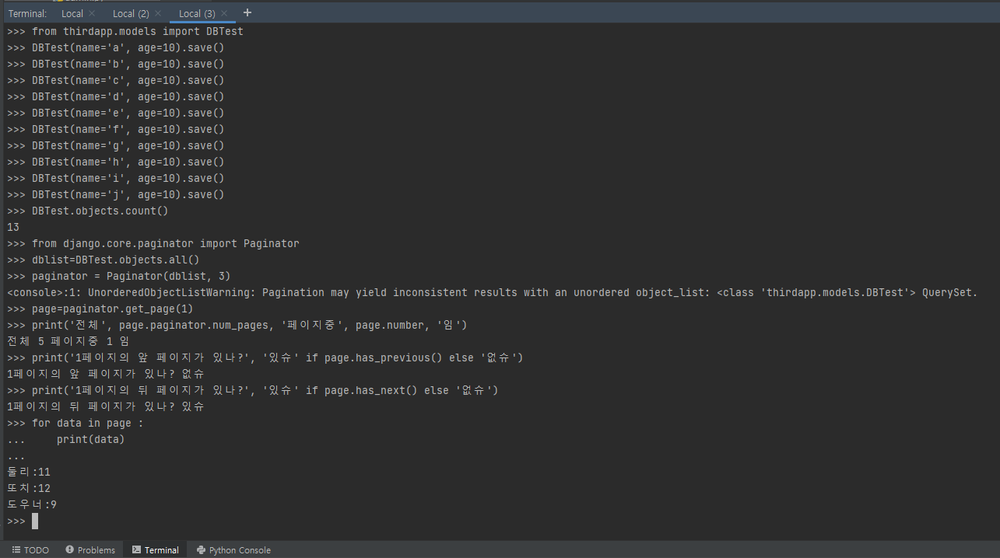

# 리스트 페이징

> Django에서는 리스트 페이징을 편하게 구현할 수 있게 Paginator라는 클래스를 제공한다. 리스트 출력 시에 페이징을 원하는 views에서는 데이터들을 추출하고 나서 Paginator 클래스의 객체를 생성한 다음 생성 시 설정된 데이터 갯수로 구성된 Page 객체를 추출하여 템플릿에게 전달한다.

```python
from django.core.paginator import Paginator

vlist = Visitor.objects.all()
paginator = Paginator(vlist, 3) # Paginator(페이징 대상, 한 페이지에 담길 글의 수)
vlistpage = paginator.get_page(pagenum) # vlistpage에 Page 객체가 리턴됨
```


## 메소드

| 메소드                 | 설명                                  |
| ---------------------- | ------------------------------------- |
| count()                | 총 객체 수                            |
| num_pages()            | 총 페이지 수                          |
| page(n)                | n 번째 페이지 반환                    |
| page_range()           | (1부터 시작하는) 페이지 리스트 반환   |
| get_page()             | n번 페이지 가져오기                   |
| has_next()             | 다음 페이지의 유무를 boolean으로 반환 |
| has_previous()         | 이전 페이지의 유뮤를 boolean으로 반환 |
| previous_page_number() | 이전 페이지 번호 반환                 |


* 페이징 관련 템플릿에서는 다음과 같이 Page 객체에서 제공하는 메서드를 사용해서 페이지 단위로 요청할 수 있는 링크를 출력한다.

```html
<h5>
    
    <a href='?page={{vlist.number|add:-1}}'>이전페이지</a>
    
    Page {{ vlist.number }} / {{ vlist.paginator.num_pages }}
    
    <a href='?page={{vlist.number|add:+1}}'>다음페이지</a>
    
</h5>
```


## 실습

> 페이징 기능을 실습하기 위해 장고 터미널 창에서 파이썬 인터랙티브 수행모드로 들어간다.

```shell
python manage.py shell
```




### 실행 명령 리스트

```shell
from thirdapp.models import DBTest
DBTest(name='a', age=10).save()
DBTest(name='b', age=10).save()
DBTest(name='c', age=10).save()
DBTest(name='d', age=10).save()
DBTest(name='e', age=10).save()
DBTest(name='f', age=10).save()
DBTest(name='g', age=10).save()
DBTest(name='h', age=10).save()
DBTest(name='i', age=10).save()
DBTest(name='j', age=10).save()

DBTest.objects.count()
from django.core.paginator import Paginator
dblist = DBTest.objects.all()
paginator = Paginator(dblist, 3)

page = paginator.get_page(1)
print("전체", page.paginator.num_pages, "페이지중", page.number, "임")
print("1페이지의 앞 페이지가 있남?", "있슈" if page.has_previous() else "없슈")
print("1페이지의 뒤 페이지가 있남?", "있슈" if page.has_next() else "없슈")
for data in page :
    print(data)

page = paginator.get_page(2)
print("전체", page.paginator.num_pages, "페이지중", page.number, "임")
print("2페이지의 앞 페이지가 있남?", "있슈" if page.has_previous() else "없슈")
print("2페이지의 뒤 페이지가 있남?", "있슈" if page.has_next() else "없슈")
for data in page :
    print(data)


page = paginator.get_page(3)
print("전체", page.paginator.num_pages, "페이지중", page.number, "임")
print("3페이지의 앞 페이지가 있남?", "있슈" if page.has_previous() else "없슈")
print("3페이지의 뒤 페이지가 있남?", "있슈" if page.has_next() else "없슈")
for data in page :
    print(data)

page = paginator.get_page(4)
print("전체", page.paginator.num_pages, "페이지중", page.number, "임")
print("4페이지의 앞 페이지가 있남?", "있슈" if page.has_previous() else "없슈")
print("4페이지의 뒤 페이지가 있남?", "있슈" if page.has_next() else "없슈")
for data in page :
    print(data)

page = paginator.get_page(5)
print("전체", page.paginator.num_pages, "페이지중", page.number, "임")
print("5페이지의 앞 페이지가 있남?", "있슈" if page.has_previous() else "없슈")
print("5페이지의 뒤 페이지가 있남?", "있슈" if page.has_next() else "없슈")
for data in page :
    print(data)
```



