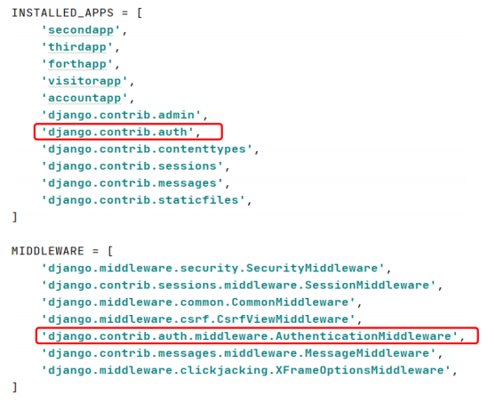

# Django 인증 시스템

> Django에는 로그인 기능과 로그아웃 기능을 지원하는 앱과 미들웨어 프로그램이 내장되어 있다.



* 내장된 앱과 미들웨어 프로그램에 의해서 관련된 DB 테이블들이 최초로 수행된 migrate명령에 의해 생성된다.
* django.contrib.auth 앱에서 제공되는 User 라는 모델 클래스를 통해서 회원을 가입하고 가입된 회원 정보를 통해서 로그인과 로그아웃 기능을 간단하게 처리할 수 있다.


## 관련 API

```python
from django.contrib import auth
from django.contrib.auth.models import User
```

### 회원가입

```python
# User.objects.create_user(회원정보를 키워드 아규먼트로 설정)

user = User.objects.create_user(
		username = useremail,
		first_name = firstname,
		last_name = lastname,
		password = password)
```

### 회원체크

```python
# auth.authenticate(username=사용자계정, password=사용자패스워드)
# 리턴값
# 회원이 아니면 - None
# 회원이면 - 해당 회원의 User 객체
```

### 로그인

```python
# auth.login(request, User객체)
```

### 로그아웃

```python
# auth.logout(request)
```

### 로그인 여부 체크

```python
# request.user.is_authenticated
```

