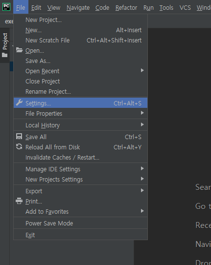

# 장고 실습-1

### 7월23일실습1

#### 0. djangovenv 라는 파이썬 가상 환경이 활성화된 명령프롬프트 창이 없는 교육생은 명령프롬프트 창을 새로 기동시키고 다음 명령을 실행시켜서 가상환경을 활성화 한다.

> cd \yyj\python_venv\djangovenv\Scripts
>
> activate


#### 1. 실습용 장고 프로젝트를 한 개 생성한다.

명령프롬프트 창에서 **c:\yyj\DJANGOexam** 폴더로 옮겨가고 여기에서 **exerciseproject** 이라는 장고 프로젝트 폴더를 생성한다. (교안 8페이지 참고)


#### 2. exerciseproject 이라는 장고프로젝트을 파이참에서 오픈한다.


#### 3. exerciseproject의 실행 환경을 djangovenv 이라는 가상환경으로 설정한다.




#### 4. workapp 이라는 장고앱을 생성한다.


#### 5. 프로젝트의 settings.py 파일의 INSTALLED_APPS에 wrokapp 을 등록한다.(33행)
####   LANGUAGE_CODE('ko-kr') 와 TIME_ZONE('Asia/Seoul')도 설정한다.(107행)


#### 6. 프로젝트의 urls.py 파일에 workapp의 urls.py 를 “workapp/”이라는 매핑명으로 등록한다.

> (include)


#### 7. workapp의 다음 기능의 웹 서버 프로그램을 구현한다.

브라우저에서 http://localhost:8000/workapp/exercise1/이라고 요청하면 
```html
<h1> 안녕하세요? xxx가 만든 첫 장고 웹 페이지 입니다.</h1>         
```


* 서버 기동시키기


## [ 요구사항 ]

- 구현하는 뷰의 함수명은 `exercise1()` 이다.

- 브라우저에서 요청할 때 사용하는 URL에 작성할 이 뷰에 대한 매핑명은  `“exercise1/”` 이다.

   (이 때 매핑 정보를 등록하는 urls.py 는 workapp 에 있는 urls.py 이다.)

- 응답 역할의 템플릿은 `exercise1.html` 으로 한다

- XXX은 본인의 이름 또는 별명이다.

- 구현이 끝나면, exerciseproject 폴더를 압축해서 압축파일을 메일로 제출한다. 


##### * 실습을 끝내면 Terminal에서 `ctrl+c`를 입력하여 서버를 종료한다.

