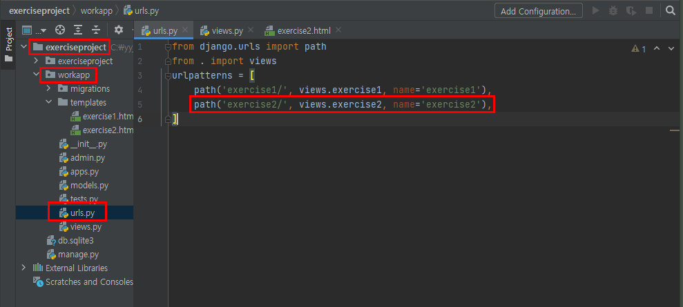
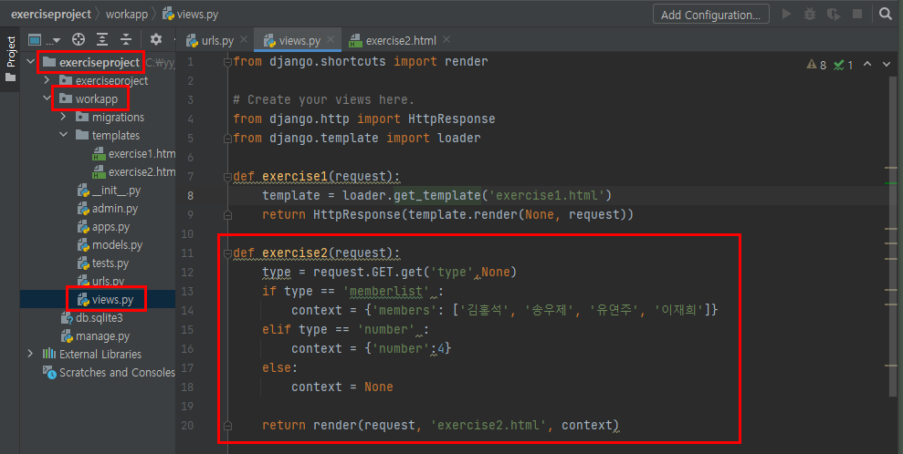
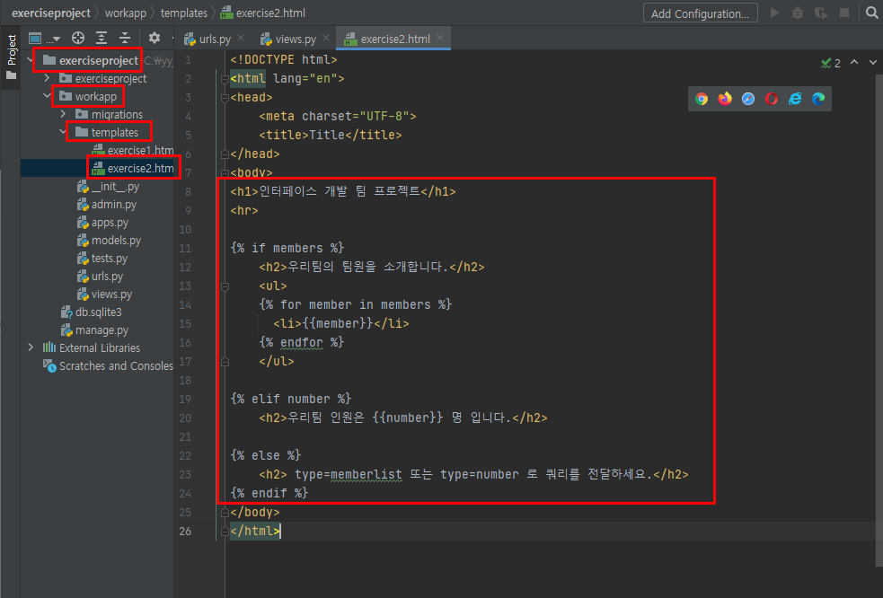
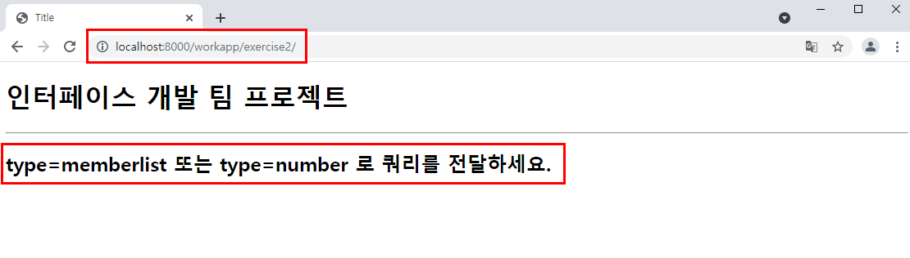
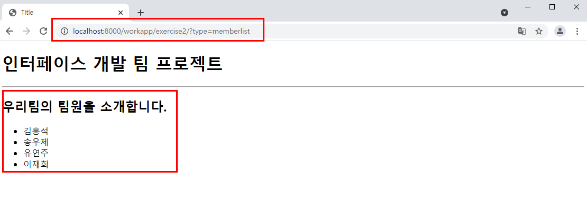
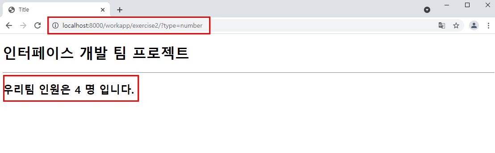
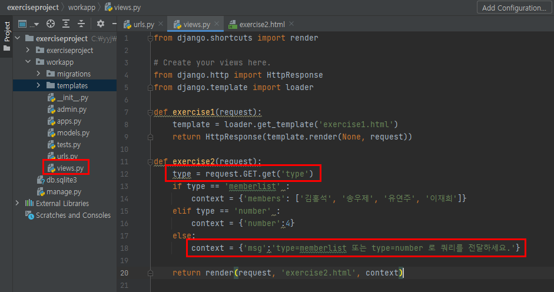
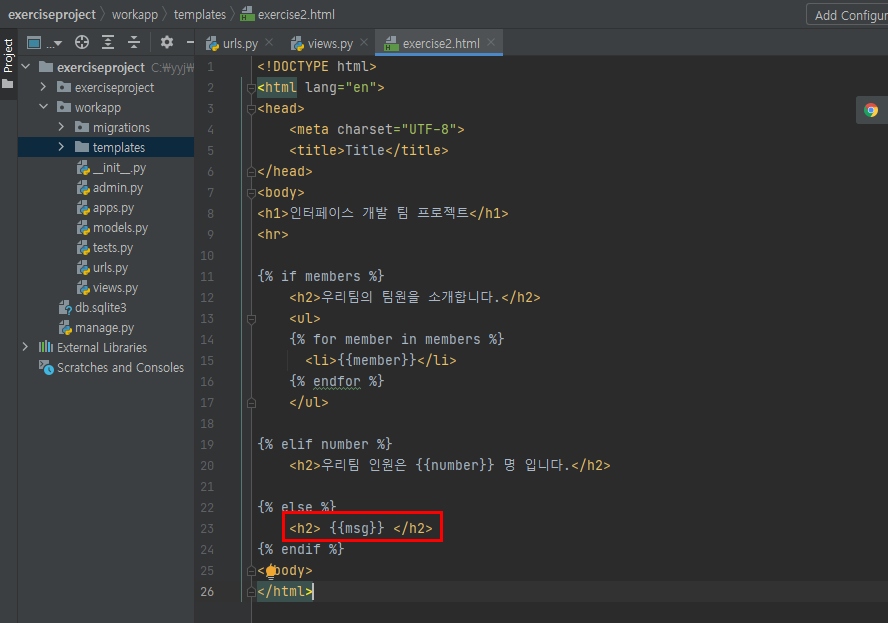

# 장고 실습-2

### 7월26일실습1

- 1개의 뷰함수(views.py)와 1개의 템플릿으로 완성한다.
  - **(뷰함수명: exercise2(), 템플릿 파일명 : exercise2.html)**
- Query 문자열이 전달되지 않으면 “type=memberlist 또는 type=number 로 쿼리를 전달하세요”라는 메시지를 뷰에서 템플릿으로 전달한다.

- Query 문자열로 type=memberlist 가 전달되면 팀 동료들의 이름을 리스트에 담아서 뷰에서 템플릿으로 전달하거나 각각의 이름으로 전달한다.

- Query 문자열로 type=number가 전달되면 “우리팀 인원은 4명입니다”라는 메시지를 뷰에서 템플릿으로 전달한다.


## 실습 내용

1. **exerciseproject>workapp>urls.py**




2. **exerciseproject>workapp>views.py**



* 다음은 views.py 파일의 실패 코드이다.

```python
def exercise2(request):
    if request.GET.get('type', 'memberlist'):
        context = {'members': ['김홍석', '송우제', '유연주', '이재희']}
    elif request.GET.get('type', 'number'):
        context = {'number':4}
    else:
        context = None
```

* 실패 소스 리뷰
  * 같은 type이라는 변수에 한 번은 'memberlist'를 전달한 경우, 또 한 번은 'number'를 전달한 경우를 나누는 데 있어서 생각하는 데 시간이 걸렸다.
  * 가장 큰 실수는 type이라는 변수를 생성하지 않고, type 변수에 값을 전달을 하지 않았다는 점이다.


3. **exerciseproject>workapp>templates>exercise2.html**



* 다음은 exercise2.html 파일의 실패 코드이다.

```html
<body>
<h1>인터페이스 개발 팀 프로젝트</h1>
<hr>


    <h2>우리팀의 팀원을 소개합니다.</h2>
    <ul>
    
      <li>{{member}}</li>
    
    </ul>


    <h2>우리팀 인원은 {{number}} 명 입니다.</h2>


    <h2> type=memberlist 또는 type=number 로 쿼리를 전달하세요.</h2>

</body>
```


> 결과 flow)
>
> `?type=memberlist` 라는 query를 전달하면, if type == 'memberlist'에서 참이고, context에 members를 전달하게 된다. 이후, exercise2.html 파일에서 { % if members % }에 걸리게 되고, 해당 블록을 실행하게 된다.
>
> 이때, 변수를 memberlist와 members를 분리하여 변수 전달의 흐름을 정확하게  파악하였다.


## 실습 결과

1. 브라우저에서 http://localhost:8000/workapp/exercise2/ 을 입력하여 요청하면 다음과 같이 입력 화면이 출력된다.




2.  브라우저에서 http://localhost:8000/workapp/exercise2/?type=memberlist 을 입력하여 요청하면 다음과 같이 입력 화면이 출력된다.




3. 브라우저에서 http://localhost:8000/workapp/exercise2/?type=number 를 입력하여 요청하면 다음과 같이 입력 화면이 출력된다.




## 소스코드 리뷰 및 수정

> *Query 문자열이 전달되지 않으면 “type=memberlist 또는 type=number 로 쿼리를 전달하세요”라는 메시지를 **뷰에서 템플릿으로 전달**한다.*
>
> 라는 사항에 대한 소스를 수정하였습니다.



> ⚠ type = request.GET.get('type', None)에서 None을 주지 않아도 자동으로 None을 주게 되어 있다. 그러므로 None은 생략한다.



