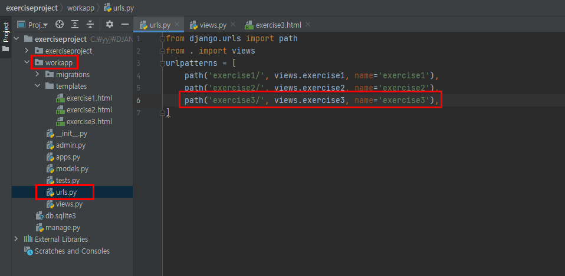

# 장고 실습-3

### 7월27일실습1

> 앞으로 강의(studyproject)에 대한 내용 포트 번호는 8000번(python manage.py runserver),
>
> 실습(exerciseproject)에 대한 내용 포트 번호는 8001번(python manage.py runserver 8001)으로 기동시킨다.

[ 요구 사항 ]

- 1개의 뷰함수(views.py)와 1개의 템플릿으로 완성한다.
  - 뷰함수명: exercise3(), 템플릿 파일명 : exercise3.html

- GET 방식 요청시 위의 입력 폼 화면이 출력((1)번 화면)되고, POST 방식 요청시 Query 문자열로 전달되는 작성자명과 의견 정보를 추출하여 (3)번 화면과 같이 브라우저에 출력한다.


## 실습 내용

1. **exerciseproject>workapp>urls.py**




2. **exerciseproject>workapp>views.py**


3. **exerciseproject>workapp>templates>exercise3.html**


> 이번 실습의 복습 코드
>
> * input 태그의 속성 및 textarea 태그

```html
<form method="POST" action="/workapp/exercise3/">
    
    <input type="text" name="name" placeholder="작성자 이름을 입력하세요" required>
    <textarea name="opinion" placeholder="자신의 의견을 간단히 작성하세요" cols="60" rows="10" required></textarea>
    <input type="submit" value="제출">
    <input type="reset" value="재작성">
</form>
```


## 실습 결과

1. Terminal에서 **python manage.py runserver 8001**을 입력하여 서버를 기동시킨다.


2. 브라우저에 http://localhost:8001/workapp/exercise3/ 를 입력하여 요청하면 다음과 같이 입력 화면이 출력된다.


3. 작성자 이름과 의견을 다음과 같이 입력하고 제출버튼을 클릭하면 http://localhost:8001/workapp/exercise3/ 를 POST 방식으로 요청하게 `<form>` 태그를 작성한다.


4. 결과적으로 다음과 같은 화면이 출력되는 장고 서버 프로그램이 구현되었다.


*이때, 3번과 4번에서 서버 프로그램이 구현될 때, Python Terminal에서는 다음과 같이 작동됨을 알 수 있다.*


