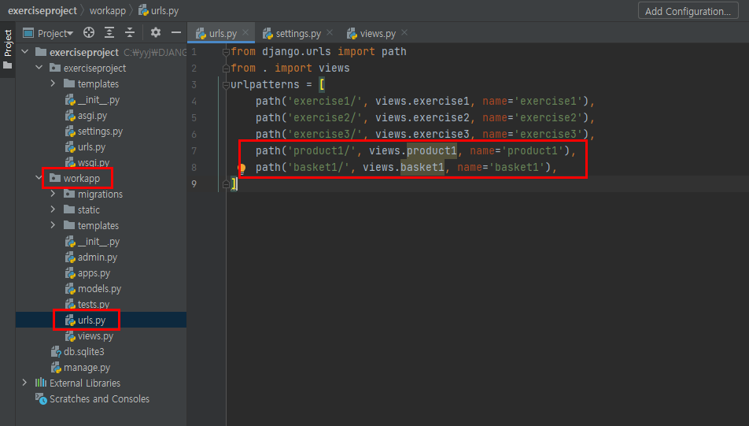
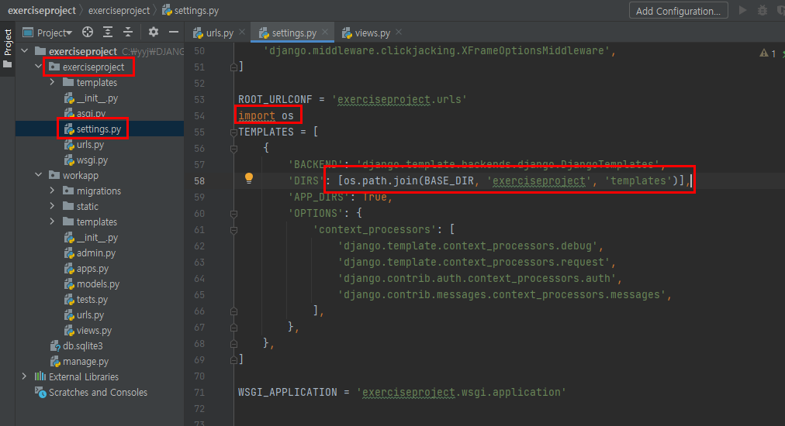
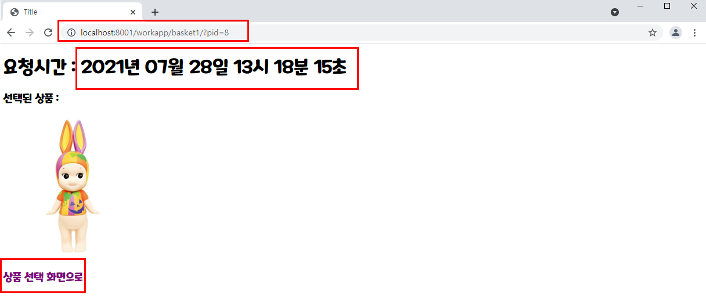

# 장고 실습-4

### 7월28일실습1

[ 요구 사항 ]

- studyproject의 secodapp 폴더에 있는 static 폴더를 exerciseproject의 workapp 에 복사한다.

  

- 이미지는 images 폴더에 있는 제공된 것을 사용해도 되고 다른 이미지들을 사용해도 된다.

- workapp의 urls.py 에 다음 내용 추가한다. 

​        path(**'product1/'**, views.product1, name=**'product1'**),
​        path(**'basket1/'**, views.basket1, name=**'basket1'**),

​	

- studyproject의 studyproject 폴더에 있는 templates 폴더를 exerciseproject의 exerciseproject 폴더에 복사한 후, 이 디렉토리의 파일들이 베이스 템플릿으로 사용 가능하도록 settings.py 를 수정한다.

  (제공된 문서 참조)

  

- product1.html 과 basket1.html 구현시 basesimple.html을 상속받아 템플릿 파일을 완성한다.

  ```html
  
  ```

- 제출 : views.py, product1.html, basket1.html


참고) *basesimple.html의 구성은 다음과 같다.*

```html
<!DOCTYPE html>
<html lang="ko">
<head>
    <meta charset="UTF-8">
    <title>Title</title>
    <style>
    @font-face {
         font-family: 'MaplestoryOTFBold';
         src: url('https://cdn.jsdelivr.net/gh/projectnoonnu/noonfonts_20-04@2.1/MaplestoryOTFBold.woff') format('woff');
         font-weight: normal;
         font-style: normal;
    }
    * {
       font-family: 'MaplestoryOTFBold';
    }
    
    </style>
</head>
<body>
    
    
</body>
</html>
```


<hr>

## 실습 내용

**exerciseproject>workapp>views.py**

```python
from django.shortcuts import render
from datetime import datetime


def product1(request):
    return render(request, 'product1.html')

def basket1(request):
    now = datetime.now()
    pid = request.GET.get('pid')
    context = {'current_date':now, 'pid':'images/'+pid+'.jpg'}
    return render(request, 'basket1.html', context)
```


**exerciseproject>workapp>templates>product1.html**

```html



img {
    width:15%;
    height:150px;
    margin:10px;
    border:1px solid black;
    box-shadow:10px 10px 5px gray;
}




    <div style="text-align:center">
        <h2>원하시는 상품을 클릭해 주세요!!!</h2>
        <hr>
        <div class="group">
            <a href="?pid=1">
                
            </a>
            <a href="?pid=2">
                
            </a>
            <a href="?pid=3">
                
            </a>
            <a href="?pid=4">
                
            </a>
            <a href="?pid=5">
                
            </a>
        </div>
        <div class="group">
            <a href="?pid=6">
                
            </a>
            <a href="?pid=7">
                
            </a>
            <a href="?pid=8">
                
            </a>
            <a href="?pid=9">
                
            </a>
            <a href="?pid=10">
                
            </a>
        </div>
    </div>

```

> get 방식이든 post 방식이든 url 주소 문자열 끝에 `/` 를 붙이는 습관을 들이자.
>
> 예) "/workapp/basket1/?pid={{data}}"


**exerciseproject>workapp>templates>basket1.html**

```html



img {
    width:20%;
    height:30%;
}
a {text-decoration-line: none;}




<h1>요청시간 : {{ current_date|date:"Y년 m월 d일 H시 i분 s초" }}</h1>
<h3>선택된 상품 :</h3>

<a href="">
    <h3 style="color:purple">상품 선택 화면으로</h3>
</a>

```


## 실습 결과

1. 브라우저에 http://localhost:8001/workapp/product1 을 입력하면 다음과 같이 입력 화면이 출력된다.

   화면에 보이는대로 이미지에 스타일을 주어야 하며 각 이미지 클릭시 pid=1 부터 pid=10 까지의 Query 문자열을 전달하면서 **/workapp/basket1/** 을 요청한다.(GET방식)


2. 상품 이미지를 선택하면 다음 화면이 출력된다. 

   다음과 같이 선택된 상품의 이미지가 출력되게 `basket1.html` 을 구현해야 하며 위에는 날짜 필터를 이용해서 요청시간을 출력하게 한다. 

   또한 상품 선택 화면으로 라는 문자열을 클릭하면 **/workapp/product1/** 이 요청되도록 링크를 설정한다.




<hr>

## 실습 리뷰

> 이번 실습은 html 파일간의 상속을 할 수 있도록 연동하는 것을 구현하는 실습이었다.

* exerciseproject의 templates라는 디렉터리에 존재하는 html 파일을 이용하여 템플릿 확장한다.(템플릿 상속)
   * 해당 프로젝트(exerciseproject)의 **setteings.py 파일에서 dir을 수정**한 후, 템플릿을 확장하여 사용하려는 html에서 ****을 포함시킨다.
   
* 상위 폴더의 이미지를 사용하려면 ****을 사용한다.

   ```html
   
   
   ```

* 쿼리요청으로 받은 정보를 이용하여 이미지 파일을 출력하고자 하는 경우는 다음과 같은 코드를 이용한다.

   * 다음은 각각 views.py 파일과 basket1.html의 문서 내용 중 일부이다.

   ```python
   def basket1(request):
       pid = request.GET.get('pid')
       context = {'pid':'images/'+pid+'.jpg'}
       return render(request, 'basket1.html', context)
   ```

   ```html
   
   
   ```


### <실패 코드>

* img를 찾는 경로에서 **템플릿으로 찾을 경우** 전달받을 쿼리값을 수정하지 않고 그대로 입력하면 원하는 쿼리값 그대로를 문자열로 받는 것이 아닌, {{pid}}라는  문자열로 받는다.😅

```python
def basket1(request):
    pid = request.GET.get('pid')
    context = {'pid':pid}
    return render(request, 'basket1.html', context)
```

```html


```


#### 해결방법

> 이미지 경로를 직접 지정한다. 이때는 다음과 같이 {{ pid }} 를 이용하여 전달받을 수 있다.

```html

```


#### 추가 보완

> for 템플릿(반복문)을 사용하여 숫자 1~10로 구성된 datalist로부터 data를 받아와 처리하는 것이다.

**exerciseproject>workapp>views.py**

```python
def product1(request) :
    return render(request, "product1.html", {'datalist':[x for x in range(1, 11)]})

def basket1(request) :
    pid = request.GET.get("pid")
    dt = datetime.now()
    context = {'pid':pid, 'current_date':dt}
    return render(request, "basket1.html", context)
```


**exerciseproject>workapp>templates>product1.html**

```html



img {
    width:150px;
    height:150px;
    margin:10px;
    padding:10px;
    border:1px solid black;
    box-shadow:10px 10px 5px gray;
}



<h2>원하는 상품을 클릭 해주세요!!!</h2>
<hr>
<section>
	
        <a href="/workapp/basket1/?pid={{data}}"></a>
        
            <br>
        
    
</section>

```


**exerciseproject>workapp>templates>basket1.html**

```html



a {
	text-decoration:none;
}



<h2>
    요청시간 : {{ current_date|date:"Y년 m월 d일 H시 i분 s초" }}
</h2>
선택된 상품: <br>
<br>
<a href="">상품 선택 화면으로</a>

```

